# Lab 6.1 官方範例

_以下操作比較特殊，因為無法在本地進行 Lab 專案的諸多操作，一定要在 Sagemaker 運行，這與我的學習目的不同，所以以下筆記將對官方範例進行改寫，以能在個人帳號中運行為目標，行有餘力會對 Lab 操作進行筆記。_

<br>

## 說明

1. 這個 Lab 使用 `Comprehend` 實作 `主題建模`，數據是從數據集 [20 個新聞組] (https://archive.ics.uci.edu/ml/datasets/Twenty+Newsgroups) 中提取主題。

    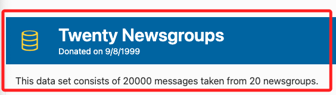

<br>

2. 在 Lab 中，實測可透過 Sagemaker 操作 Lab 提供的 S3 Bucket，但在本地運行時不具備權限，因為也不具備權限對相關設定做查詢，所以無法進一步說明；但是，很幸運的 Lab 提供建立新的 Bucket 的權限，而本筆記著重於本地的操作，所以在接下來的步驟中，將建立新的 Bucket 進行相關演練，另外在 Bucket 的命名上也將延續 Lab 命名風格，僅改變尾綴。

<br>

3. 以下實作分做幾個步驟，按進程為 `建立變量`、`導入數據`、`清洗數據`、`分析 Comprehend 任務輸出` 等主要階段。

<br>

## 關於數據集

1. Lab 使用的 `20 個新聞組` 數據集是近 `20,000` 個 `新聞文件` 的集合，這些文件平均分佈在 `20` 個不同的 `新聞組` 中。

<br>

2. 此數據集常用於機器學習技術如 `文本分類` 和 `文本聚類` 的應用，在本 Lab 中將了解如何使用 `神經主題模型 (NTM) 演算法` 從此組文檔中學到主題。

<br>

3. 數據集資訊可參考連結 [Tom Mitchell，*20 Newsgroups Data*，1999 年 9 月 9 日，由 UCI KDD Archive 發布](https://kdd.ics.uci.edu/databases/20newsgroups/20newsgroups.data.html)。

<br>

## 準備工作

_建立本地工作環境_

<br>

1. 建立專案資料夾。

    ```bash
    mkdir -p ~/Desktop/_test_ && cd ~/Desktop/_test_
    touch .env .gitignore ex01.ipynb
    echo ".env" >> .gitignore
    code .
    ```

<br>

2. 在 `.env` 貼上帳號的 AWS CLI 設置；相關設置可在 `~/.aws` 中查詢。

    ```bash
    aws_access_key_id = XXXXXXXXXXXXXXXXXXXXXXXXXX
    aws_secret_access_key = XXXXXXXXXXXXXXXXXXXXXXXXXX
    ```

<br>

3. 緊接著在下方貼上以下內容。

    ```bash
    AWS_ACCESS_KEY_ID=${aws_access_key_id}
    AWS_SECRET_ACCESS_KEY=${aws_secret_access_key}
    AWS_SESSION_TOKEN=${aws_session_token}
    AWS_DEFAULT_REGION=us-east-1
    ```

<br>

4. 在 `ex01.ipynb` 中選擇適當核心如 `envAWS`，貼上並運行以下代碼，確認設置是否正確。

    ```python
    import boto3

    # 載入 .env 檔案中的環境變數
    from dotenv import load_dotenv
    import os
    load_dotenv()

    # 建立 STS 客戶端
    sts_client = boto3.client("sts")

    # 呼叫 get_caller_identity 以取得當前 AWS 帳號資訊
    response = sts_client.get_caller_identity()
    account_id = response["Account"]

    print(f"AWS Account ID: {account_id}")
    ```

<br>

5. 務必進入主控台查看是否與 Account ID 相同。

    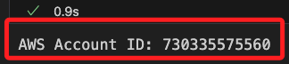

<br>

6. 查看預設 S3 的內容。

    ```python
    import boto3

    # 建立 S3 資源對象
    s3 = boto3.resource('s3')

    def list_s3_bucket_structure(bucket_name):
        bucket = s3.Bucket(bucket_name)
        print(f"Bucket: {bucket_name}")
        
        has_objects = False
        for obj in bucket.objects.all():
            print(" └── ", obj.key)
            has_objects = True

        if not has_objects:
            print(" └── <此 bucket 為空>")

    # 取得所有 bucket 名稱並顯示每個 bucket 的樹狀結構
    s3_client = boto3.client("s3")
    buckets = s3_client.list_buckets()["Buckets"]

    if buckets:
        for bucket in buckets:
            list_s3_bucket_structure(bucket["Name"])
    else:
        print("當前為空的：沒有任何 S3 bucket")
    ```

    _若是 Lab 會顯示如下，其餘帳號依實際而定_

    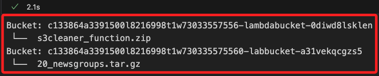

<br>

## 開始運行專案

_建立 Lab 所需權限的變數_

<br>

1. 修改官方原本在筆記本中提供的 `硬編碼` 變數，使用自動化方式取得所需的名稱提供後續步驟使用，未來也無需每次開啟官方腳本進行複製 `硬編碼` 內容。

    ```python
    import boto3

    # 初始化 S3 和 IAM 客戶端
    s3_client = boto3.client("s3")
    iam_client = boto3.client("iam")

    # 列出符合條件的 Bucket
    def get_target_bucket():
        try:
            response = s3_client.list_buckets()
            bucket_names = [bucket["Name"] for bucket in response["Buckets"] if "labbucket" in bucket["Name"]]
            return bucket_names[0] if bucket_names else None
        except Exception as e:
            print(f"無法取得 bucket 列表。錯誤訊息：{e}")
            return None

    # 列出符合條件的 IAM 角色 ARN
    def get_data_access_role_arn():
        try:
            response = iam_client.list_roles()
            for role in response["Roles"]:
                if "ComprehendDataAccessRole" in role["RoleName"]:
                    return role["Arn"]
            print("無法找到符合條件的 Comprehend Data Access Role。")
            return None
        except Exception as e:
            print(f"無法取得 IAM 角色列表。錯誤訊息：{e}")
            return None

    # 自動取得 bucket 名稱和 data_access_role_arn
    bucket = get_target_bucket()
    data_access_role_arn = get_data_access_role_arn()

    # 輸出確認
    if bucket:
        print(f"選定的 Bucket: {bucket}")
    else:
        print("沒有找到符合條件的 Bucket。")

    if data_access_role_arn:
        print(f"選定的 Data Access Role ARN: {data_access_role_arn}")
    else:
        print("沒有找到符合條件的 Data Access Role。")
    ```

    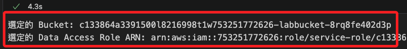

<br>

2. 同樣地，可以在 Sagemaker 提供的腳本中查看是否與腳本內容一致，這在腳本中提供的是硬編碼內容。

    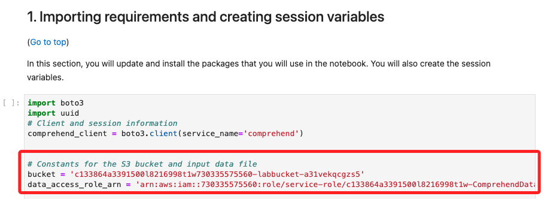

<br>

3. 因應權限問題，修改前一個步驟自動化取得的 Bucket 名稱，將其中 `labbucket` 字串改為 `custom`，因為原本的 Bucket 中存放了所需的 `.gz` 文件，所以保留原本的變數名稱 `bucket_custom`，將自訂名稱命名為 `bucket_custom`，而名稱部分則使用 `custom`；特別說明，之所以去除 `bucket` 字樣主要是因為 `custombucket` 命名剛好過長讓建立 Bucket 時出現出錯，所以縮短為合法命名。

    ```python
    # 將 bucket 名稱中的 "labbucket" 替換為 "custom"
    bucket_custom = bucket.replace("labbucket", "custom")
    print(bucket)
    print(bucket_custom)
    ```

    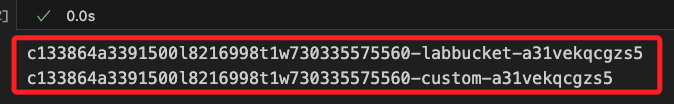

<br>

## 下載並解壓縮數據

_延續前步驟進行_

<br>

1. 指定本地路徑。

    ```python
    # 指定文件的名稱
    file_key = '20_newsgroups.tar.gz'
    # 本地儲存路徑
    local_file_path = './20_newsgroups.tar.gz'

    # 確認 bucket 變數後進行文件下載
    if bucket:
        try:
            s3_client.download_file(bucket, file_key, local_file_path)
            print(f"成功下載 {file_key} 到本地 {local_file_path}")
        except Exception as e:
            print("下載文件時出錯:", e)
    else:
        print("無法進行下載，因為未選定任何有效的 Bucket。")
    ```

    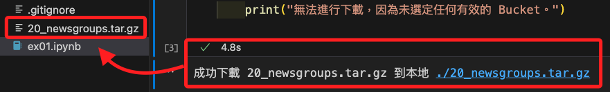

<br>

2. 依據官方建議的操作，在解壓縮數據集之前，除了定義存放數據的文件夾外，並清理其中可能存在的舊數據；特別注意，這在本地是多餘的動作，僅保留作爲參考，實際運行也沒問題。

    ```python
    import os
    import shutil

    data_dir = '20_newsgroups'
    # 清理現有的數據文件夾
    if os.path.exists(data_dir):
        shutil.rmtree(data_dir)
    ```

<br>

## 解壓縮數據

_接下來要進行數據的解壓縮_

<br>

1. 首先特別說明，在 CELL 中可使用開發環境提供的 `魔法指令 !` 使用終端機語法進行解壓縮文件並列出內容；我個人是不喜歡這樣的操作，若需要運行終端機指令，那就在終端機中運行即可，除非 Python SDK 無法處理這個指令。

    ```python
    !tar -xzf 20_newsgroups.tar.gz
    !ls 20_newsgroups
    ```

<br>

2. 建議使用代碼進行解壓縮工作，同時輸出解壓縮後的子資料夾列表。

    ```python
    import tarfile
    import os

    # 解壓縮 .tar.gz 文件
    with tarfile.open('20_newsgroups.tar.gz', 'r:gz') as tar:
        # 壓縮檔案內已經設定路徑，這裡無需再指定 path 參數
        tar.extractall()

    # 列出解壓縮後的內層資料夾名稱
    print("20_newsgroups 內層資料夾名稱:")
    for folder_name in sorted(os.listdir('20_newsgroups')):
        folder_path = os.path.join('20_newsgroups', folder_name)
        if os.path.isdir(folder_path):
            print(folder_name)
    ```

    

<br>

5. 統計總文件數量，如前面描述的近 `20,000` 筆。

    ```python
    folders = [
        os.path.join(data_dir, f) for f in sorted(os.listdir(data_dir)) if os.path.isdir(os.path.join(data_dir, f))
    ]
    file_list = [
        os.path.join(d, f) for d in folders for f in os.listdir(d)
    ]
    print('文件數量:', len(file_list))
    ```

    

<br>

## 數據清洗

_檢查數據並執行一些標準的 `NLP` 數據清洗工作。_

<br>

1. 使用魔法指令顯示 *指定文件* 的內容。

    ```python
    !cat 20_newsgroups/comp.graphics/37917
    ```

<br>

2. 同樣地，可使用代碼處理相同工作。

    ```python
    file_path = "20_newsgroups/comp.graphics/37917"

    # 打開文件並讀取內容
    with open(file_path, "r") as file:
        content = file.read()

    # 輸出文件內容
    print(content)
    ```

    _輸出_

    ```bash
    Path: cantaloupe.srv.cs.cmu.edu!crabapple.srv.cs.cmu.edu!fs7.ece.cmu.edu!europa.eng.gtefsd.com!howland.reston.ans.net!usc!elroy.jpl.nasa.gov!nntp-server.caltech.edu!andrey
    From: andrey@cco.caltech.edu (Andre T. Yew)
    Newsgroups: comp.graphics
    Subject: Re: 16 million vs 65 thousand colors
    Date: 3 Apr 1993 19:51:06 GMT
    Organization: California Institute of Technology, Pasadena
    Lines: 28
    Message-ID: <1pkpraINNck9@gap.caltech.edu>
    References: <1993Mar26.210323.27802@midway.uchicago.edu> <dotzlaw-020493084300@murphy.biochem.umanitoba.ca> <d9hh.733845825@dtek.chalmers.se>
    NNTP-Posting-Host: punisher.caltech.edu
    
    d9hh@dtek.chalmers.se (Henrik Harmsen) writes:
    
    >1-4 bits per R/G/B gives horrible machbanding visible in almost any picture.
    
    >5 bits per R/G/B (32768, 65000 colors) gives visible machbanding
    
    >color-gradient picture has _almost_ no machbanding. This color-resolution is 
    
    >see some small machbanding on the smooth color-gradient picture, but all in all,
    >There _ARE_ situiations where you get visible mach-banding even in
    >a 24 bit card. If
    >you create a very smooth color gradient of dark-green-white-yellow
    >or something and turn
    >up the contrast on the monitor, you will probably see some mach-banding.
    
        While I don't mean to damn Henrik's attempt to be helpful here,
    he's using a common misconception that should be corrected.
    
        Mach banding will occur for any image.  It is not the color
    quantization you see when you don't have enough bits.  It is the
    human eye's response to transitions or edges between intensities.
    The result is that colors near the transistion look brighter on
    the brighter side and darker on the darker side.
    
    --Andre
    
    -- 
                Andre Yew andrey@cco.caltech.edu (131.215.139.2)
    ```

<br>

3. 每個新聞組文檔都可能包含以下部分；特別注意，*消息* 就是這個 Lab 希望提取主題的正文。

    ```bash
    頁眉 - 包含標準的新聞組頁眉信息，應將其移除。

    引用文本 - 上一條消息的文本，通常有 ">" 或 "|" 前綴，並且有時以 `writes*`、`wrote`、`said` 或 `says` 開頭。

    消息 - 這就是任務希望從中提取主題的消息正文。

    頁腳 – 通常是以簽名結尾的消息。
    ```

<br>

4. 觀察好數據後，先定義三個函數用來清洗數據，分別是 `移除頁眉`、`移除引用文本` 和 `移除頁腳`。

    ```python
    # 匯入正則表達式模組
    import re

    # 移除新聞組文件中的頁眉
    def strip_newsgroup_header(text):
        # 使用 partition 函數將文本分為三部分，遇到第一個空行（\n\n）分割
        _before, _blankline, after = text.partition('\n\n')
        # 返回空行之後的部分，即去除頁眉的文本
        return after

    # 定義正則表達式，用於匹配常見的引用格式
    _QUOTE_RE = re.compile(
        r'(writes in|writes:|wrote:|says:|said:'
        r'|^In article|^Quoted from|^\||^>)'
    )

    # 定義函數以移除新聞組文件中的引用文字
    def strip_newsgroup_quoting(text):
        # 將文本逐行分割，並過濾掉符合引用格式的行
        good_lines = [
            line for line in text.split('\n') if not _QUOTE_RE.search(line)
        ]
        # 將過濾後的行重新合併為單一文本，行間以換行符號連接
        return '\n'.join(good_lines)

    # 定義函數以移除新聞組文件中的頁腳
    def strip_newsgroup_footer(text):
        # 將文本分割為每一行，並去除多餘的空白行
        lines = text.strip().split('\n')
        # 從最後一行開始，逐行檢查
        for line_num in range(len(lines) - 1, -1, -1):
            line = lines[line_num]
            # 如果該行為空白行或僅包含破折號，則認為是頁腳的開始
            if line.strip().strip('-') == '':
                break

        # 如果找到了頁腳，返回頁腳以上的所有內容
        if line_num > 0:
            return '\n'.join(lines[:line_num])
        else:
            # 如果沒有找到頁腳，返回原文本
            return text
    ```

<br>

5. 運行以上三個函數來清洗數據，也就是 `移除頁眉、頁腳和引號`。

    ```python
    data = []
    for f in file_list:
        with open(f, 'rb') as fin:
            content = fin.read().decode('latin1')   
            content = strip_newsgroup_header(content)
            content = strip_newsgroup_quoting(content)
            content = strip_newsgroup_footer(content)
            data.append(content)
    ```

<br>

6. 列出第一筆處理後的資料內容觀察結果。

    ```python
    print("處理後的文件內容示例：")
    print(data[0])
    ```

    

<br>

7. 確認無誤後，將所有清洗過的數據存入文件 `comprehend_input.txt` 中，每行包含一個文檔。

    ```python
    with open('comprehend_input.txt','w', encoding='UTF-8') as cf:
        for line in data:
            line = line.strip()
            line = re.sub('\n',' ',line)
            line = re.sub('\r',' ',line)
            cf.write(line+'\n')
    ```

<br>

8. 可對儲存後的文件 `comprehend_input.txt` 稍作觀察。

    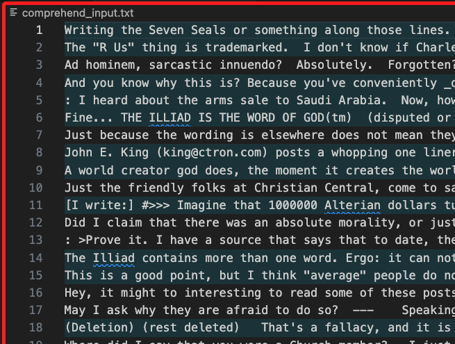

<br>

## 上傳數據

_需要將數據上傳到 `S3 Bucket`，這樣 `Comprehend` 才能使用數據；特別注意，這裡將使用字建立的 S3 Bucket 中。_

<br>

1. 檢查 Bucket 是否存在，若不存在則建立新的 Bucket。

    ```python
    from botocore.exceptions import ClientError

    # 初始化 S3 資源
    s3 = boto3.resource('s3')

    # 檢查並建立 bucket
    def ensure_bucket_exists(bucket_name):
        try:
            s3.meta.client.head_bucket(Bucket=bucket_name)
            print(f"Bucket '{bucket_name}' already exists.")
        except ClientError:
            # 若 bucket 不存在，則建立它
            print(f"Bucket '{bucket_name}' does not exist. Creating now...")
            s3.create_bucket(Bucket=bucket_name)
            print(f"Bucket '{bucket_name}' created successfully.")

    # 確保 bucket 存在
    ensure_bucket_exists(bucket_custom)
    ```

    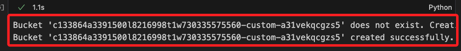

<br>

2. 將數據上傳到 `S3`。

    ```python
    s3 = boto3.resource('s3')
    s3.Bucket(bucket_custom).upload_file(
        'comprehend_input.txt',
        'comprehend/newsgroups/comprehend_input.txt'
    )
    ```

<br>

3. 特別注意，在本地運行上傳 S3 的時候出現權限問題，但是從 Sagemaker 是可以儲存的，這裡先透過上傳 `comprehend_input.txt` 到 Sagemaker 中，然後透過以上代碼轉存到 S3 來排除，之後再回來處理。

<br>

4. 上傳後重新運行前面的檢查代碼。

    ```python
    if buckets:
        for bucket in buckets:
            list_s3_bucket_structure(bucket["Name"])
    else:
        print("當前為空的：沒有任何 S3 bucket")
    ```

    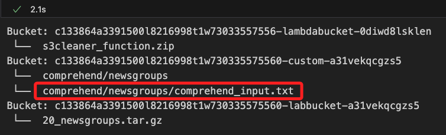

<br>

5. 特別注意，在上方截圖中會看到一個名為 `comprehend/newsgroups` 的對象，這是因官方原本提供的代碼僅指定鍵名 `comprehend/newsgroups`，這樣可能會導致 S3 把這個路徑直接作為單一的對象，而非目錄中的文件；為了避免這樣的問題，並將文件正確上傳至指定的資料夾並顯示在該目錄下，可在鍵名中包含具體文件名稱。

    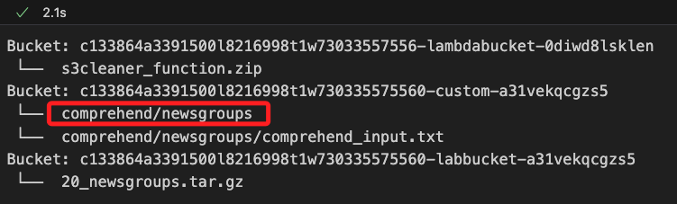

<br>

## 進行 Comprehend

1. 設定 Comprehend 主題檢測工作的相關參數。

    ```python
    import uuid

    # 主題數量，表示 Comprehend 要識別的主題數目
    number_of_topics = 20

    # S3 路徑
    input_s3_url = f"s3://{bucket}/comprehend"

    # 輸入文件的格式，每行作為單個文件進行處理
    input_doc_format = "ONE_DOC_PER_LINE"

    # 輸入數據的配置字典，包括 S3 路徑和文件格式
    input_data_config = {
        "S3Uri": input_s3_url,
        "InputFormat": input_doc_format
    }

    # 輸出文件的 S3 路徑，主題檢測結果將儲存在此路徑下
    output_s3_url = f"s3://{bucket}/outputfolder/"

    # 輸出數據的配置字典，指定 S3 儲存位置
    output_data_config = {
        "S3Uri": output_s3_url
    }

    # 生成工作的唯一識別 ID
    job_uuid = uuid.uuid1()

    # 加入 UUID 組合主題檢測工作名稱
    job_name = f"top-job-{job_uuid}"

    # 輸出輸入的 S3 路徑
    print(input_s3_url)
    ```

    _輸出_

    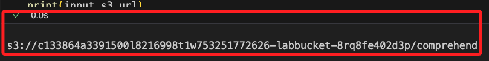

<br>

2. 開始 `Comprehend` 主題檢測任務；特別注意這個函數中的 `DataAccessRoleArn` 參數，必須設定 Lab 提供的角色來獲取權限，這在後續 Lab 中會提供角色 ARN，但不會再交代這個函數設定。

    ```python
    # 客戶端
    comprehend_client = boto3.client(service_name='comprehend')

    # 啟動主題檢測工作
    start_topics_detection_job_result = comprehend_client.start_topics_detection_job(
        # 指定要識別的主題數量
        NumberOfTopics=number_of_topics,
        # 提供輸入數據的配置
        InputDataConfig=input_data_config,
        # 設定工作名稱
        JobName=job_name,
        # 輸出數據的配置
        OutputDataConfig=output_data_config,
        # 設定資料訪問的角色 ARN，用於允許 Comprehend 存取 S3 上的數據
        DataAccessRoleArn=data_access_role_arn
    )
    ```

<br>

3. 獲取任務狀態並等待任務完成，這個過程相當耗時，在 Sagemaker 中需 `25–35` 分鐘的時間；本機尚未實測。

    ```python
    # 因為這段代碼會運行很久，透過代碼讓程式暫停指定的秒數以顯示進行狀態
    from time import sleep

    # 透過 JobId 確認目前的工作狀態
    job = comprehend_client.describe_topics_detection_job(JobId=start_topics_detection_job_result['JobId'])

    # 初始化等待時間計數，單位為 `秒`
    waited = 0

    # 設定超時時間，單位為 `分鐘`
    timeout_minutes = 40

    # 透過 while 檢查工作的狀態是否完成
    while job['TopicsDetectionJobProperties']['JobStatus'] != 'COMPLETED':
        # 每次迴圈暫停 60 秒再進行下一次狀態檢查，沒耐心的話可自訂短一點
        sleep(60)
        # 累計已等待的時間，每次 60 秒
        waited += 60

        # 檢查是否已超過自訂的上限時間
        # 若超時則透過語法 assert 終止程式並提示錯誤
        assert waited // 60 < timeout_minutes, "Job timed out after %d seconds." % waited
        
        # 印出 `.` 表示程式正在等待完成
        print('.', end='')

        # 再次查詢工作狀態，更新 job 資訊
        job = comprehend_client.describe_topics_detection_job(
            JobId=start_topics_detection_job_result['JobId']
        )

    # 工作完成
    print('Ready')
    ```

<br>

4. 任務完成，下載結果。

    ```python
    # 取得 Comprehend 工作輸出文件的 S3 URI
    topic_comprehend_output_file = job['TopicsDetectionJobProperties']['OutputDataConfig']['S3Uri']

    # 輸出文件的名稱
    print(f'output filename: {topic_comprehend_output_file}')

    # 移除 S3 URI 的開頭，並拆分出 bucket 名稱和檔案路徑
    topics_comprehend_bucket, topics_comprehend_key = topic_comprehend_output_file.replace("s3://", "").split("/", 1)

    # 顯示從 S3 路徑解析出的檔案路徑（key）
    print(topics_comprehend_key)

    # 建立 S3 資源物件
    s3r = boto3.resource('s3')

    # 從指定的 S3 bucket 下載主題檢測輸出文件到本地，並命名為 'output.tar.gz'
    s3r.meta.client.download_file(
        topics_comprehend_bucket, 
        topics_comprehend_key, 
        'output.tar.gz'
    )
    ```

    _輸出_

    ```bash
    output filename: s3://c133864a3391500l8216998t1w753251772626-labbucket-m0jhfwhqvfik/outputfolder/753251772626-TOPICS-5199ae6b337b522fab6a70844842b5ea/output/output.tar.gz
    outputfolder/753251772626-TOPICS-5199ae6b337b522fab6a70844842b5ea/output/output.tar.gz
    ```

<br>

5. 利用 tarfile 進行解壓縮。

    ```python
    import tarfile
    tf = tarfile.open('output.tar.gz')
    tf.extractall()
    ```

<br>

## 分析 Comprehend 輸出

_Comprehend 下載的壓縮文件包含兩個文件_

<br>

1. `topic-terms.csv` 列出集合中的主題。對於每個主題，此列表包含前 10 個詞語（按權重）；`doc-topics.csv` 列出與主題關聯的文件及其比例。每個文件可以與多個主題關聯。

<br>

2. 將 `topic-terms.csv` 文件加載到 pandas DataFrame 中。

    ```python
    import pandas as pd
    dftopicterms = pd.read_csv("topic-terms.csv")
    ```

<br>

3. 查看前幾行。

    ```python
    dftopicterms.head()
    ```

<br>

4. 輸出每個主題及其熱門詞語。

    ```python
    for t in range(0, number_of_topics):
        rslt_df = dftopicterms.loc[dftopicterms['topic'] == t]
        topic_list = rslt_df['term'].values.tolist()
        print(f'Topic {t:2} - {topic_list}')
    ```

    _輸出_

    ```bash
    Topic  0 - [
        'people', 'thing', 'government', 'force', 'kill', 'live', 'associate', 'gun', 'law', 'moral'
    ]
    Topic  1 - [
        'find', 'source', 'information', 'stuff', 'code', 'delete', 'site', 'ftp', 'image', 'advance'
    ]
    # 以下省略
    ```

<br>

5. 在上一個 CELL 的輸出中選擇一個描述每個主題的詞語，在以下 CELL 中將佔位符文本替換為決定用來描述每個主題的詞語。

    ```python
    colnames = pd.DataFrame({
        'topics': [
            'topic 0', 'topic 1', 'topic 2', 'topic 3', 'topic 4', 
            'topic 5', 'topic 6', 'topic 7', 'topic 8', 'topic 9',
            'topic 10', 'topic 11', 'topic 12', 'topic 13', 
            'topic 14', 'topic 15', 'topic 16', 'topic 17', 
            'topic 18', 'topic 19'
        ]
    })
    ```

<br>

6. 接著，讀取 `doc-topics.csv` 文件。

    ```python
    dfdoctopics = pd.read_csv("doc-topics.csv")
    dfdoctopics.head()
    ```

<br>

7. 為了簡化可視化，選擇 `5` 篇文章進行繪製。

    ```python
    to_chart = dfdoctopics.loc[dfdoctopics['docname'].isin([
        'newsgroups:1000', 'newsgroups:2000', 
        'newsgroups:3000', 'newsgroups:4000', 
        'newsgroups:5000'
    ])]
    ```

<br>

8. 然後，使用 `pivot_table` 函數將 **docname** 列中的值映射到實際列。

    ```python
    to_chart = to_chart.pivot_table(
        values='proportion', 
        index='topic', 
        columns='docname'
    )
    to_chart.head()
    ```

<br>

9. 最後，繪製新聞組文件的主題。某些文檔具有單一主題，而其他文檔則具有多個主題的組合；加入魔法指令 `%matplotlib inline` 可讓 `Matplotlib` 繪製的圖表直接在 Notebook 的輸出區域中顯示。

    ```python
    import matplotlib.pyplot as plt
    %matplotlib inline

    fs = 12
    to_chart.plot(kind='bar', figsize=(16, 4), fontsize=fs)
    plt.ylabel('Topic assignment', fontsize=fs+2)
    plt.xlabel('Topic ID', fontsize=fs+2)
    ```

<br>

___

_END_