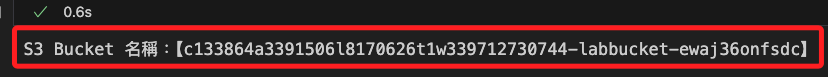
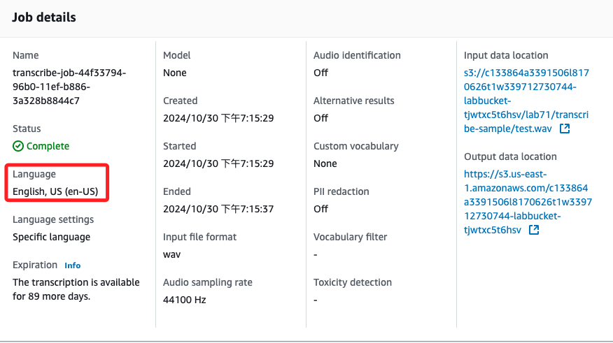

# Lab 7.1: Implementing a Multilingual Solution

_官方範例說明，這個 Lab 將使用三種不同的 AWS 服務來建立將音訊檔案翻譯為不同語言的文字的解決方案。_

<br>

## 步驟概要

1. Amazon Transcribe example，語音轉文本服務；上傳音訊文件至 S3，啟動 Transcribe 轉錄作業，指定音訊格式和語言等參數，轉錄結果可儲存在 S3 中，或在 Transcribe 控制台中檢視並下載 JSON 格式的轉錄文本。

<br>

2. Amazon Translate example，自動翻譯服務；上傳待翻譯的文本文件至 S3，啟動 Translate 翻譯作業，指定源語言和目標語言，可以是一對多選，翻譯結果文件儲存在指定的 S3 路徑中，供進一步使用或下載。

<br>

3. Amazon Polly example，文本轉語音服務；上傳要轉換的文本至 S3，也可直接傳遞文本，然後啟動 Polly 語音合成作業，指定語音引擎、音訊格式和語音 ID，在這個範例中是指定 `Lucia 西班牙語音`，語音合成結果儲存在 S3 中，通常為 MP3 格式的音頻文件，可以下載或直接播放。

<br>

4. Challenge exercise；範例最後提示了延伸了練習的情境。

<br>

## 建立本地授權

_STS，Security Token Service；因為要在本地運行專案，所以要建立本地運行環境，假如在 Sagemaker 中運行，可以省略本地授權的部分。_

<br>

1. 在 `.env` 文件中貼上 Lab 主控台所取得的 `aws_access_key_id`、`aws_secret_access_key`、`aws_session_token`。

    

<br>

2. 接著在 `.env` 文件中貼上以下語句，這樣便可將取得的憑證導入，並添加設置 Region。

    ```json
    AWS_ACCESS_KEY_ID=${aws_access_key_id}
    AWS_SECRET_ACCESS_KEY=${aws_secret_access_key}
    AWS_SESSION_TOKEN=${aws_session_token}
    AWS_DEFAULT_REGION=us-east-1
    ```

<br>

3. 透過取得 Account ID 驗證 AWS 本機設置正確完成。

    ```python
    import boto3
    
    # 載入 .env 檔案中的環境變數
    from dotenv import load_dotenv
    import os
    load_dotenv()

    # 建立 STS 客戶端
    sts_client = boto3.client("sts")

    # 呼叫 get_caller_identity 以取得當前 AWS 帳號資訊
    response = sts_client.get_caller_identity()
    account_id = response["Account"]

    print(f"AWS Account ID: {account_id}")
    ```

    _輸出結果為_

    

<br>

4. 開啟主控台進行比對，確認與 Lab 當前的 Account ID 相同，以上完成驗證。

    

<br>

## 取得資源資訊

_為了提升腳本自動化運行的能力，修正原本官方腳本中硬編碼，以下將自動取回資源名稱並進行篩選，然後自動帶入後續步驟中_

<br>

1. 透過代碼自動取得 Lab 所指派的所有 `Role name` 和 `ARN（資源名稱）`，並根據名稱篩選範例所需的角色；特別說明，這裡的篩選條件是依據 Lab 角色使用的命名規則推論而來，並非統一性的規範。

    ```python
    # 建立 IAM 客戶端
    iam_client = boto3.client("iam")

    # 取得所有角色
    def list_roles():
        try:
            # 透過客戶端取得所有角色
            response = iam_client.list_roles()

            # 儲存所有角色的名稱和 ARN
            roles = {role["RoleName"]: role["Arn"] for role in response["Roles"]}
            return roles
        except Exception as e:
            print(f"無法取得角色列表。錯誤訊息：{e}")
            return None


    # 自訂義篩選角色的函數，函數需傳入關鍵字進行篩選
    def get_role_arn(role_keyword):
        try:
            # 呼叫 list_roles 方法以取得所有角色
            response = iam_client.list_roles()
            # 遍歷所有角色以篩選出包含指定關鍵字的角色 ARN
            for role in response["Roles"]:
                if role_keyword in role["RoleName"]:
                    return role["Arn"]
            print(f"無法找到包含關鍵字 '{role_keyword}' 的角色。")
            return None
        except Exception as e:
            print(f"無法取得角色列表。錯誤訊息：{e}")
            return None


    # 定義要搜尋的角色關鍵字
    database_role_keyword = "ComprehendDataAccessRole"
    translate_role_keyword = "TranslateDemoRole"

    # 取得包含 'ComprehendDataAccessRole' 的角色 ARN
    database_access_role_arn = get_role_arn(
        database_role_keyword
    )
    # 取得包含 'TranslateDemoRole' 的角色 ARN
    translate_access_role_arn = get_role_arn(
        translate_role_keyword
    )

    # 輸出查看
    print(
        f"Database Access Role ARN：【{database_access_role_arn}】"
    )
    print(
        f"Translate Access Role ARN：【{translate_access_role_arn}】"
    )
    ```

    

<br>

2. 篩選出名稱中包含 `labbucket` 的 Bucket，後續代碼將使用這個 Bucket 作為存放資料對象。

    ```python
    # 建立 S3 客戶端
    s3_client = boto3.client("s3")

    # 列出 Buckets
    def list_buckets():
        try:
            # 呼叫 list_buckets 方法以取得所有 bucket
            response = s3_client.list_buckets()

            # 從回應中提取每個 bucket 名稱並篩選包含 'labbucket' 的
            bucket_names = [
                bucket["Name"]
                for bucket in response["Buckets"]
                if "labbucket" in bucket["Name"]
            ]
            return bucket_names
        except Exception as e:
            print(f"無法取得 bucket 列表。錯誤訊息：{e}")
            return None


    # 取得篩選後的 bucket 名稱
    bucket_names = list_buckets()

    # 顯示取得的 bucket 名稱
    if bucket_names:
        print("包含 'labbucket' 的 Bucket 名稱列表：")
        for name in bucket_names:
            print(name)
    else:
        print("沒有找到包含 'labbucket' 的 Bucket。")
    ```

    

<br>

3. 調用以上步驟建立的函數，進一步建立篩選資源的函數 `list_buckets_with_keyword`。

    ```python
    # 生成全域唯一識別碼
    import uuid

    # 處理 JSON 格式的數據
    import json

    # 從 time 模組匯入 sleep 函數，用於讓程式暫停指定的秒數
    from time import sleep

    # 自訂義篩選 Bucket 的函數，需傳入關鍵字進行篩選
    def list_buckets_with_keyword(keyword):
        try:
            # 調用 list_buckets 取得所有 bucket
            response = s3_client.list_buckets()
            bucket_names = [
                # 篩選包含特定關鍵字的名稱
                # 特別注意這是 inline 的表達式，斷行不要縮排
                bucket["Name"]
                for bucket in response["Buckets"]
                if keyword in bucket["Name"]
            ]
            if bucket_names:
                # 假設只取第一個符合條件的 bucket 名稱
                return bucket_names[0]
            else:
                print(f"沒有找到包含 '{keyword}' 的 bucket。")
                return None
        except Exception as e:
            print(f"無法取得 bucket 列表。錯誤訊息：{e}")
            return None


    # 取得包含 'labbucket' 的 S3 bucket 名稱
    bucket = list_buckets_with_keyword("labbucket")

    # 輸出以上步驟取得的 ARN
    print(f"S3 Bucket 名稱：【{bucket}】")
    ```

    

<br>

## Amazon Transcribe example

_完成準備工作後開始官方範例，第一步：透過 SDK 使用服務 `Amazon Transcribe` 將音訊檔案轉換為文字_

<br>

1. 透過前面步驟取得的 Bucket 名稱，建立範例文件 `test.wav` 所在的路徑，該文件是一個音頻檔案，內容是 `Test、Hello、Hello、Hello。This is a test、Test、Test、Test。`

    ```python
    media_input_uri = f"s3://{bucket}/lab71/transcribe-sample/test.wav"
    ```

<br>

2. 檢查 S3 Bucket 是否存在，同時是否具備對於 S3 訪問的權限。

    ```python

    try:
        s3_client.head_bucket(Bucket=bucket)
        print("Bucket exists and is accessible.")
    except Exception as e:
        print(f"Error accessing bucket: {e}")
    ```

    

<br>

3. 在前面步驟的變數 `media_input_uri` 中指向 `test.wav` 檔案，接下來使用這個音檔作為輸入，建立並啟動一個 AWS Transcribe 的轉錄作業。

    ```python
    # 建立一個 AWS Transcribe 的客戶端
    transcribe_client = boto3.client("transcribe")

    # 標識此次轉錄作業的名稱
    job_uuid = uuid.uuid1()
    transcribe_job_name = f"transcribe-job-{job_uuid}"
    # 轉錄輸出的檔案名稱
    transcribe_output_filename = "transcribe_output.txt"

    # 啟動轉錄作業
    response = transcribe_client.start_transcription_job(
        # 轉錄作業的名稱
        TranscriptionJobName=transcribe_job_name,
        # 轉錄的媒體檔案 URI
        Media={"MediaFileUri": media_input_uri},
        MediaFormat="wav",
        # 音訊中的語言代碼
        LanguageCode="en-US",
        # 轉錄結果的輸出 S3 bucket
        OutputBucketName=bucket,
        # 輸出結果檔案的名稱
        OutputKey=transcribe_output_filename,
    )
    ```

<br>

4. 檢查 `AWS Transcribe` 轉錄工作 `transcription job` 的狀態，直到工作完成或失敗為止。

    ```python
    job = None
    while True:
        # 指定轉錄工作狀態，並將結果存放在變數 job 中
        # transcribe_job_name 是轉錄工作的名稱。
        job = transcribe_client.get_transcription_job(
            TranscriptionJobName=transcribe_job_name
        )

        # 檢查轉錄工作狀態
        if job["TranscriptionJob"]["TranscriptionJobStatus"] in ["COMPLETED", "FAILED"]:
            # 如果符合條件，則跳出循環
            break
        print(".", end="")
        sleep(20)

    print(job["TranscriptionJob"]["TranscriptionJobStatus"])
    ```

    

<br>

## 查看

_這裡只是查看，並無作為其他用途_

<br>

1. 使用 `get_transcription_job` 方法呼叫的結果檢索輸出文件，其中 `transcription_file` 包含的 URI 是轉錄結果的連結，允許下載或查看轉錄文本。

    ```python
    transcription_file = job["TranscriptionJob"]["Transcript"]["TranscriptFileUri"]
    print(transcription_file)
    ```

    

<br>

## 下載文件

1. 從 S3 下載文件 `transcribe_output.txt`。

    ```python
    s3_client = boto3.client("s3")
    with open(transcribe_output_filename, "wb") as f:
        s3_client.download_fileobj(bucket, transcribe_output_filename, f)
    ```

<br>

2. 開啟檔案並將內容讀入 JSON 物件。

    ```python
    with open(transcribe_output_filename) as f:
        data = json.load(f)
    ```

<br>

3. 可查看壹下文件內容。

    ```python
    print(data)
    ```

    

<br>

4. 獲得實際的轉錄。

    ```python
    data["results"]["transcripts"][0]["transcript"]
    ```

    

<br>

## Amazon Translate example

_呼叫 `Amazon Translate` 並將文字檔案從英文轉換為西班牙文，運行後可轉到 `Amazon Translate` 控制台查看翻譯。_

<br>

1. 首先，建立翻譯作業需要輸入和輸出位置，`Amazon Translate` 可以將相同的文字翻譯成多種目標語言，以下範例使用西班牙語，其語言代碼為 `es`；在本機第實作約需要 `15` 分鐘

    ```python
    # 生成全域唯一識別碼
    import uuid

    # 建立 AWS Translate 的客戶端，用於呼叫 AWS Translate 服務
    translate_client = boto3.client(service_name="translate")

    # 定義輸入數據的 S3 路徑
    input_data = f"s3://{bucket}/lab71/translate-sample"

    # 定義轉譯後輸出結果的 S3 路徑
    output_data = f"s3://{bucket}"

    # 生成一個 UUID，作為此次翻譯作業的唯一識別碼
    job_uuid = uuid.uuid1()

    # 將 UUID 加入到 "translate-job-" 的前綴中
    translate_job_name = f"translate-job-{job_uuid}"

    # 啟動文本翻譯作業
    translate_job_submission = translate_client.start_text_translation_job(
        # 設定翻譯作業的名稱
        JobName=translate_job_name,
        # 配置輸入數據的參數，包含 S3 路徑和數據類型
        InputDataConfig={"S3Uri": input_data, "ContentType": "text/plain"},
        # 配置輸出數據的參數，指定輸出結果的 S3 路徑
        OutputDataConfig={"S3Uri": output_data},
        # 設定存取 AWS Translate 服務所需的 IAM 角色 ARN，以授權訪問 S3 資源
        DataAccessRoleArn=translate_access_role_arn,
        # 指定源語言的語言代碼，這裡為英文（en）
        SourceLanguageCode="en",
        # 指定目標語言的語言代碼，這裡為西班牙語（es）
        TargetLanguageCodes=["es"],
    )

    # 從作業提交的回應中提取 Job ID
    # 將 ID 儲存到 translate_job_id 變數中
    translate_job_id = translate_job_submission["JobId"]

    # 使用 ID 來取得狀態，等待作業完成
    while True:
        translate_job = translate_client.describe_text_translation_job(
            JobId=translate_job_id
        )
        if translate_job["TextTranslationJobProperties"]["JobStatus"] in [
            "COMPLETED",
            "FAILED",
        ]:
            break
        sleep(20)
        print(".", end="")

    print(translate_job["TextTranslationJobProperties"]["JobStatus"])
    ```

    

<br>

2. 轉錄需要幾分鐘才能完成，完成後可前往 `Amazon Transcribe` 控制台查看轉錄內容。

    

<br>

3. 輸出資料夾的格式是根據帳號和作業 ID 建立的，使用此資訊建立一條路徑。

    ```python
    # 獲取當前 AWS 帳戶的 ID
    account_id = boto3.client("sts").get_caller_identity().get("Account")

    # 定義翻譯輸出結果的 S3 路徑
    # 使用帳戶 ID、固定的 "TranslateText" 標識、翻譯作業的 ID，組成路徑名稱
    translate_output_path = f"{account_id}-TranslateText-{translate_job_id}/"
    ```

<br>

4. Amazon Translate 輸出多個檔案，下載 .txt 檔案。

    ```python
    # 建立 S3 資源對象
    s3_resource = boto3.resource("s3")

    # 使用指定名稱建立 bucket
    my_bucket = s3_resource.Bucket(bucket)

    # 過濾 bucket 中以 translate_output_path 作為前綴的物件
    for my_bucket_object in my_bucket.objects.filter(
        Prefix=translate_output_path
    ):
        # 提取每個物件的 key，文件名稱及路徑
        file = my_bucket_object.key

        # 檢查文件是否以 "txt" 結尾，即確認文件格式為文本文件
        if file.endswith("txt"):
            # 去除路徑前綴 translate_output_path，使 file 僅包含文件名稱
            file = file.lstrip(translate_output_path)
            # 去除開頭的 "/" 符號，以獲得乾淨的文件名稱
            file = file.lstrip("/")
            
            # 輸出文件名稱，便於查看下載的文件
            print(file)
            
            # 打開本地文件，準備以二進制寫入方式將文件下載到本地
            with open(file, "wb") as f:
                # 使用 s3_client 將 S3 中的物件下載到本地文件
                s3_client.download_fileobj(bucket, my_bucket_object.key, f)

    ```

<br>

## Amazon Polly example

1. 使用 Polly 建立西班牙文文字檔案的發聲，運行後打開 S3 儲存桶以查看輸出；輸出是一個 `.mp3` 文件，開啟檔案會聽到 Lucia 的聲音說 `Prueba de prueba, este es una prueba`。


    ```python
    # 呼叫 Polly 語音合成服務
    polly_client = boto3.client("polly")

    # 指定要讀取的文件路徑
    itemname = "lab71/polly-sample/es.test.txt"

    # 取得 bucket 中的特定文件對象
    obj = s3_resource.Object(bucket, itemname)

    # 取得文件內容，並將二進制數據解碼為 `UTF-8` 編碼的字串
    body = obj.get()["Body"].read().decode("utf-8")

    # 啟動語音合成作業
    response = polly_client.start_speech_synthesis_task(
        # 指定使用標準語音合成引擎
        Engine="standard",
        # 指定輸出音訊格式
        OutputFormat="mp3",
        # 將輸出結果儲存到的 S3 bucket
        OutputS3BucketName=bucket,
        # 傳入要合成語音的文本內容
        Text=body,
        # 指定語音 ID，這裡使用西班牙語的 Lucia 聲音
        VoiceId="Lucia"
    )
    ```

<br>

2. 從回應中提取任務 ID。

    ```python
    task_id = response["SynthesisTask"]["TaskId"]
    print(task_id)
    ```

    

<br>

3. 使用任務 ID 檢查作業是否已完成。

    ```python
    while True:
        # 查詢語音合成作業的狀態
        polly_job = polly_client.get_speech_synthesis_task(TaskId=task_id)
        
        # 檢查作業的狀態是否為 `completed` 或 `failed``
        if polly_job["SynthesisTask"]["TaskStatus"] in ["completed", "failed"]:
            break
        
        # 若作業仍在進行中，暫停 20 秒以避免頻繁查詢狀態
        sleep(20)
        # 每20秒檢查一次，假如仍在進行，就會看到輸出一個點 `.`
        print(".", end="")

    # 循環結束後會輸出最終的作業狀態 `completed` 或 `failed``
    print(polly_job["SynthesisTask"]["TaskStatus"])
    ```

    

<br>

4. 下載結果。

    ```python
    # 建立 S3 客戶端
    s3_client = boto3.client("s3")

    # 定義要下載的文件名稱
    polly_output_filename = f"{task_id}.mp3"

    # 以二進制寫入模式 ("wb") 打開輸出文件
    with open(polly_output_filename, "wb") as f:
        # 將 S3 中指定的 的文件下載至本地
        s3_client.download_fileobj(bucket, polly_output_filename, f)
    ```

<br>

##  Challenge exercise

1. 從具有英語音訊通道的影片建立翻譯後的音訊檔案。

<br>

2. 可以使用前三個範例中的程式碼作為解決方案的範本。

<br>

3. 挑戰影片位於 S3 儲存桶的 `lab71/challenge` 資料夾中，影片檔名為 `sample.mp4`，此文件也可在此筆記本實例的「/s3」資料夾中找到。

<br>

___

_END_
