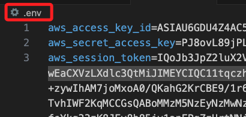
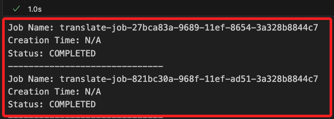
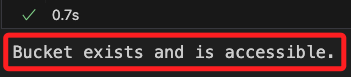
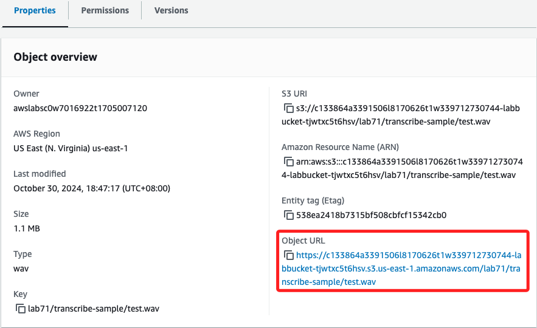
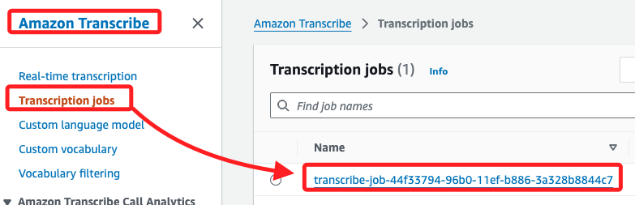
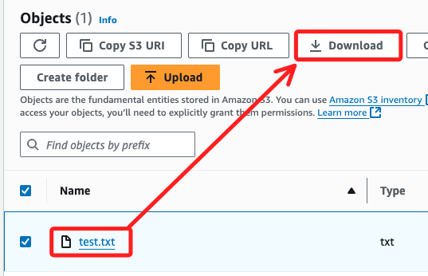
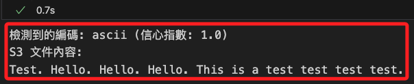
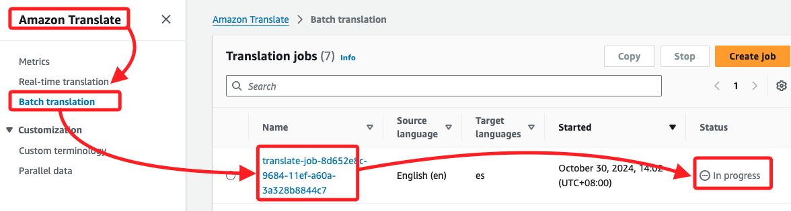
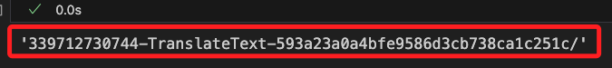
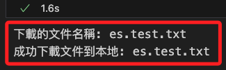

# 實作多語言解決方案

_官方範例說明，這個 Lab 將使用三種不同的 AWS 服務，分別處理 `音檔轉文本`、`文本轉音檔` 以及 `不同語言間的翻譯`。_

<br>

## 範例與使用的服務簡介

1. Amazon Transcribe example，語音轉文本服務；上傳音訊文件至 S3，啟動 Transcribe 轉錄工作，也就是將音檔轉換為文本；運作時需指定音訊格式和語言等參數，轉錄結果可儲存在 S3 中，或在 Transcribe 控制台中檢視並下載 JSON 格式的轉錄文本。

<br>

2. Amazon Translate example，自動翻譯服務；上傳待翻譯的文本文件至 S3，啟動 Translate 翻譯工作，指定 `來源語言` 和 `目標語言`，可以是一對多的翻譯，翻譯結果文件儲存在指定的 S3 路徑中，供進一步使用或下載。

<br>

3. Amazon Polly example，文本轉語音服務；上傳要轉換的文本至 S3，也可直接傳遞文本，然後啟動 Polly 語音合成作業，指定語音引擎、音訊格式和語音 ID，語音合成結果儲存在 S3 中，通常為 MP3 格式的音頻文件，可進行下載或直接播放。

<br>

## 建立本地授權

_使用 Lab 提供的 STS 服務，Security Token Service；因為要在本地運行專案，所以要建立本地運行環境，假如在 Sagemaker 中運行，可以省略本地授權的部分。_

<br>

1. 建立任意的專案資料夾並進入，在其中新增三個文檔；接著啟動 VSCode。

    ```bash
    cd ~/Desktop && mkdir _test_ && cd _test_
    touch .env .gitignore test.ipynb
    code .
    ```

<br>

2. 在 `.gitignore` 中貼上以下內容。

    ```bash
    .env
    ```

<br>

3. 在 `.env` 文件中貼上 Lab 主控台所取得的 `aws_access_key_id`、`aws_secret_access_key`、`aws_session_token`。

    

<br>

4. 接著在 `.env` 文件中貼上以下語句，這樣便可將取得的憑證導入，並添加設置 Region。

    ```json
    AWS_ACCESS_KEY_ID=${aws_access_key_id}
    AWS_SECRET_ACCESS_KEY=${aws_secret_access_key}
    AWS_SESSION_TOKEN=${aws_session_token}
    AWS_DEFAULT_REGION=us-east-1
    ```

<br>

5. 在 `test.ipynb` 中貼上並運行以下代碼，這會透過取得 Account ID 驗證 AWS 本機設置正確完成。

    ```python
    import boto3
    
    # 載入 .env 檔案中的環境變數
    from dotenv import load_dotenv
    import os
    load_dotenv()

    # 建立 STS 客戶端
    sts_client = boto3.client("sts")

    # 呼叫 get_caller_identity 以取得當前 AWS 帳號資訊
    response = sts_client.get_caller_identity()
    account_id = response["Account"]

    print(f"AWS Account ID: {account_id}")
    ```

    _輸出結果為_

    

<br>

6. 開啟主控台進行比對，確認與 Lab 當前的 Account ID 相同，以上完成驗證。

    

<br>

##  查詢現有資源

_以下將本範例會應用到的資源先做簡單查詢_

<br>

1. 遍歷所有 S3 bucket 中的資源並顯示樹狀結構；預設準備了一個資料夾 `Lab71`。

    ```python
    import boto3

    # 建立 S3 資源對象
    s3 = boto3.resource('s3')

    def list_s3_bucket_structure(bucket_name):
        bucket = s3.Bucket(bucket_name)
        print(f"Bucket: {bucket_name}")
        
        has_objects = False
        for obj in bucket.objects.all():
            print(" └── ", obj.key)
            has_objects = True

        if not has_objects:
            print(" └── <此 bucket 為空>")

    # 取得所有 bucket 名稱並顯示每個 bucket 的樹狀結構
    s3_client = boto3.client("s3")
    buckets = s3_client.list_buckets()["Buckets"]

    if buckets:
        for bucket in buckets:
            list_s3_bucket_structure(bucket["Name"])
    else:
        print("當前為空的：沒有任何 S3 bucket")
    ```

    

<br>

2. 列出所有現有的 Transcription Jobs 並顯示其狀態。

    ```python
    import boto3

    # 建立 Transcribe 客戶端
    transcribe_client = boto3.client("transcribe")

    def list_transcription_jobs():
        response = transcribe_client.list_transcription_jobs()
        jobs = response.get("TranscriptionJobSummaries", [])

        if not jobs:
            print("No transcription jobs found.")
        else:
            for job in jobs:
                print(f"Job Name: {job['TranscriptionJobName']}")
                print(f"Creation Time: {job['CreationTime']}")
                print(f"Status: {job['TranscriptionJobStatus']}")
                print("-" * 30)

    list_transcription_jobs()
    ```

    

<br>

3. 列出所有 Translation Jobs 並顯示其時間和狀態。

    ```python
    import boto3

    # 建立 Translate 客戶端
    translate_client = boto3.client("translate")

    def list_translation_jobs():
        try:
            response = translate_client.list_text_translation_jobs()
            jobs = response.get("TextTranslationJobPropertiesList", [])

            if not jobs:
                print("No translation jobs found.")
            else:
                for job in jobs:
                    job_name = job.get("JobName", "N/A")
                    creation_time = job.get("CreationTime", "N/A")
                    status = job.get("JobStatus", "N/A")

                    print(f"Job Name: {job_name}")
                    print(f"Creation Time: {creation_time}")
                    print(f"Status: {status}")
                    print("-" * 30)

        except Exception as e:
            print(f"An error occurred: {e}")

    list_translation_jobs()
    ```

    

<br>

4. 列出已發起的語音合成任務。

    ```python
    import boto3

    # 建立 Polly 客戶端
    polly_client = boto3.client("polly")

    def list_polly_tasks():
        try:
            response = polly_client.list_speech_synthesis_tasks()
            tasks = response.get("SynthesisTasks", [])

            if not tasks:
                print("No speech synthesis tasks found.")
            else:
                for task in tasks:
                    task_id = task.get("TaskId", "N/A")
                    creation_time = task.get("CreationTime", "N/A")
                    status = task.get("TaskStatus", "N/A")
                    output_uri = task.get("OutputUri", "N/A")
                    voice_id = task.get("VoiceId", "N/A")

                    print(f"Task ID: {task_id}")
                    print(f"Creation Time: {creation_time}")
                    print(f"Status: {status}")
                    print(f"Output URI: {output_uri}")
                    print(f"Voice ID: {voice_id}")
                    print("-" * 30)

        except Exception as e:
            print(f"An error occurred: {e}")

    list_polly_tasks()
    ```

    

<br>

## 補充說明 Polly

1. 查詢 Amazon Polly 支援的所有語音及其相關資訊，使用 describe_voices 方法。

    ```python
    def list_available_voices():
        try:
            response = polly_client.describe_voices()
            voices = response.get("Voices", [])

            for voice in voices:
                name = voice.get("Name", "N/A")
                language = voice.get("LanguageName", "N/A")
                gender = voice.get("Gender", "N/A")
                engine = voice.get("SupportedEngines", [])

                print(f"Voice Name: {name}")
                print(f"Language: {language}")
                print(f"Gender: {gender}")
                print(f"Supported Engines: {', '.join(engine)}")
                print("-" * 30)

        except Exception as e:
            print(f"An error occurred: {e}")

    list_available_voices()
    ```

<br>

2. 可得到以下訊息；其中 `Voice Name` 代表這個語音的名稱，`Language` 指示這個語音所使用的語言及其地區方言，`Gender` 表示語音的性別，`Supported Engines` 表示該語音支持的語音合成引擎。

    

<br>

## 取得資源資訊

_為了提升腳本自動化運行的能力，修正原本官方腳本中硬編碼，以下將自動取回資源名稱並進行篩選，然後自動帶入後續步驟中_

<br>

1. 透過代碼自動取得 Lab 所指派的所有 `Role name` 和 `ARN（資源名稱）`，並根據名稱篩選範例所需的角色；特別說明，這裡的篩選條件是依據 Lab 角色使用的命名規則推論而來，並非統一性的規範。

    ```python
    # 建立 IAM 客戶端
    iam_client = boto3.client("iam")

    # 取得所有角色
    def list_roles():
        try:
            # 透過客戶端取得所有角色
            response = iam_client.list_roles()

            # 儲存所有角色的名稱和 ARN
            roles = {role["RoleName"]: role["Arn"] for role in response["Roles"]}
            return roles
        except Exception as e:
            print(f"無法取得角色列表。錯誤訊息：{e}")
            return None


    # 自訂義篩選角色的函數，函數需傳入關鍵字進行篩選
    def get_role_arn(role_keyword):
        try:
            # 呼叫 list_roles 方法以取得所有角色
            response = iam_client.list_roles()
            # 遍歷所有角色以篩選出包含指定關鍵字的角色 ARN
            for role in response["Roles"]:
                if role_keyword in role["RoleName"]:
                    return role["Arn"]
            print(f"無法找到包含關鍵字 '{role_keyword}' 的角色。")
            return None
        except Exception as e:
            print(f"無法取得角色列表。錯誤訊息：{e}")
            return None


    # 定義要搜尋的角色關鍵字
    database_role_keyword = "ComprehendDataAccessRole"
    translate_role_keyword = "TranslateDemoRole"

    # 取得包含 'ComprehendDataAccessRole' 的角色 ARN
    database_access_role_arn = get_role_arn(
        database_role_keyword
    )
    # 取得包含 'TranslateDemoRole' 的角色 ARN
    translate_access_role_arn = get_role_arn(
        translate_role_keyword
    )

    # 輸出查看
    print(
        f"Database Access Role ARN：【{database_access_role_arn}】"
    )
    print(
        f"Translate Access Role ARN：【{translate_access_role_arn}】"
    )
    ```

    

<br>

2. 篩選出名稱中包含 `labbucket` 的 Bucket，後續代碼將使用這個 Bucket 作為存放資料對象。

    ```python
    # 建立 S3 客戶端
    s3_client = boto3.client("s3")

    # 列出 Buckets
    def list_buckets():
        try:
            # 呼叫 list_buckets 方法以取得所有 bucket
            response = s3_client.list_buckets()

            # 從回應中提取每個 bucket 名稱並篩選包含 'labbucket' 的
            bucket_names = [
                bucket["Name"]
                for bucket in response["Buckets"]
                if "labbucket" in bucket["Name"]
            ]
            return bucket_names
        except Exception as e:
            print(f"無法取得 bucket 列表。錯誤訊息：{e}")
            return None


    # 取得篩選後的 bucket 名稱
    bucket_names = list_buckets()

    # 顯示取得的 bucket 名稱
    if bucket_names:
        print("包含 'labbucket' 的 Bucket 名稱列表：")
        for name in bucket_names:
            print(name)
    else:
        print("沒有找到包含 'labbucket' 的 Bucket。")
    ```

    

<br>

3. 調用以上步驟建立的函數，進一步建立篩選資源的函數 `list_buckets_with_keyword`。

    ```python
    # 生成全域唯一識別碼
    import uuid

    # 處理 JSON 格式的數據
    import json

    # 從 time 模組匯入 sleep 函數，用於讓程式暫停指定的秒數
    from time import sleep

    # 自訂義篩選 Bucket 的函數，需傳入關鍵字進行篩選
    def list_buckets_with_keyword(keyword):
        try:
            # 調用 list_buckets 取得所有 bucket
            response = s3_client.list_buckets()
            bucket_names = [
                # 篩選包含特定關鍵字的名稱
                # 特別注意這是 inline 的表達式，斷行不要縮排
                bucket["Name"]
                for bucket in response["Buckets"]
                if keyword in bucket["Name"]
            ]
            if bucket_names:
                # 假設只取第一個符合條件的 bucket 名稱
                return bucket_names[0]
            else:
                print(f"沒有找到包含 '{keyword}' 的 bucket。")
                return None
        except Exception as e:
            print(f"無法取得 bucket 列表。錯誤訊息：{e}")
            return None


    # 取得包含 'labbucket' 的 S3 bucket 名稱
    bucket = list_buckets_with_keyword("labbucket")

    # 輸出以上步驟取得的 ARN
    print(f"S3 Bucket 名稱：【{bucket}】")
    ```

    

<br>

## Amazon Transcribe example

_完成準備工作後開始官方範例，第一步：透過 SDK 使用服務 `Amazon Transcribe` 將音訊檔案轉換為文字_

<br>

1. 透過 S3 客戶端對指定的 Bucket 執行 `head_bucket` 請求，以確認該 Bucket 是否存在並且當前帳號有權限訪問；這個操作不會下載或顯示任何 Bucket 的內容。

    ```python
    try:
        # 建立該 Bucket 的客戶端
        s3_client.head_bucket(Bucket=bucket)
        # 成功的話就會輸出這個訊息
        print("Bucket exists and is accessible.")
    except Exception as e:
        print(f"Error accessing bucket: {e}")
    ```

    

<br>

2. 使用前面步驟取得的 Bucket 名稱，組建範例文件 `test.wav` 所在的路徑，該文件是一個音頻檔案，內容是 `Test、Hello、Hello、Hello。This is a test、Test、Test、Test。`；特別說明，這是 Lab 所準備的音檔，這裡僅是透過自動化步驟取得其路徑。

    ```python
    media_input_uri = f"s3://{bucket}/lab71/transcribe-sample/test.wav"
    print(media_input_uri)
    ```

    _輸出 `s3://` 開頭的 URL_

    

<br>

3. 可以在 S3 主控台中點擊文件進入查看詳細內容，這段音頻是一個男性聲音，以英文讀取一段文字 `Test Hello. Hello ...`。

    

<br>

4. 右下角會顯示該文件的 Object URL，與前一段代碼查詢結果不同，這是以 `https://` 協定表示；兩者的差異是 `s3://` 前綴的 URI 是 AWS 內部的對象路徑標識，用於在 SDK 中直接訪問 S3 對象，也就是程式碼中對 S3 對象進行操作時使用，與物件的公共 IP 不同。

    

<br>

5. 將 S3 上的文件下載到本地；可在資料夾中點擊播放，這是英文的音頻。

    ```python
    # 定義下載到本地的文件名稱
    local_filename = "test.wav"

    # 解析 S3 路徑以獲取文件的 key
    s3_file_key = media_input_uri.replace(f"s3://{bucket}/", "")

    # 下載文件到本地
    try:
        with open(local_filename, "wb") as f:
            s3_client.download_fileobj(bucket, s3_file_key, f)
        print(f"文件已成功下載到本地：{local_filename}")
    except Exception as e:
        print("下載過程中發生錯誤:", e)
    ```

    

<br>

## 轉換音檔到文字

_使用 `start_transcription_job` 啟動新的轉錄工作 `Transcribe job`，將指定的音訊文件 `test.wav` 傳送至 Amazon Transcribe 進行轉錄。_

<br>

1. 使用前一個步驟生成的路徑 `media_input_uri`，也就是以 `test.wav` 檔案，並用來作為輸入；特別說明，這裡使用的是 `uuid1()` 來生成唯一識別碼，這基於當前的時間戳和主機的 MAC 地址來生成，另外還有 `uuid3()` 基於命名空間和名稱生成、`uuid4()` 是基於隨機數生成、`uuid5()` 使用 `SHA-1 哈希算法` 來生成 `UUID`。

    ```python
    # 建立 AWS Transcribe 的客戶端
    transcribe_client = boto3.client("transcribe")

    # 生成 UUID 作為此轉錄工作的名稱
    job_uuid = uuid.uuid1()
    # 組合轉錄工作名稱
    transcribe_job_name = f"transcribe-job-{job_uuid}"
    # 自訂義轉錄輸出的檔案名稱
    transcribe_output_filename = "transcribe_output.txt"

    # 啟動轉錄工作
    response = transcribe_client.start_transcription_job(
        # 轉錄工作的名稱
        TranscriptionJobName=transcribe_job_name,
        # 轉錄的媒體檔案 URI
        Media={"MediaFileUri": media_input_uri},
        MediaFormat="wav",
        # 音訊中的語言代碼
        LanguageCode="en-US",
        # 轉錄結果的輸出 S3 bucket
        OutputBucketName=bucket,
        # 輸出結果檔案的名稱
        OutputKey=transcribe_output_filename,
    )
    # 輸出查看
    print(response)
    ```

    

<br>

2. 這個 `response` 是一個 JSON 文件，可排版查看內容，其中 `TranscriptionJobStatus` 在進行中會顯示 `IN_PROGRESS`，完成時會顯示 `COMPLETED` 或 `FAILED`。

    

<br>

3. 檢查回傳值中 `transcription job` 的狀態，直到顯示 `COMPLETED` 或 `FAILED` 為止。

    ```python
    job = None
    while True:
        # 指定轉錄工作狀態，並將結果存放在變數 job 中
        # transcribe_job_name 是轉錄工作的名稱。
        job = transcribe_client.get_transcription_job(
            TranscriptionJobName=transcribe_job_name
        )

        # 檢查轉錄工作狀態
        if job["TranscriptionJob"]["TranscriptionJobStatus"] in ["COMPLETED", "FAILED"]:
            # 如果符合條件，則跳出循環
            break
        print(".", end="")
        sleep(20)

    print(job["TranscriptionJob"]["TranscriptionJobStatus"])
    ```

    

<br>

4. 建立並運行一個 Job 之後，可在 `Amazon Transcribe` 服務中的 `Transcription jobs` 頁籤查看，jobs 清單。

    

<br>

## 查看轉換後的文本

_工作啟動之後，可使用 `get_transcription_job` 定期查詢轉錄工作的狀態和結果，其狀態可以是進行中 `IN_PROGRESS`、完成 `COMPLETED` 或失敗 `FAILED` 三種。_

<br>

1. 查看回傳值 `job` 的完整內容。

    ```python
    job
    ```

    

<br>

2. 透過鍵 `TranscriptionJob`、`Transcript`、`TranscriptFileUri` 可取得輸出的路徑。

    ```python
    transcription_file = job["TranscriptionJob"]["Transcript"]["TranscriptFileUri"]
    print(transcription_file)
    ```

    

<br>

3. 可從 S3 主控台中依循路徑查看文件。

    

<br>

## 下載文件

1. 從 S3 下載轉錄後的文本文件 `transcribe_output.txt`；以下代碼運行後無回傳值，但會看到本地多了一個文件。

    ```python
    with open(transcribe_output_filename, "wb") as f:
        s3_client.download_fileobj(
            bucket,
            transcribe_output_filename,
            f
        )
    ```

    

<br>

2. 因為下載的 `.txt` 是一個 JSON 文件，所以可將其內容讀入 Python 的 JSON 物件中。

    ```python
    with open(transcribe_output_filename) as f:
        data = json.load(f)
    ```

<br>

3. 查看 JSON 文件內容，其中包含轉錄完成的文本 `Test Hello. Hello ...`。

    ```python
    print(data)
    ```

    

<br>

4. 從 JSON 中確認資料所在節點，並透過鍵名來取得實際轉錄的文本內容；至此取得語音轉文字的最終結果。

    ```python
    data["results"]["transcripts"][0]["transcript"]
    ```

    

<br>

5. 在 `Transcribe jobs` 中點擊進入查看。

    

<br>

6. 這裡顯示的 `en-US` 並非辨識而來，是設定在 `start_transcription_job` 函數中的 `LanguageCode` 參數。

    

<br>

7. 在此特別注意，會發現 Lab 做到這裡並未將結果進行解析，而是直接儲存為 `transcribe_output.txt`，雖然進行了下載，但並沒有進一步作業。

<br>

## 進入下個步驟前

_由於翻譯後的文件並未解析，所以這裡先對於相關文檔進行查看，藉此了解接下來的步驟中，`Lab` 使用什麼數據作為輸入。_

<br>

1. 接下來的任務要將英文文本轉換為西班牙文文本，而後續的腳本指明的來源檔案在 Bucket 的 `/lab71/translate-sample'` 路徑中，並非使用前一個步驟生成、位於 `lab71` 同層的文件 `transcribe_output.txt`。

    

<br>

2. 所以查看一下這個作為輸入、應該是英文文本內容的文件 `test.txt`，選取後點擊 `Download`。

    

<br>

3. 結果令人訝異，這是一個 `西班牙文` 的文本，也就是說，依照官方範例的指引，接下來要做的會是 **_將一段西班牙文文本翻譯為西班牙文_**。

    

<br>

## 修正範例的錯誤

_讓第二階段任務是使用第一階段任務的產出作為輸入_

<br>

1. 先將第一個階段的結果寫入本地文檔 `test.txt`。

    ```python
    # 前一步獲得的英文文本
    translated_text = data["results"]["transcripts"][0]["transcript"]

    # 定義本地文件名稱
    local_file = 'test.txt'

    # 將文本寫入本地文件
    with open(local_file, 'w') as f:
        f.write(translated_text)
    ```

<br>

2. 將 `test.txt` 上傳並覆蓋 S3 資源中的 `test.txt`。

    ```python
    # 這是個多餘的變數，但比較符合我個人的命名風格
    # 在範例外添加的代碼，可能會使用這個命名
    bucket_name = bucket
    # 將文件上傳至此 S3 路徑
    s3_file_key = "lab71/translate-sample/test.txt"

    # 嘗試上傳並覆蓋現有文件
    try:
        s3_client.upload_file(local_file, bucket_name, s3_file_key)
        print(f"成功將文件 {local_file} 上傳並覆蓋到 S3 路徑 {s3_file_key} 中")
    except s3_client.exceptions.ClientError as e:
        error_code = e.response['Error']['Code']
        if error_code == 'AccessDenied':
            print("上傳文件失敗，無法覆蓋 S3 中的文件，權限不足")
        else:
            print("上傳過程中發生其他錯誤:", e)
    except Exception as ex:
        print("上傳過程中發生其他錯誤:", ex)
    ```

    

<br>

3. 安裝 `chardet` 套件，在以下代碼中將用於檢測文件或字串的編碼。

    ```bash
    pip install chardet
    ```

<br>

4. 運行以下腳本在本地查看 S3 文本中的內容。

    ```python
    import chardet

    try:
        # 使用 get_object 取得 S3 文件內容
        response = s3_client.get_object(
            Bucket=bucket_name, Key=s3_file_key
        )
        # 讀取文件內容的二進制數據
        file_data = response['Body'].read()

        # 檢測文件編碼
        result = chardet.detect(file_data)
        detected_encoding = result['encoding']
        confidence = result['confidence']
        print(f"檢測到的編碼: {detected_encoding} (信心指數: {confidence})")

        # 使用檢測到的編碼進行解碼
        file_content = file_data.decode(detected_encoding)

        print("S3 文件內容:")
        print(file_content)

    except s3_client.exceptions.NoSuchKey:
        print(f"文件 '{s3_file_key}' 不存在於 bucket '{bucket_name}' 中。")
    except s3_client.exceptions.ClientError as e:
        error_code = e.response['Error']['Code']
        if error_code == 'AccessDenied':
            print("讀取文件失敗，權限不足")
        else:
            print("讀取過程中發生其他錯誤:", e)
    except Exception as ex:
        print("讀取過程中發生其他錯誤:", ex)
    ```

    

<br>

## Amazon Translate example

_經過以上修正，接下來是第二部分進行翻譯；使用 `Amazon Translate` 服務將文字檔案從 `英文` 轉換為 `西班牙文`；這部分相當耗時，在本地運行約需要 `15` 分鐘、在 Sagemaker 中運行大約 `7` 分鐘。_

<br>

1. 首先，翻譯工作需要指定 `來源` 與 `輸出` 的位置，該服務可對 `來源文本` 翻譯成多種目標語言；以下代碼在本機實測約需耗時 `15` 分鐘

    ```python
    # 建立 AWS Translate 的客戶端
    translate_client = boto3.client(service_name="translate")

    # 定義輸入數據的路徑
    input_data = f"s3://{bucket}/lab71/translate-sample"

    # 定義輸出結果的路徑
    output_data = f"s3://{bucket}"

    # 生成 UUID 作為翻譯工作的唯一識別碼
    job_uuid = uuid.uuid1()

    # 將 UUID 加入到 "translate-job-" 的後綴
    translate_job_name = f"translate-job-{job_uuid}"

    # 啟動文本翻譯工作
    translate_job_submission = translate_client.start_text_translation_job(
        # 命名翻譯工作
        JobName=translate_job_name,
        # 配置輸入數據的參數，包含路徑和數據類型
        InputDataConfig={
            "S3Uri": input_data,
            "ContentType": "text/plain"
        },
        # 配置輸出數據的參數，指定輸出結果的路徑
        OutputDataConfig={"S3Uri": output_data},
        # 設定存取 AWS Translate 服務所需的 IAM 角色 ARN
        DataAccessRoleArn=translate_access_role_arn,
        # 指定源語言的語言代碼為英文（en）
        SourceLanguageCode="en",
        # 指定目標語言代碼為西班牙語（es），可以多選
        TargetLanguageCodes=["es"],
    )

    # 從 job 回傳值中提取 `Job ID` 並儲存到 `translate_job_id`
    translate_job_id = translate_job_submission["JobId"]

    # 使用 ID 來取得狀態，等待 job 完成
    while True:
        translate_job = translate_client.describe_text_translation_job(
            JobId=translate_job_id
        )
        # 唯有當狀態為 COMPLETED 或 FAILED 時才會結束回圈
        if translate_job["TextTranslationJobProperties"]["JobStatus"] in [
            "COMPLETED",
            "FAILED",
        ]:
            break
        # 每次停頓 20 秒，然後輸出一個點 `.` 來表示進行中
        sleep(20)
        print(".", end="")

    print(translate_job["TextTranslationJobProperties"]["JobStatus"])
    ```

    

<br>

2. 在等待的過程中可以進入 `Amazon Translate` 主控台查看，切換到頁籤 `Batch translation`，當前 job 還在運行時，狀態會顯示 `In peogress`。

    

<br>

3. 完成時會顯示 `Completed`，點擊可查看細節，此一任務的來源是 `英文`、目標是 `西班牙文`，不過這個語言並非偵測而來，都是使用者透過代碼指定的。

    

<br>

## 查看輸出

1. 輸出資料夾的格式是根據 `帳號` 和 `job ID` 建立的，所以先使用 `帳號與 ID` 取得路徑。

    ```python
    # 獲取當前 AWS 帳戶的 ID
    account_id = boto3.client("sts").get_caller_identity().get("Account")

    # 定義翻譯輸出結果的 S3 路徑
    # 使用帳戶 ID、固定的 "TranslateText" 標識、翻譯工作的 ID，組成路徑名稱
    translate_output_path = \
        f"{account_id}-TranslateText-{translate_job_id}/"
    ```

<br>

2. 輸出路徑查看，並可藉此進入主控台進行對照。

    ```python
    translate_output_path
    ```

    

<br>

3. 在 S3 主控台中找到這個路徑，並點擊進入查看。

    

<br>

4. 首先，執行翻譯工作時會自動生成一個 `details` 資料夾，點擊進入可看到一個文件 `es.auxiliary-translation-details.json`，其中包含與翻譯工作相關的詳細資料。

    

<br>

5. 可在本地透過腳本進行查看，內容有翻譯工作的狀態、錯誤報告、作業的輸入和輸出文件摘要等。

    ```python
    details_folder = "details"
    details_filename = "es.auxiliary-translation-details.json"
    details_file_key = \
        f"{translate_output_path}{details_folder}"\
        f"/{details_filename}"

    # 嘗試讀取 S3 中的 JSON 文件
    try:
        response = s3_client.get_object(
            Bucket=bucket_name, 
            Key=details_file_key
        )
        file_content = response['Body'].read().decode('utf-8')

        # 將 JSON 字符串解析為 Python 字典
        details_data = json.loads(file_content)
        print("文件內容:")
        print(
            json.dumps(
                details_data,
                indent=4,
                ensure_ascii=False
            )
        )

    except s3_client.exceptions.NoSuchKey:
        print(
            f"文件 '{details_file_key}' "
            f"不存在於 bucket '{bucket_name}' 中。"
        )
    except s3_client.exceptions.ClientError as e:
        error_code = e.response['Error']['Code']
        if error_code == 'AccessDenied':
            print("讀取文件失敗，權限不足")
        else:
            print("讀取過程中發生其他錯誤:", e)
    except Exception as ex:
        print("讀取過程中發生其他錯誤:", ex)
    ```

    

<br>

6. 另外，資料夾中還一個文檔 `es.test.txt`，這就是翻譯為西班牙文的 `目標文件`。

    

<br>

7. 可以透過腳本進行查看 Amazon Translate 翻譯的結果，也就是 `es.test.txt` 的內容。

    ```python
    # 建立 S3 資源對象
    s3_resource = boto3.resource("s3")

    # 過濾 bucket 中以指定前綴開頭的文件
    for my_bucket_object in s3_resource.Bucket(bucket).objects.filter(Prefix=translate_output_path):
        # 提取每個物件的 key
        file_key = my_bucket_object.key

        # 檢查文件是否為 `es.test.txt`
        if file_key.endswith("es.test.txt"):
            # 從 S3 中讀取文件並顯示內容
            obj = s3_resource.Object(bucket, file_key)
            file_content = obj.get()["Body"].read().decode("utf-8")
            print(f"文件內容 ({file_key}):\n", file_content)
    ```

    

<br>

8. 或是將 `es.test.txt` 進行下載。

    ```python
    # 使用指定名稱建立 bucket
    my_bucket = s3_resource.Bucket(bucket)

    # 過濾 bucket 中以 translate_output_path 作為前綴的物件
    for my_bucket_object in my_bucket.objects.filter(Prefix=translate_output_path):
        # 提取每個物件的 key，文件名稱及路徑
        file_key = my_bucket_object.key

        # 檢查文件是否以 "txt" 結尾，即確認文件格式為文本文件
        if file_key.endswith("txt"):
            # 從完整的 S3 key 中獲取文件名稱
            # 只保留文件名稱部分
            file_name = file_key.split("/")[-1]

            # 輸出文件名稱，便於查看下載的文件
            print("下載的文件名稱:", file_name)
            
            # 打開本地文件，準備以二進制寫入方式將文件下載到本地
            with open(file_name, "wb") as f:
                # 使用 s3_client 將 S3 中的物件下載到本地文件
                s3_client.download_fileobj(bucket, file_key, f)

            print(f"成功下載文件到本地: {file_name}")
    ```

    

<br>

9. 點開下載的文件 `es.test.txt`，內容確實是西班牙文。

    

<br>

## 疑似出現亂碼

_原本誤解了西班牙文的符號是亂碼，所以嘗試對上傳、翻譯、下載等程序進行可能的處理來排除亂碼，後來確認這是西班牙文的標準表示而非亂碼，不過還是保留這段說明，僅供參考可以略過。_

<br>

1. 重新下載文件，並將文件解碼為 `UTF-8 格式` 的字串，結果顯示還是亂碼。

    ```python
    # 過濾 bucket 中以 translate_output_path 作為前綴的物件
    for my_bucket_object in my_bucket.objects.filter(
        Prefix=translate_output_path
    ):
        # 提取每個物件的 key，文件名稱及路徑
        file_key = my_bucket_object.key

        # 檢查文件是否以 "txt" 結尾，即確認文件格式為文本文件
        if file_key.endswith("txt"):
            # 從完整的 S3 key 中獲取文件名稱
            # 只保留文件名稱部分
            file_name = file_key.split("/")[-1]

            # 輸出文件名稱，便於查看下載的文件
            print("下載的文件名稱:", file_name)
            
            # 使用 S3 客戶端下載文件內容並解碼
            obj = s3_client.get_object(
                Bucket=bucket, Key=file_key
            )
            # 使用 UTF-8 解碼
            file_content = obj["Body"].read().decode("utf-8")
            
            # 將解碼後的內容寫入本地文件
            with open(file_name, "w", encoding="utf-8") as f:
                f.write(file_content)

            print(f"成功下載並寫入文件到本地: {file_name}")
            # 可以選擇性地檢查內容
            print("文件內容:", file_content)
    ```

    

<br>

2. 更進一步直接查看 S3 中文件的內容，結果也顯示相同疑似亂碼的內容。

    ```python
    # 過濾 bucket 中以 translate_output_path 作為前綴的物件
    for my_bucket_object in my_bucket.objects.filter(
        Prefix=translate_output_path
    ):
        # 提取每個物件的 key，文件名稱及路徑
        file_key = my_bucket_object.key

        # 檢查文件是否以 "txt" 結尾，即確認文件格式為文本文件
        if file_key.endswith("txt"):
            # 從完整的 S3 key 中獲取文件名稱，僅保留文件名稱部分
            file_name = file_key.split("/")[-1]

            # 輸出文件名稱以便查看
            print("S3 上的文件名稱:", file_name)
            
            # 使用 S3 客戶端讀取文件內容
            try:
                obj = s3_client.get_object(
                    Bucket=bucket_name, Key=file_key
                )
                # 使用 UTF-8 解碼文件內容
                file_content = obj["Body"].read().decode("utf-8")

                # 打印文件內容，直接從 S3 中檢查文件內容是否正常
                print("文件內容:", file_content)
            
            except s3_client.exceptions.NoSuchKey:
                print(
                    f"文件 '{file_key}' 不存在於 bucket "
                    f"'{bucket_name}' 中。"
                )
            except s3_client.exceptions.ClientError as e:
                error_code = e.response['Error']['Code']
                if error_code == 'AccessDenied':
                    print("讀取文件失敗，權限不足")
                else:
                    print("讀取過程中發生其他錯誤:", e)
            except Exception as ex:
                print("讀取過程中發生其他錯誤:", ex)
    ```

    

<br>

3. 檢查本地 `test.txt` 文件的編碼，同時對該文件重新編碼；由結果得知 `test.txt` 並沒有編碼問題，因為 `ASCII` 編碼是 `UTF-8` 的子集，ASCII 是一種無特殊字符的基本編碼，並且與 UTF-8 完全兼容。

    ```python
    # 定義文件名稱
    original_file = "test.txt"
    utf8_file = "test_utf8.txt"

    # 檢測原始文件的編碼
    with open(original_file, "rb") as f:
        raw_data = f.read()
        result = chardet.detect(raw_data)
        detected_encoding = result["encoding"]
        print(f"檢測到的編碼: {detected_encoding}")

    # 使用檢測到的編碼讀取原始文件內容
    try:
        with open(original_file, "r", encoding=detected_encoding) as src:
            original_content = src.read()
        print("\n轉換前的內容:")
        print(original_content)
    except UnicodeDecodeError as e:
        print("無法讀取文件，可能是因為編碼錯誤:", e)

    # 將內容重新編碼並寫入 UTF-8 文件
    with open(utf8_file, "w", encoding="utf-8") as dst:
        dst.write(original_content)

    # 讀取 UTF-8 文件的內容並輸出
    with open(utf8_file, "r", encoding="utf-8") as dst:
        utf8_content = dst.read()

    print("\n轉換後的內容:")
    print(utf8_content)
    ```

    

<br>

4. 碼農的頑強，再次將重新編碼後的文件上傳；但結果依舊沒有排除亂碼；紀錄過程並將另做處理。

    ```python
    # 已重新編碼的 UTF-8 文件
    local_file = "test_utf8.txt" 

    # 上傳文件並設置 ContentType 和 ContentEncoding
    try:
        s3_client.upload_file(
            local_file,
            bucket_name,
            s3_file_key,
            ExtraArgs={
                "ContentType": "text/plain",
                "ContentEncoding": "utf-8"
            }
        )
        print(
            f"成功將 UTF-8 編碼文件 {local_file} 上傳"
            f"並覆蓋到 S3 路徑 {s3_file_key} 中"
        )
    except s3_client.exceptions.ClientError as e:
        error_code = e.response['Error']['Code']
        if error_code == 'AccessDenied':
            print("上傳文件失敗，無法覆蓋 S3 中的文件，權限不足")
        else:
            print("上傳過程中發生其他錯誤:", e)
    except Exception as ex:
        print("上傳過程中發生其他錯誤:", ex)

    # 確保 S3 上的文件是 UTF-8 編碼
    try:
        obj = s3_client.get_object(
            Bucket=bucket_name, Key=s3_file_key
        )
        file_content = obj['Body'].read().decode("utf-8")
        print("文件內容（UTF-8 解碼後）:", file_content)
    except UnicodeDecodeError:
        print("文件不是 UTF-8 編碼，建議進行重新編碼")
    except Exception as ex:
        print("檢查過程中發生其他錯誤:", ex)
    ```

    

<br>

5. 最後烏龍收場，這裡其實並沒有出現亂碼，因為 `¿` 和 `¡` 是西班牙語的句子中正常的結構和符號，用於表示疑問句或驚嘆句的開頭，若顯示的內容如上所示，就代表沒有亂碼的問題。

<br>

## Amazon Polly example

_特別注意，官方在這部分並未使用前面步驟的輸出作為輸入，依舊讀取了 `lab71/polly-sample/es.test.txt` 文件，以下代碼將進行修正，細節不做贅述。_

<br>

1. 使用 Polly 建立西班牙文文字檔案的發聲，運行後打開 S3 儲存桶以查看輸出；輸出是一個 `.mp3` 文件，開啟檔案會聽到 Lucia 的聲音說 `Prueba de prueba, este es una prueba`。


    ```python
    # 呼叫 Polly 語音合成服務
    polly_client = boto3.client("polly")

    # 指定要讀取的文件路徑，這是西班牙的文本
    itemname = f"{translate_output_path}es.test.txt"

    # 取得 bucket 中的特定文件對象
    obj = s3_resource.Object(bucket, itemname)

    # 取得文件內容，並將二進制數據解碼為 `UTF-8` 編碼的字串
    body = obj.get()["Body"].read().decode("utf-8")

    # 啟動語音合成作業
    response = polly_client.start_speech_synthesis_task(
        # 指定使用標準語音合成引擎
        Engine="standard",
        # 指定輸出音訊格式
        OutputFormat="mp3",
        # 將輸出結果儲存到的 S3 bucket
        OutputS3BucketName=bucket,
        # 傳入要合成語音的文本內容
        Text=body,
        # 指定語音 ID，這裡使用西班牙語的 Lucia 聲音
        VoiceId="Lucia"
    )
    ```

<br>

2. 從回應中提取任務 ID。

    ```python
    task_id = response["SynthesisTask"]["TaskId"]
    print(task_id)
    ```

    

<br>

3. 使用任務 ID 檢查作業是否已完成。

    ```python
    while True:
        # 查詢語音合成作業的狀態
        polly_job = polly_client.get_speech_synthesis_task(TaskId=task_id)
        
        # 檢查作業的狀態是否為 `completed` 或 `failed``
        if polly_job["SynthesisTask"]["TaskStatus"] in ["completed", "failed"]:
            break
        
        # 若作業仍在進行中，暫停 20 秒以避免頻繁查詢狀態
        sleep(20)
        # 每20秒檢查一次，假如仍在進行，就會看到輸出一個點 `.`
        print(".", end="")

    # 循環結束後會輸出最終的作業狀態 `completed` 或 `failed``
    print(polly_job["SynthesisTask"]["TaskStatus"])
    ```

    

<br>

4. 下載結果到本地電腦，音頻名稱會以 `task_id` 直接命名，副檔名為 `.mp3`；完成後可點擊播放，內容會是翻譯為西班牙文的音頻。

    ```python
    # 定義要下載的文件名稱
    polly_output_filename = f"{task_id}.mp3"
    print(f"開始下載文件: {polly_output_filename}")
    # 以二進制寫入模式 ("wb") 打開輸出文件
    with open(polly_output_filename, "wb") as f:
        # 將 S3 中指定的 的文件下載至本地
        s3_client.download_fileobj(
            bucket, polly_output_filename, f
        )
    print(f"文件下載完成。")
    ```

    

<br>

___

_END_
