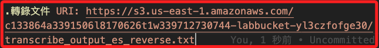
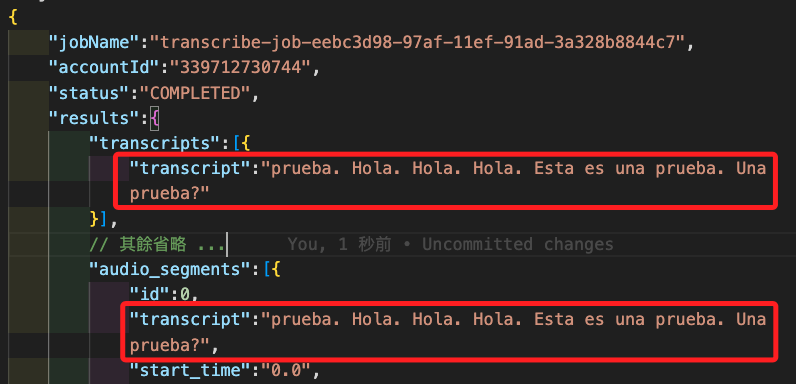
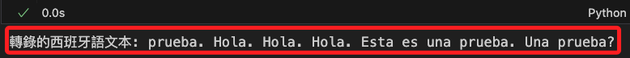
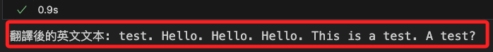
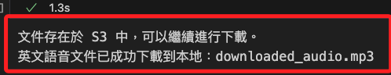

# 反向轉換

_將轉換為西班牙語的音檔，原路返回轉換為最初始的英文文本，接著再轉換為英文音檔_

<br>

# 原路返回

1. 先檢查 `bucket` 名稱，確認無誤再開始進行。

    ```python
    bucket = list_buckets_with_keyword("labbucket")
    print(bucket)
    ```

    

<br>

2. 將前面步驟完成的音檔回傳到 S3，存放在 `lab71` 內的新資料夾 `reverse_audio` 中，並確認音頻文件上傳成功。

    ```python
    # 上傳本地音頻文件至 S3 的指定路徑
    with open(polly_output_filename, "rb") as f:
        s3_client.upload_fileobj(
            f,
            bucket,
            # 建立新的位置
            f"lab71/reverse_audio/{polly_output_filename}"
    )
    print(
        "文件已成功上傳至 S3: lab71/reverse_audio/"
        f"{polly_output_filename}"
    )
    ```

    

<br>

3. 開始設定轉錄工作。

    ```python
    # 建立客戶端
    transcribe_client = boto3.client("transcribe")
    # 使用新的位置
    media_input_uri = \
        f"s3://{bucket}/lab71/reverse_audio/"\
        f"{polly_output_filename}"

    # 建立 UUID 作為轉錄工作名稱
    job_uuid = uuid.uuid1()
    transcribe_job_name = f"transcribe-job-{job_uuid}"

    # 啟動轉錄工作
    response = transcribe_client.start_transcription_job(
        TranscriptionJobName=transcribe_job_name,
        Media={"MediaFileUri": media_input_uri},
        # 確保格式與文件一致
        MediaFormat="mp3",
        LanguageCode="es-ES",
        OutputBucketName=bucket,
        OutputKey="transcribe_output_es_reverse.txt"
    )

    # 等待轉錄工作完成
    while True:
        job = transcribe_client.get_transcription_job(TranscriptionJobName=transcribe_job_name)
        if job["TranscriptionJob"]["TranscriptionJobStatus"] in ["COMPLETED", "FAILED"]:
            break
        sleep(20)
        print(".", end="")

    # 確認作業完成並顯示結果 URI 或失敗原因
    if job["TranscriptionJob"]["TranscriptionJobStatus"] == "COMPLETED":
        transcription_file_uri = job["TranscriptionJob"]["Transcript"]["TranscriptFileUri"]
        print("轉錄文件 URI:", transcription_file_uri)
    else:
        print("轉錄工作失敗，狀態:", job["TranscriptionJob"]["TranscriptionJobStatus"])
        if "FailureReason" in job["TranscriptionJob"]:
            print("失敗原因:", job["TranscriptionJob"]["FailureReason"])

    ```

    

<br>

4. 在 S3 中可看到這幾個轉錄的紀錄。

    

<br>

5. 查看轉錄的 JSON 文件。

    ```python
    # 下載並檢查轉錄文件
    transcribe_output_filename = "transcribe_output_es_reverse.txt"

    # 使用 S3 客戶端從 S3 中下載轉錄結果文件
    with open(transcribe_output_filename, "wb") as f:
        s3_client.download_fileobj(
            bucket, transcribe_output_filename, f
        )

    # 查看轉錄內容
    with open(transcribe_output_filename, "r") as f:
        # 提取為 JSON
        transcribe_data = json.load(f)
    print("轉錄的西班牙語文本:", transcribe_data)
    ```

<br>

6. 在返回的文本中，有兩處可以看到轉錄的西班牙語文本。

    

<br>

7. 提取西班牙語文本。

    ```python
    spanish_text = transcribe_data["results"]["transcripts"][0]["transcript"]
    print("轉錄的西班牙語文本:", spanish_text)
    ```

    

<br>

8. 將西班牙語文本翻譯為英文。

    ```python
    # 將西班牙語文本翻譯為英文
    response = translate_client.translate_text(
        Text=spanish_text,
        SourceLanguageCode="es",
        TargetLanguageCode="en"
    )

    # 獲取翻譯後的英文文本
    english_text = response['TranslatedText']
    print("翻譯後的英文文本:", english_text)
    ```

    

<br>

9. 將翻譯的英文文本轉換成語音。

    ```python
    # 啟動語音合成作業
    response = polly_client.start_speech_synthesis_task(
        Engine="standard",
        OutputFormat="mp3",
        OutputS3BucketName=bucket,
        Text=english_text,
        # 美式英文的 Joanna 聲音
        VoiceId="Joanna"
    )

    # 等待語音合成作業完成並獲取文件 URI
    task_id = response["SynthesisTask"]["TaskId"]
    while True:
        polly_job = polly_client.get_speech_synthesis_task(TaskId=task_id)
        if polly_job["SynthesisTask"]["TaskStatus"] in ["completed", "failed"]:
            break
        sleep(20)
        print(".", end="")

    # 確認合成成功並獲取文件 URI
    if polly_job["SynthesisTask"]["TaskStatus"] == "completed":
        audio_file_uri = polly_job["SynthesisTask"]["OutputUri"]
        print("英文語音文件 URI:", audio_file_uri)
    else:
        print("語音合成失敗:", polly_job["SynthesisTask"]["TaskStatus"])
    ```

<br>

10. 下載前先查看一下路徑。

    ```python
    print("Bucket 名稱:", bucket)
    print("S3 文件完整路徑:", s3_file_key)
    ```

    

<br>

11. 進行下載。

    ```python
    # 根據 S3 文件的實際路徑修正文件 key
    # 文件直接位於根目錄
    s3_file_key = f"{task_id}.mp3"

    # 定義本地文件名稱
    local_filename = "downloaded_audio.mp3"

    # 檢查文件是否存在於 S3 中並下載
    try:
        # 確認 bucket 名稱和 key 是否正確
        print("Bucket 名稱:", bucket)
        print("S3 文件完整路徑:", s3_file_key)
        
        # 檢查文件是否存在
        s3_client.head_object(Bucket=bucket, Key=s3_file_key)
        print("文件存在於 S3 中，可以繼續進行下載。")

        # 下載文件
        with open(local_filename, "wb") as f:
            s3_client.download_fileobj(bucket, s3_file_key, f)

        print(f"英文語音文件已成功下載到本地：{local_filename}")

    except s3_client.exceptions.ClientError as e:
        error_code = e.response['Error']['Code']
        if error_code == '404':
            print(
                f"文件 '{s3_file_key}' 在 bucket '{bucket}' 中不存在。"
                "請檢查路徑和文件名是否正確。"
            )
        else:
            print("其他 S3 錯誤:", e)
    except Exception as ex:
        print("下載過程中發生其他錯誤:", ex)
    ```

    


<br>

___

_END_