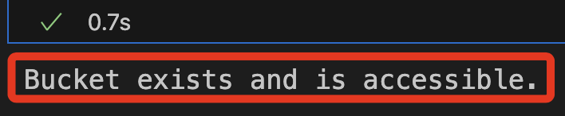

# Lab 7.1

_這個 Lab 每次可使用 300 分鐘_

## 基本步驟

_簡單文字敘述步驟_

<br>

1. 開始 Lab 後，搜尋並進入 `Sagemaker` 服務。

2. 點擊左側頁籤 `Notebooks`，在實例右側點擊 `Open JupyterLab`。

3. 開啟腳本 `en_us/lab-7-1.jpynb`_

## 建立開發環境所需憑證

_後補_

## 特別注意

1. 這個 Lab 每次重建後都會有新的 `bucket`、`database_access_role_arn`、`translate_access_role_arn`；在範例代碼載入資源後，添加以下代碼區塊用已檢查是否具備權限。

```python
import boto3

s3_client = boto3.client("s3")
try:
    s3_client.head_bucket(Bucket=bucket)
    print("Bucket exists and is accessible.")
except Exception as e:
    print(f"Error accessing bucket: {e}")
```

2. 確認具備權限，再繼續範例代碼。



3. 