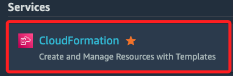
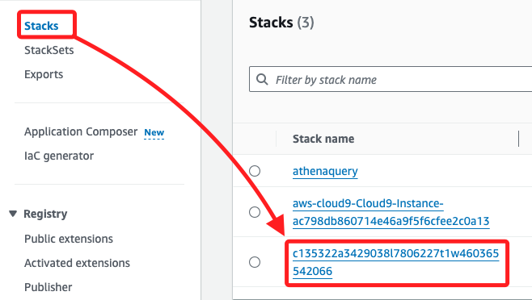

## 檢視 IAM 策略

_Lab 已建立好查詢的 IAM 策略，自己是無法在 Lab 中建立 IAM 策略的_

<br>

1. 進入 IAM。

    

<br>

2. 點擊左側的 `Users`，可看到已有兩個 User。

    

<br>

3. 點擊 `mary` 進入，可看到政策 `Policy-For-Data-Scientists`。

    

<br>

4. 點擊 `Policy-For-Data-Scientists` 進一步檢視該策略對相關服務如 S3、Glue 和 Athena 的訪問權限。

    

<br>

## 確認 Mary 的查詢訪問權限

1. 進入 `CloudFormation`。

    

<br>

2. 點擊 `Stacks`，然後在右側清單中選取 Lab 環境所建立的 Stack，點擊進入。

    

<br>

3. 切換到 `Outputs` 頁籤，可以看到 `mary` 的 `MarysAccessKey`、`MarysSecretAccessKey`，將值複製備用。

    

<br>

4. 使用 Mary 的 IAM 用戶進行測試，使用 AWS CLI 測試 Mary 是否能夠訪問命名查詢；確認了 Mary 可以使用適當的權限訪問並運行 Athena 命名查詢。

    ```bash
    AWS_ACCESS_KEY_ID=$AK
    AWS_SECRET_ACCESS_KEY=$SAK
    aws athena get-named-query --named-query-id $NQ
    ```

<br>

## 完成

_Submit & End Lab_


<br>

___

_END_