# Task 1：建立並查詢 AWS Glue 資料庫與表格

_進入 Lab 之後_

<br>

## 步驟說明

1. 進入主控台搜尋並進入 `Athena`。

    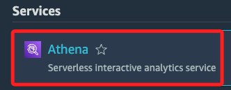

<br>

2. 啟動查詢編輯器。

    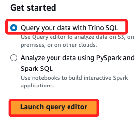

<br>

3. 或展開選單，點擊 `Query editor` 進入。

    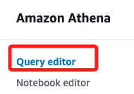

<br>

4. 切換到 `Settings` 頁籤，會看到當前所在是 `Query result and encryption settings`，點擊右側的 `Manage`。

    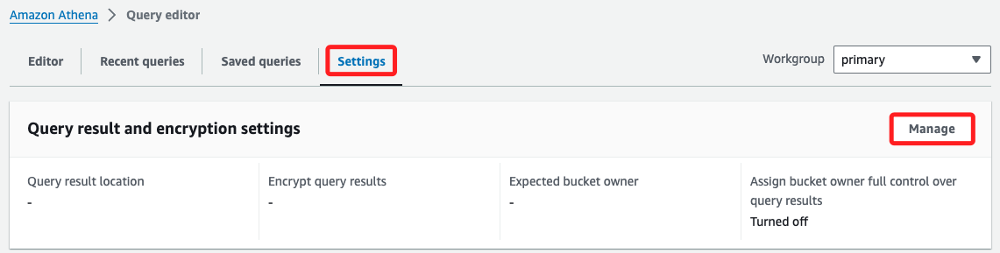

<br>

4. 在 `Location of query result` 選擇 `Browse S3`。

    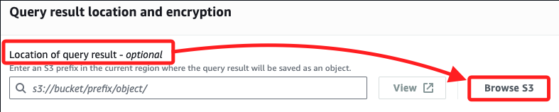

<br>

5. 選取預設的 `S3 Bucket`，點擊右下角 `Choose`。

    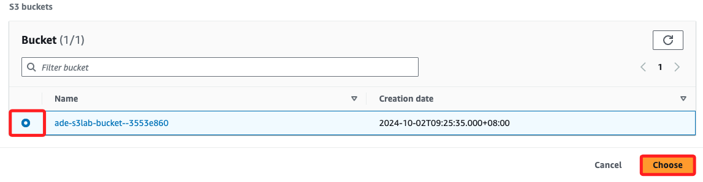

<br>

6. 這個頁面其他部分使用預設值即可，點擊 `Save`。

    

<br>

## 建立 `Glue` 資料庫

1. 切換頁籤到 `Editor`。

    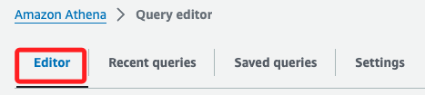

<br>

2. 在 `Athena` 查詢編輯器中，輸入以下 SQL 指令建立資料庫，點擊下方的 `Run` 執行指令。

    ```sql
    CREATE DATABASE taxidata;
    ```

    

<br>

3. 完成後，下方會顯示完成、成功等資訊。

    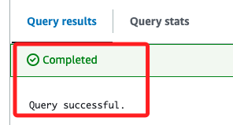

<br>

## 查看

_使用另一個服務 AWS Glue，這裡只是簡單示範如何查看，不細說功能。_

<br>

1. 搜尋並進入 `Glue`。

    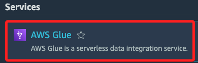

<br>

2. 點擊左側欄中的 `Databases`，接著可在右側 `Databases` 清單中看到前面步驟建立的資料庫 `taxidata`。

    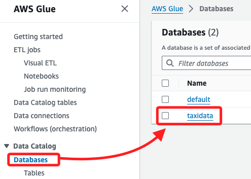

<br>

## 建立 Glue 表格

_回到 Athena_

<br>

1. 在左側 `Tables and views` 區塊中，展開選單 `Create` 並點擊 `S3 bucket data`。

    

<br>

2. 設定 `表格名稱 (Table name)` 為 `yellow`，`描述 (Description)` 為 `Table for taxi data`；在 `Database configuration` 部分，下拉選單後點擊前面建立的 `taxidata` 資料庫。

    

<br>

3. 輸入 S3 資料位置 `Location of input data set`，並勾選下方的 `I acknowledge ...`；這個路徑是 Lab 環境中固定的數據位置，包含預先準備好的數據集，提供在 Lab 中使用，通過這個路徑來指向該數據，以便在 Athena 表格中查詢；其中 `aws-tc-largeobjects` 是 Bucket 的名稱，而 `CUR-TF-200-ACDSCI-1` 是 Bucket 下的資料夾名稱，`Lab2` 是 Lab 名稱，`yellow` 則是自訂的 table 名稱。

    ```
    s3://aws-tc-largeobjects/CUR-TF-200-ACDSCI-1/Lab2/yellow/
    ```

    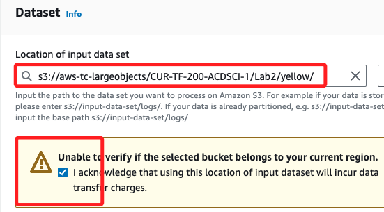

<br>

4. 在選擇數據格式 `Data format` 項目下的 `File format` 為 `CSV`。

    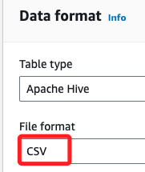

<br>

5. 在 `Column details` 部分，點擊 `Bulk add columns` 進行快速添加欄位名稱與類型。

    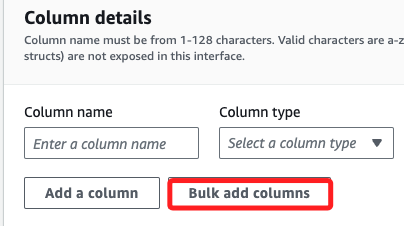

<br>

6. 在彈窗中輸入以下內容，這是快速添加 `metadata` 的方法；稍作觀察可發現，輸入的並非是資料庫語法，而是欄位與其數據格式。

    ```bash
    vendor string,
    pickup timestamp,
    dropoff timestamp,
    count int,
    distance int,
    ratecode string,
    storeflag string,
    pulocid string,
    dolocid string,
    paytype string,
    fare decimal,
    extra decimal,
    mta_tax decimal,
    tip decimal,
    tolls decimal,
    surcharge decimal,
    total decimal
    ```

<br>

8. 完成後點擊 `Add`。

    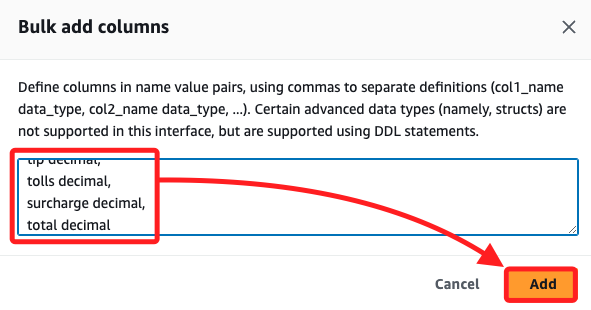

<br>

9. 可在 `Preview table query` 進行語法的預覽，這才是寫入前面欄位數據的語法；然後點擊右下角 `Create Table`；至此完成建立 Glue 資料庫與表格，並導入了 Lab 預設儲存在 S3 的數據。

    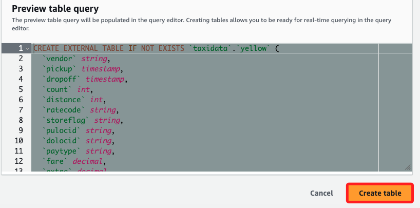

<br>

## 在 Glue table 預覽

1. 在左側 ` Data` 區塊，先點擊刷新圖標。

    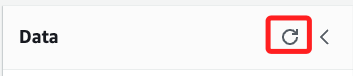

<br>

2. 確認 `Database` 是 `taxidata`，然後 `Tables` 是 `yellow`；點擊 `yellow` 尾部的三個點來展開選單，點擊 `Preview Table`。

    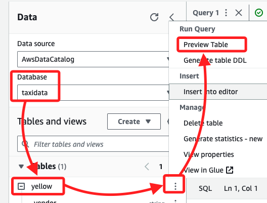

<br>

3. 此時在 `Query` 視窗中會自動顯示以下語法；這條查詢會從資料庫 `taxidata` 中的 `yellow` 表格中選取所有欄位，並僅返回最多 10 筆資料，可藉此檢查表格中的數據樣本。

    ```sql
    SELECT * FROM "taxidata"."yellow" limit 10;
    ```

<br>

4. 點擊 `Run` 之後，在下方的 `Results` 會顯示前十筆資料。

    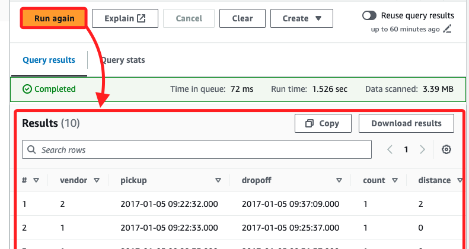

<br>

5. 可點擊個別查詢頁籤右側的 `X` 來關閉查詢。

    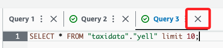

<br>

6. 彈窗中再次點擊 `Close query`。

    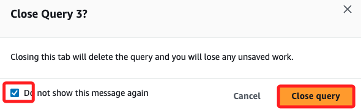

<br>

___

_END_