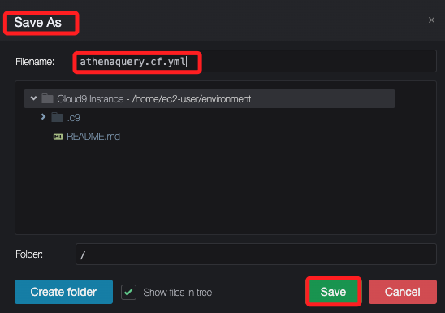

# Task 5：建立 Athena 查詢

_利用 `CloudFormation` 建立 `Amazon Athena` 的查詢，並分享給其他 AWS 帳戶的部門使用。_

<br>

## 預檢 `CloudFormation`

_自主預覽，並非教程所指引_

<br>

1. 搜尋並進入 `CloudFormation`。

    

<br>

2. 啟動 Lab 的時候已經自動建立了兩個 Stack。

    

<br>

## 在 Athena 中查詢

1. 以下查詢從 `yellow` 表中選取了 `行程距離（distance）`、`支付類型（paytype）`、`車資（fare）`、`小費（tip）`、`過路費（tolls）`、`附加費（surcharge）` 和 `總金額（total）` 這些欄位，並過濾出 `總金額大於等於 100` 的行程記錄；結果將按 `總金額（total）` 從 `高到低排序（DESC 代表降序排列）`。

    ```sql
    SELECT 
        distance, 
        paytype, 
        fare, 
        tip, 
        tolls, 
        surcharge, 
        total 
    FROM 
        yellow 
    WHERE 
        total >= 100.0 
    ORDER BY 
        total DESC;
    ```

    _結果如下_

    

<br>

## 使用 Cloud9

1. 搜尋並進入 `Cloud9`；這是 Lab 已經準備好的環境。

    

<br>

2. 選取並開啟 IDE。

    

<br>

3. 展開左上角的 `File`，點擊 `New File` 建立新文件。

    

<br>

4. 同在 `File` 中將文件儲存 `Save as`，命名為 `athenaquery.cf.yml`。

    

<br>

5. 在腳本中貼上以下內容，貼上後記得儲存文件；特別注意，`CloudFormation` 模板使用的 `YAML` 格式對於縮排的規範是非常嚴格的，必須正確排版。

    ```yaml
    AWSTemplateFormatVersion: 2010-09-09
    Resources:
        AthenaNamedQuery:
            Type: AWS::Athena::NamedQuery
            Properties:
                Database: "taxidata"
                Description: "A query that selects all fares over $100.00 (US)"
                Name: "FaresOver100DollarsUS"
                QueryString: > 
                    SELECT distance, paytype, fare, tip, tolls, surcharge, total
                    FROM yellow 
                    WHERE total >= 100.0 
                    ORDER BY total DESC
    Outputs:
        AthenaNamedQuery:
            Value: !Ref AthenaNamedQuery
    ```

<br>

6. 驗證模板語法是否正確，如果格式正確會輸出 `Parameters: []` 表示模板驗證通過。

    ```bash
    aws cloudformation validate-template --template-body file://athenaquery.cf.yml
    ```

    

<br>

7. 部署模板，執行以下指令來部署 CloudFormation 堆疊，使用 CloudFormation 來建立可重用的 Athena 查詢模板，並將其部署到 AWS；特別注意，Lab 中的角色並無權限刪除 CloudFormation 中的 Stack。

    ```bash
    aws cloudformation create-stack --stack-name athenaquery --template-body file://athenaquery.cf.yml
    ```

    _完成後顯示_

    ```bash
    {
        "StackId": "arn:aws:cloudformation:us-east-1:423809875316:stack/athenaquery/eb2010e0-80c3-11ef-b2e9-0e80309c6219"
    }
    ```

<br>

8. 檢查堆疊的建立狀態。

    ```bash
    aws cloudformation describe-stacks --stack-name athenaquery
    ```

    

<br>

9. 使用以下指令來列出 Athena 中的命名查詢，確認查詢是否已經建立。

    ```bash
    aws athena list-named-queries
    ```

    

<br>

10. 手動複製前一個步驟取得的 ID 來執行查詢，這個指令會返回查詢的詳細信息，可以使用此查詢進行數據分析。

    ```bash
    aws athena get-named-query --named-query-id <QueryID>
    ```

    

<br>

## 儲存 bash 指令的查詢結果

_在終端機操作中，如果有連續操作時，儲存前步驟的輸出作為後續的輸入，可讓操作更為迅速_

<br>

1. 在 bash 指令中，若想要將以下查詢的 ID 儲存數值到變數。

    

<br>

2. 第一種方式，使用土法煉鋼將值寫入變數中。

    ```bash
    NQ=<查詢結果>
    ```

<br>

3. 然後查詢時或使用時，在變數前面加上取值運算子 `$` 即可；例如將值輸出。

    ```bash
    echo $NQ
    ```

    

<br>

4. 更進階的方式是使用 `jq` 工具來解析 JSON 輸出；先執行以下指令來安裝 `jq`。

    ```bash
    # 如果使用 Amazon Linux
    sudo yum install jq -y
    # 如果使用 Ubuntu
    sudo apt-get install jq
    ```

    

<br>

5. 使用以下指令將 NamedQueryId 存入 NQ 變數；其中 `aws athena list-named-queries` 是列出所有的 Athena 命名查詢的指令，
`jq -r '.NamedQueryIds[0]'` 是使用 `jq` 來解析 `JSON`，提取第一個 `NamedQueryId` 後以原始字串形式輸出，`NQ=$(...)` 是將指令輸出的結果賦值給變數 `NQ`。

    ```bash
    NQ=$(aws athena list-named-queries | jq -r '.NamedQueryIds[0]')
    ```

<br>

6. 接著使用指令 `echo $NQ` 進行查詢，結果如下。

    

<br>

___

_END_