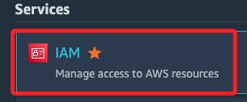
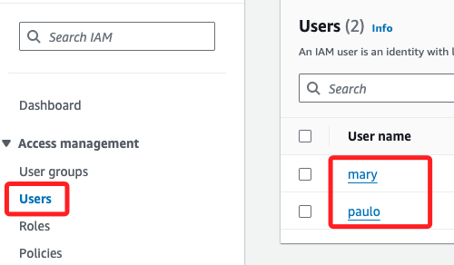
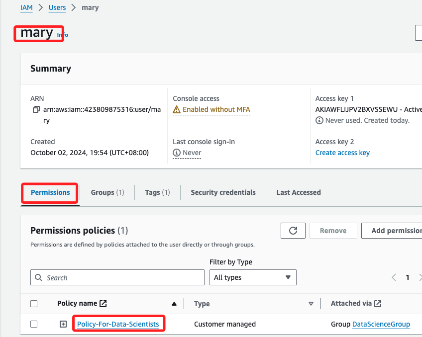
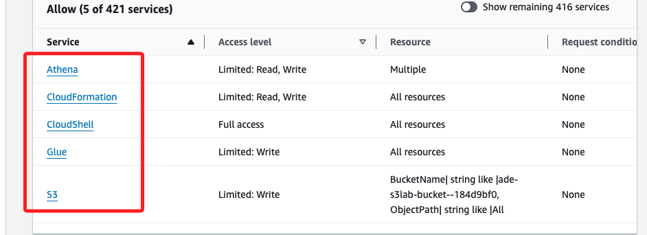

# 檢視 IAM 策略

_Lab 已建立好查詢的 IAM 策略，自己是無法在 Lab 中建立 IAM 策略的_

 

## 步驟

1. 進入 IAM。

    

 

2. 點擊左側的 `Users`，可看到已有兩個 User。

    

 

3. 點擊 `mary` 進入，可看到政策 `Policy-For-Data-Scientists`。

    

 

4. 點擊 `Policy-For-Data-Scientists` 進一步檢視該策略對相關服務如 S3、Glue 和 Athena 的訪問權限。

    

 

___

_END_