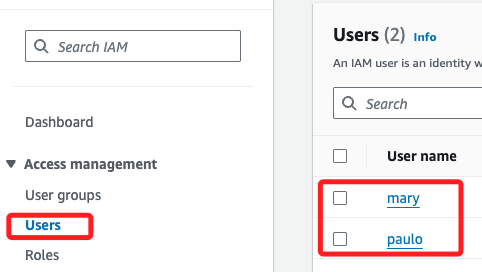
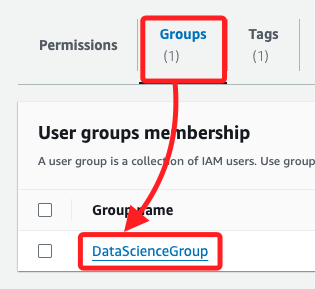
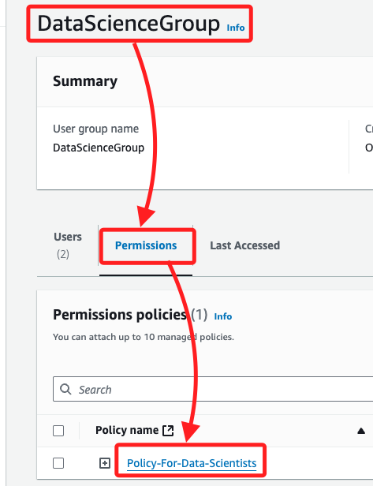
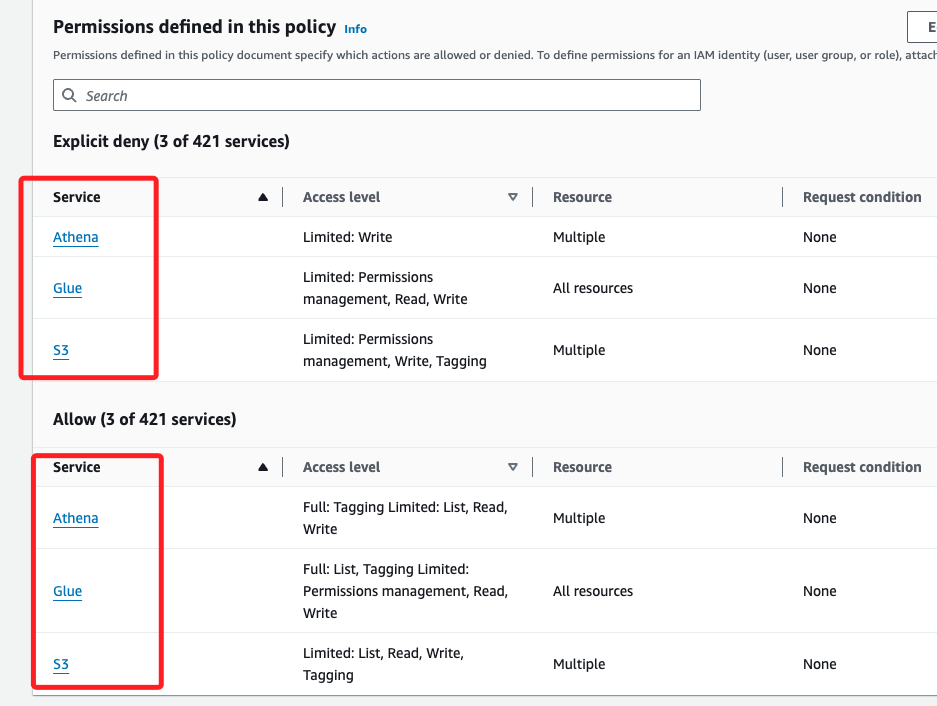
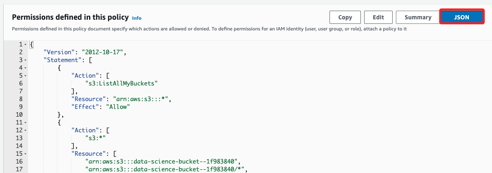

# ETL

_使用 AWS Glue 對數據集進行 ETL 操作_

 

## 任務 4，審查 Athena 和 AWS Glue 訪問的 IAM 策略

_審查爬網程式的 IAM 策略，以確保其他人可以在生產環境中使用它_

 

1. 返回 IAM 控制台中，點擊左側欄中的 `Users`，`mary` 是使用者之一，可點擊進入查看。

    

 

2. 切換到 `Groups` 頁籤，點擊 `DataScienceGroup` 進入群組。

    

 

3. 在群組詳細信息頁面，切換頁籤到 `Permissions`，點擊 `Policy-For-Data-Scientists` 策略。

    

 

4. 在策略詳細信息頁面中，可查看與策略相關的各種權限。

    

 

5. 可點擊 `JSON` 查看 IAM 策略更詳細的信息，包含允許和拒絕的操作及其相關資源。

    

 

___

_END_
