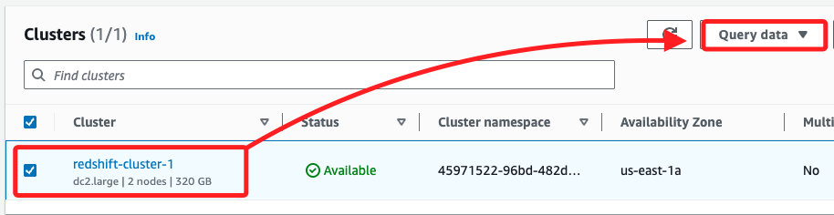
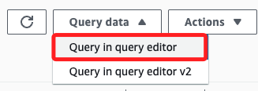
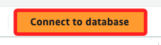
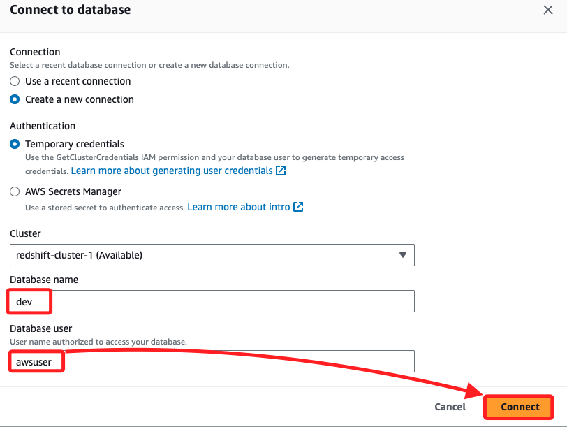
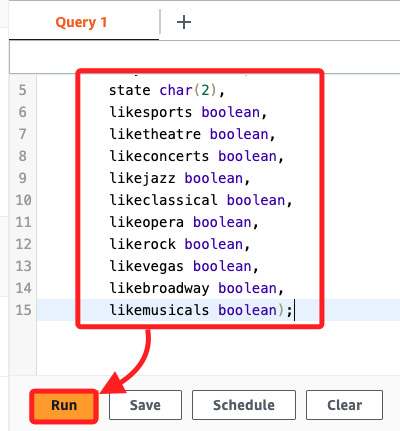
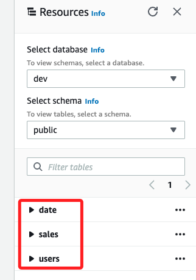
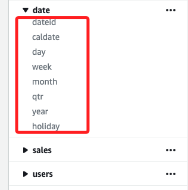

# 任務 3：在資料庫中建立表格

_從 S3 加載數據到 Redshift Cluster_

<br>

## 步驟

1. 進入 Redshift，在下方的 `Clusters` 中，選取前面步驟建立的 `redshift-cluster-1`，然後點擊 `Query data`。

    

<br>

2. 在選單中點擊 `Query in query editor`。

    

<br>

3. 點擊上方或右上角 `Connect to database`。

    

<br>

4. 名稱輸入 `dev`、使用者輸入 `awsuser`，其餘皆使用預設，然後點擊右下角 `Connect`。

    

<br>

## 建立使用者表格

1. 複製以下語句並貼到查詢標籤中，然後點擊 `Run`；完成後在左側會添加新的 Table `users`。

    ```sql
    create table users(
            userid integer not null distkey sortkey,
            username char(8),
            city varchar(30),
            state char(2),
            likesports boolean,
            liketheatre boolean,
            likeconcerts boolean,
            likejazz boolean,
            likeclassical boolean,
            likeopera boolean,
            likerock boolean,
            likevegas boolean,
            likebroadway boolean,
            likemusicals boolean);
    ```

    

<br>

2. 建立日期表，可開啟新頁籤或編輯下當前頁籤，複製並貼上以下語句，然後 `Run`；同樣的，完成後左側會添加新的表 `date`。

    ```sql
    create table date(
    dateid smallint not null distkey sortkey,
    caldate date not null,
    day character(3) not null,
    week smallint not null,
    month character(5) not null,
    qtr character(5) not null,
    year smallint not null,
    holiday boolean default('N'));
    ```

<br>

3. 若要建立銷售表，複製並貼上下語句，然後 `Run`。

    ```sql
    create table sales(
    salesid integer not null,
    listid integer not null distkey,
    sellerid integer not null,
    buyerid integer not null,
    eventid integer not null,
    dateid smallint not null sortkey,
    qtysold smallint not null,
    pricepaid decimal(8,2),
    commission decimal(8,2),
    saletime timestamp);
    ```

<br>

4. 完成以上語句後，左側會顯示三個空的 Table，

    

<br>

5. 雖然展開會有欄位，但無數據。

    

<br>

___

_這個 Task 已經完成，資料載入請進行下一個 Task_