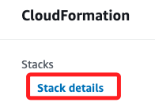
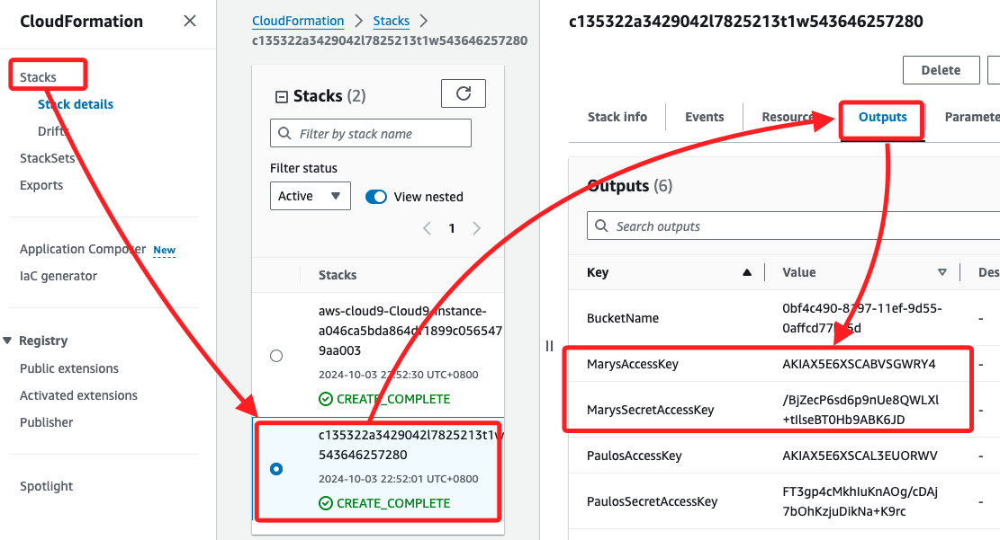
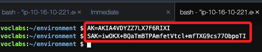
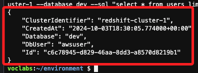
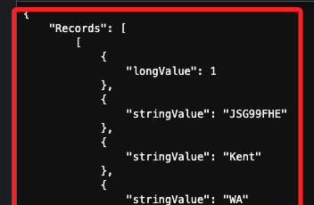
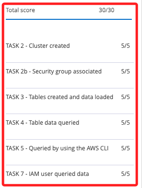

# 任務 8：確認使用者可以在 Redshift 資料庫上運行查詢

_確認 Mary 能夠透過 Redshift 查詢數據，使用 AWS CLI 指令模擬 Mary 的權限，並測試其能否檢索查詢結果。_

<br>

## 進入 CloudFormation 查詢

1. 進入 `CloudFormation` 主控台，並切換到 `Stacks`，點擊下方的 `Stacks details`。

    

<br>

2. 使用 Lab 環境中建立的 Stack，然後將頁籤切換到 `Outputs`，下方就會顯示 `mary` 的相關資訊，複製其中 `MarysAccessKey` 及 `MarysSecretAccessKey` 備用；這在前面已經做很多次，不再贅述。

    

<br>

## 返回 Cloud9

1. 先記錄變數；不用帶上尖勾括號。

    ```bash
    AK=<填入查詢的值>
    SAK=<填入查詢的值>
    ```

    _輸入如下_

    

<br>

2. 運行以下指令，使用指定憑證執行 SQL 查詢，從 Redshift Cluster 中的 `dev` 資料庫的 `users` 表中檢索一行數據。

    ```bash
    AWS_ACCESS_KEY_ID=$AK AWS_SECRET_ACCESS_KEY=$SAK aws redshift-data execute-statement --region us-east-1 --db-user awsuser --cluster-identifier redshift-cluster-1 --database dev --sql "select * from users limit 1"
    ```

    _輸出結果_

    

<br>

3. 再運行以下指令，替換其中 `前一個步驟取得的ID`，這同樣是使用指定憑證來進行檢索。

    ```bash
    AWS_ACCESS_KEY_ID=$AK AWS_SECRET_ACCESS_KEY=$SAK aws redshift-data get-statement-result  --id <前一個步驟取得的ID> --region us-east-1
    ```

    _輸出_

    

<br>

## 完成



<br>

_Submit & End Lab_

<br>

___

_END_