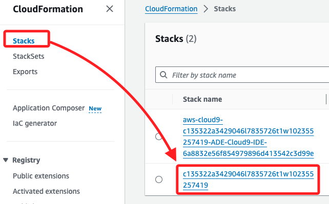
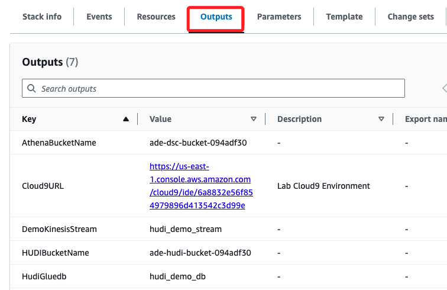

# 任務 1：分析 Lab 環境

_檢查 Lab 環境，並記錄初始配置的詳細信息。_

 

## 從 CloudFormation 堆疊檢索資源值

1. 進入 CloudFormation 主控台，點擊左側 `Stacks`，然後選擇名稱中 _不包含 `ADE`_ 的 stack，也就是如圖清單中的第二個，點擊名稱進入這個 stack。

    

 

2. 切換到 `Outputs`，複製以下內容備用；或是保留畫面不要關閉，因為這在 Task 3 中還會用到。

    

 

## CloudFormation 建立的資源

1. S3 Bucket：用於儲存 AWS Glue 和 Athena 的數據。

 

2. Kinesis 數據流：用於從 KDG 工具中接收數據。

 

3. AWS Glue 資料庫和表：用於邏輯表示儲存在 S3 的數據。

 

4. AWS Glue IAM 角色：運行 AWS Glue 作業所需。

 

5. AWS Cloud9 環境：運行命令所需。

 

6. Kinesis 數據生成器：生成並模擬 IoT 設備數據流。

 

___

_END_