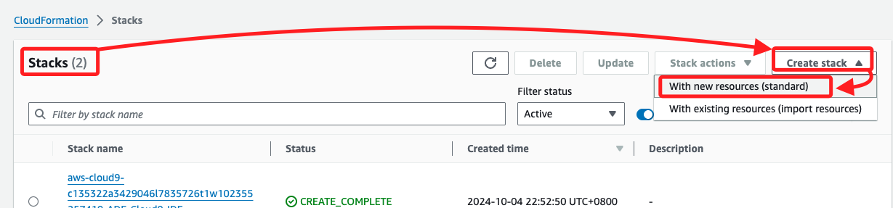
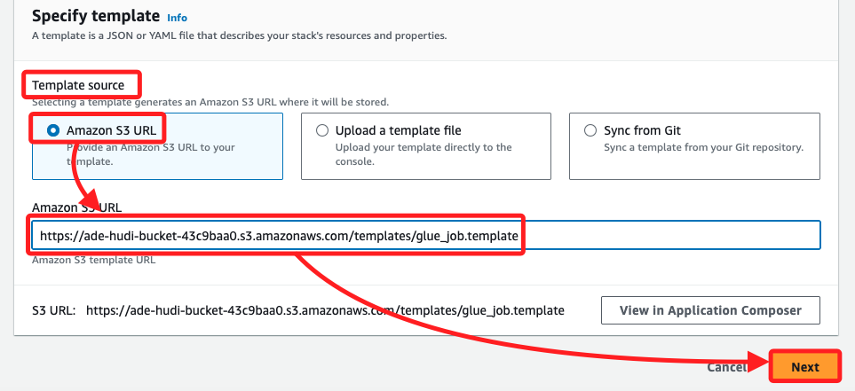
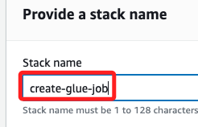
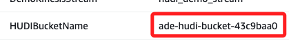
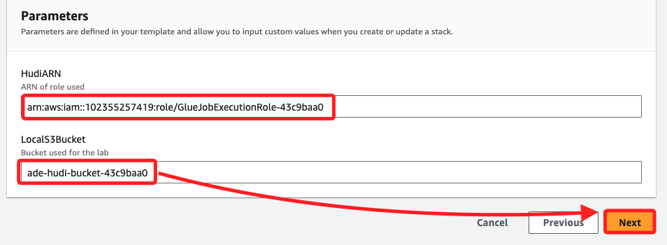
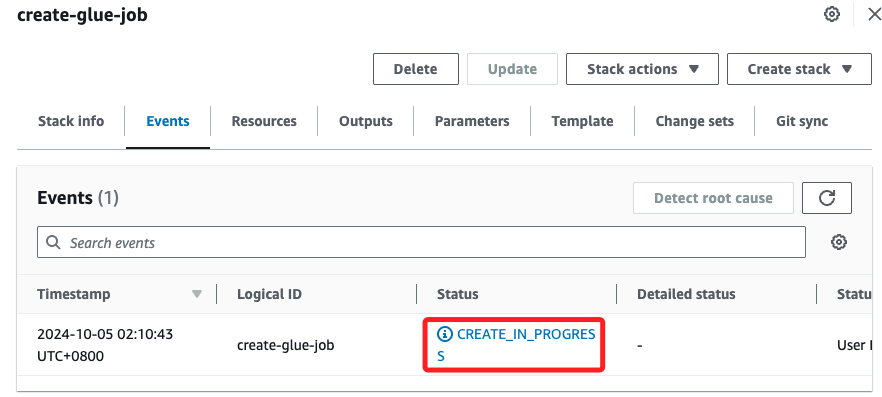
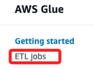
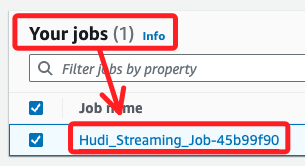
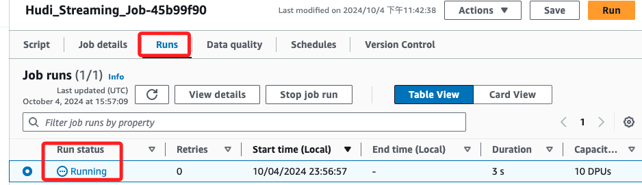

# Task 4：配置並運行 AWS Glue 作業

_AWS Glue 提供運行 ETL 作業的能力，用於在各數據源之間進行數據複製。_

 

## 步驟

1. 進入 `CloudFormation`，展開右上方的 `Create stack`，選取其中的 `With new resources (standard)`。

    

 

2. 在 `Template source` 區塊中，使用預設的 `Amazon S3 URL`，接著在下方 `Amazon S3 URL` 欄位中，貼上前一個 Task 最後複製的網址，接著點擊 `Next`。

    

 

3. 在名稱的部分使用 `create-glue-job`。

    

 

4. 回到 `CloudFormation` 的 `Outputs` 中，複製其中 `HUDIIamRoleARN` 的值；這要貼在 `HudiARN` 區塊。

    

 

5. 同樣，複製其中 `HUDIBucketName` 的值；這是要貼在 `LocalS3Bucket` 區塊。

    

 

6. 完成後點擊 `Next`。

    

 

7. 下一個 `Configure stack options` 頁面都保持預設，直接滾動到最下方、點擊右下角 `Next`。

    

 

8. 在 `Review and create` 頁面中，滾動到下方點擊 `Submit`；特別注意，在教程中，這裡指示要點擊 `Create stack.`。

    

 

9. 在當前 `create-glue-job` 的 `Events` 中顯示 `CREATE_IN_PROGRESS`。

    

 

10. 可返回 Stacks 清單中查看，當前顯示 `CREATE_IN_PROGRESS`；稍作等待，完成時顯示 `CREATE_COMPLETE`。

    

 

## 執行 AWS Glue 作業

1. 進入 `AWS Glue`，點擊進入 `ETL jobs`。

    

 

2. 在 `Your jobs` 區塊中點擊前綴為 `Hudi_Streaming` 的 job。

    

 

3. 在腳本中點擊右上角的 `Run`。

    

 

4. 切換到 `Runs` 頁籤，可見當前狀態為 `Running`；以上完成啟動了 AWS Glue 作業。

    

 

___

_END_