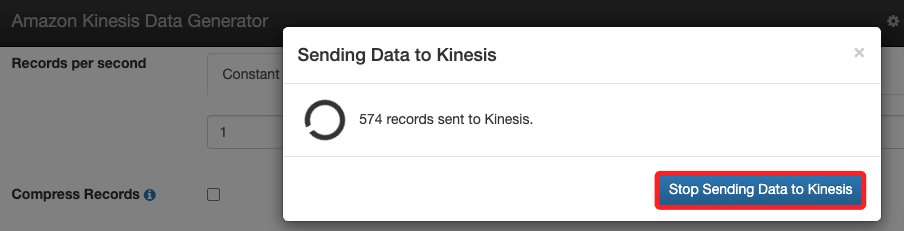
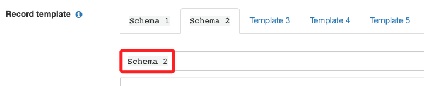
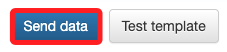
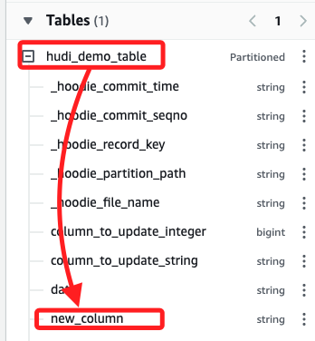

# Task 7：動態更改架構

_修改來自 KDG 的數據結構，然後在 Athena 中運行查詢，無需更改 AWS Glue 作業或表結構。_

<br>

## 更改架構並執行 Athena 查詢

1. 回到運行中的 KDG 畫面中，點擊 `Stop Sending Data to Kinesis`。

    

<br>

2. 將 `Template 2` 更名為 `Schema 2`。

    

<br>

3. 貼上以下的草稿。

    ```json
    {
    "name" : "{{random.arrayElement(["Sensor1","Sensor2","Sensor3", "Sensor4"])}}",
    "date": "{{date.utc(YYYY-MM-DD)}}",
    "year": "{{date.utc(YYYY)}}",
    "month": "{{date.utc(MM)}}",
    "day": "{{date.utc(DD)}}",
    "column_to_update_integer": {{random.number(1000000000)}},
    "column_to_update_string": "{{random.arrayElement(["45f","47f","44f","48f"])}}",
    "new_column": "{{random.number(1000000000)}}" 
    }
    ```

<br>

4. 點擊下方的 `Send data`。

    

<br>

## 回到 Athena

_刷新頁面_

<br>

1. 回到 Tables 中，展開 `hudi_demo_table` 會看到新增的欄位 `new_column`；這部分可再次查看前段草稿最末行語句。

    

<br>

2. 多次執行以下查詢並觀察 new_column 值的變化。

    ```sql
    SELECT _hoodie_commit_seqno, _hoodie_record_key, column_to_update_string, new_column FROM "hudi_demo_table"
    ```

<br>

___

_END_