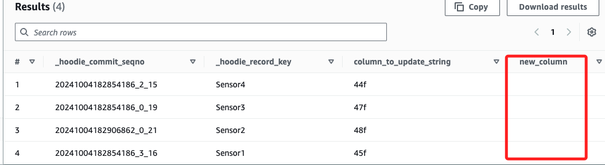

# Task 8：恢復架構變更

_恢復原始架構，並驗證是否能夠繼續進行數據分析_

<br>

## 步驟

1. 回到運行 `KDG` 的頁面中，點擊 `Stop Sending Data to Kinesis`。

    

<br>

2. 在 `Record template` 中選取 `Schema 1` 並點擊 `Send data`；同樣保持運行，不要關必頁面。

    

<br>

3. 回到 `Athena` 中，展開 `Tables` 並選取 `hudi_demo_table`，然後 _重複多次運行_ 以下查詢。

    ```sql
    SELECT _hoodie_commit_seqno, _hoodie_record_key, column_to_update_string, new_column FROM "hudi_demo_table"
    ```

<br>

4. 查詢結果中仍然包含 new_column；但是，該列不包含任何值。

    

<br>

## 說明

1. 當數據架構發生變更，移除了之前新增的 `new_column` 欄位後，AWS Glue 中的 Python 腳本能夠自動處理這種數據記錄結構與表結構之間的不匹配（layout mismatches）的情況。

<br>

2. 當有新的數據要被寫入（ingested）時，這個方法會查詢 AWS Glue Data Catalog 以取得當前 Hudi 表的結構（schema），這可保證 AWS Glue 在數據被寫入前知道當前表的架構。

<br>

3. 它將當前的 Hudi 表結構與即將被寫入的數據記錄的結構進行合併，如果記錄中有某些欄位在當前 Hudi 表結構中不存在，例如移除了的 `new_column`，那麼這些欄位將被賦予 `null` 值，這種方式可避免數據寫入時因為架構不匹配而出現錯誤。

<br>

4. 這樣處理後，即使 `new_column` 被移除，Athena 仍然能夠正常查詢 Hudi 資料集，而不會因為欄位缺失或不一致而發生問題。

<br>

___

_END_