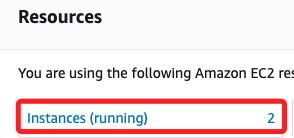
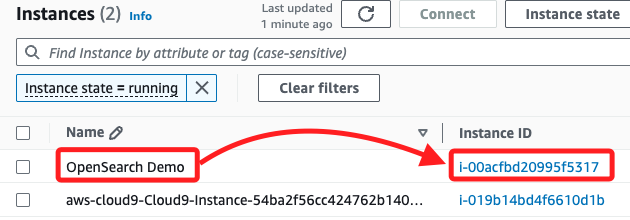
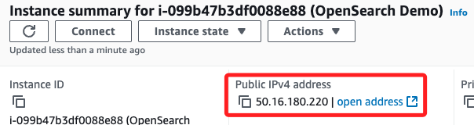
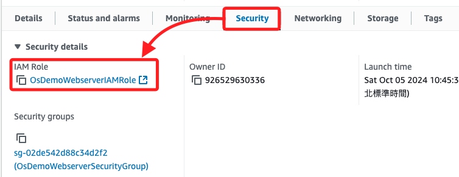
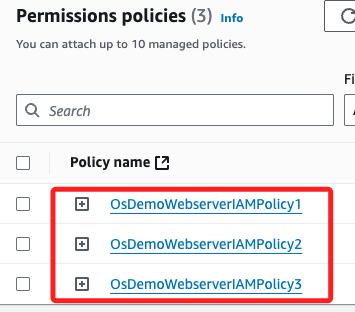
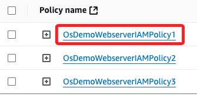
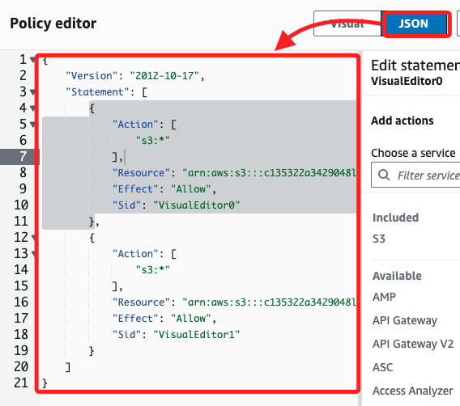

# Task 1：檢查 EC2 執行個體及其安全性配置

_簡單回顧 EC2_

 

## 檢查 EC2

1. 進入 EC2，點擊 Resources 中的 `Instances(running)`，在這個 Lab 會有兩個實例。

    

 

2. 看到其中名為 `OpenSearch Demo` 的實例，點擊其 ID 進入。

    

 

3. 複製這個實例的 `Public IPv4 address` 備用。

    

 

## 查看安全設定

1. 滑動到實例下方，切換到 `Security` 頁籤，並點擊 `IAM Role` 下方 `OsDemoWebserverIAMRole ` 的連結。

    

 

2. 這個角色下有三個 Policy，可點擊進入查看內容。

    

 

3. 點擊 `OsDemoWebserverIAMPolicy1` 進入查看。

    

 

4. 在 `JSON` 頁籤中，可從 JSON 文件查看權限設置；這個角色擁有對指定的 S3 Bucket 及其所有內部對象進行所有操作的 `完整權限（s3:*）`，包括但不限於 `讀取、寫入、刪除、列出` 等操作。

    

 

___

_END_