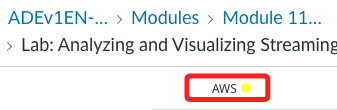
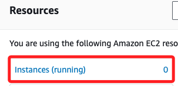
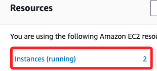

# Task 1：檢查 EC2 執行個體及其安全性配置

_簡單回顧 EC2_

 

## 檢查 EC2

1. 這個 Lab 啟動相當耗時，務必確保登入頁面中的 `AWS` 呈現綠色再進入 Lab 環境。

    

 

2. 首先進入 EC2，可查看ㄧ下 Resources，假如還沒準備好 `Instances(running)` 數量會顯示 `0`，稍等片刻。

    

 

3. 過一陣子會先顯示 `1`，這時會啟動一個名稱前綴 `aws-cloud9-Cloud9` 的實例，請繼續等候。

    

 

4. 完全啟動後會顯示 `2` 個運行中的實例，點擊 `Instances(running)` 進入。

    

 

5. 點擊其中名為 `OpenSearch Demo` 的 ID 進入。

    

 

6. 複製這個實例的 `Public IPv4 address` 備用。

    

 

## 查看安全設定

1. 滑動到實例下方，切換到 `Security` 頁籤，按住 `command` 並點擊 `IAM Role` 下方 `OsDemoWebserverIAMRole ` 的連結，這會在新頁籤開啟 IAM 主控台中的 Role。

    

 

2. 這個角色下有三個 Policy。

    

 

3. 可點擊第一個 `OsDemoWebserverIAMPolicy1` 進入查看，這會自動開啟新的瀏覽器頁面。

    

 

4. 在 `JSON` 頁籤中，可從 JSON 文件查看權限設置；這個角色擁有對指定 S3 Bucket 及其所有內部對象進行所有操作的 `完整權限（s3:*）`，包括但不限於 `讀取、寫入、刪除、列出` 等操作。

    

 

___

_END_