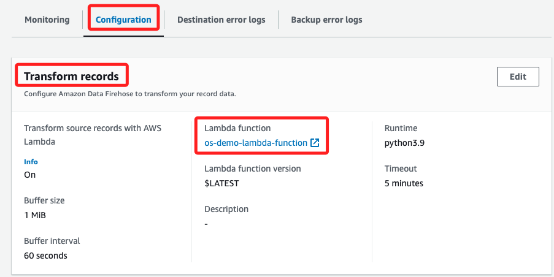

# 查看 Kinesis Data Firehose 傳輸流

 

## 步驟

1. 進入 `Kinesis`；特別注意，在 AWS 中有多種服務均以 `Kinesis` 開頭，如圖中的 `Kinesis Analytics` 和 `Kinesis Video Streams`，這裡使用的是 `Kinesis` 服務。

    

 

2. 點擊左側 `Amazon Data Firehose`，這會展開新的瀏覽頁面。

    

 

3. 點擊 `os-demo-firehose-stream` 進入。

    

 

4. 特別注意，在 `Source` 區塊顯示的是 `Direct PUT`；這是因為該 EC2 實例運行的是 Linux 系統，並使用 Apache 作為網頁伺服器，在這種配置下，可以利用 `Kinesis Agent（Linux）` 來收集網頁伺服器的日誌數據，並通過 `Kinesis Data Firehose` 進行傳輸，`Direct PUT` 的選擇代表了數據是直接由 EC2 實例推送到 Kinesis Data Firehose，而不是從其他來源拉取數據；這樣的設計有助於實現更高效的日誌收集與傳輸，並且可以根據 Kinesis Data Firehose 的來源、目的地以及名稱設置進行更詳細的配置。

    

 

5. 另外，目標被指定為 `Amazon OpenSearch Service`，這表示傳輸流會將負載傳輸到 `Amazon OpenSearch Service`，以便稍後分析日誌。

    

 

6. 下方的 Monitoring 頁籤顯示監控已啟用並產生傳輸流指標。

    

 

7. 接著再切換到 `Configuration` 來查看 `Transform records`，會看到關聯了 `os-demo-lambda-function` Lambda 函數，這個函數的主要功能是在將日誌數據傳送到 OpenSearch 服務進行分析之前，對日誌數據進行轉換和增強；Lambda 函數在高層次上對伺服器日誌進行了 `豐富化（enrichment）`，例如，它可以通過將訪客的 IP 地址轉換為地理位置來確定訪客的地理位置。

    

 

8. 點擊進入可查看 Lambda 函數更多細節。

    

 

___

_END_