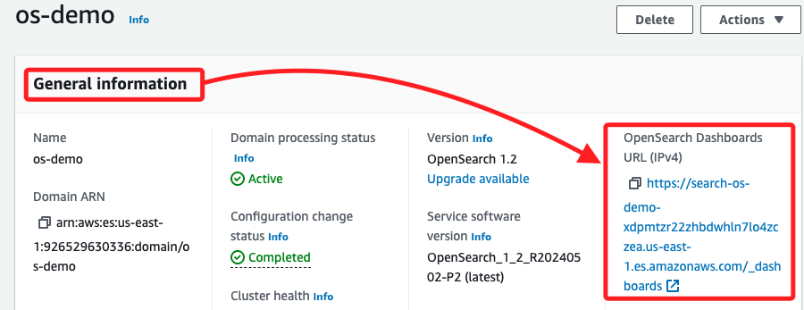

# 檢查 OpenSearch 服務集群

## 步驟

1. 回到 `Firehose streams`，切換到 `Configuration` 頁籤。


2. 點擊 `OpenSearch Service destination` 中的 `Domain`，會自動開啟新的頁面進入 `OpenSearch` 服務。


3. 複製其中的 `OpenSearch Dashboards URL (IPv4)` 鏈接備用；特別注意，假如 `OpenSearch` 網域顯示正在刪除資源，可等待進度完成再繼續操作。



4. 另外，`Cluster health` 顯示為 `Yellow`，在 Cluster 管理中代表所有 `主分片（primary shard）` 都已經分配到節點上，但至少有一個 `副本分片（replica shard）` 還沒有被分配到節點；這通常發生在單節點的叢集中，因為單節點無法同時分配主分片和副本分片，這是為了避免副本和主分片都在同一個節點上，進而失去數據冗餘，所以在這個 Lab 中的單節點叢集初始化後，健康狀態會保持黃色，這不會影響在 Lab 中的操作；但在生產環境中，會建議配置多個節點來提高可用性和冗餘性，當叢集中的節點數量增加到兩個或更多時，系統就可以將副本分配到其他節點，從而使叢集健康狀態變成 `Green`，表示所有主分片和副本分片都被成功分配且叢集處於健康狀態。


## 查看 OpenSearch 服務叢集的安全性配置

1. 切換到頁籤 `Security configuration`，並查看下方的 `Access policy`。


2. 這個 Policy 授權兩個不同的 IAM 角色對 `Amazon Elasticsearch Service` 或 `OpenSearch Service` 進行操作；第一個聲明允許 `os_demo_firehose_delivery_role` 角色對 `os-demo` 域執行所有 `Elasticsearch` 操作；第二個聲明允許 `osdemocognitoauthuserrole` 角色對該域執行所有 HTTP 相關操作。

```json
{
  "Version": "2012-10-17",
  "Statement": [
    {
      "Effect": "Allow",
      "Principal": {
        "AWS": "arn:aws:iam::926529630336:role/os_demo_firehose_delivery_role"
      },
      "Action": "es:*",
      "Resource": "arn:aws:es:us-east-1:926529630336:domain/os-demo/*"
    },
    {
      "Effect": "Allow",
      "Principal": {
        "AWS": "arn:aws:iam::926529630336:role/osdemocognitoauthuserrole"
      },
      "Action": "es:ESHttp*",
      "Resource": "arn:aws:es:us-east-1:926529630336:domain/os-demo/*"
    }
  ]
}
```

## IAM