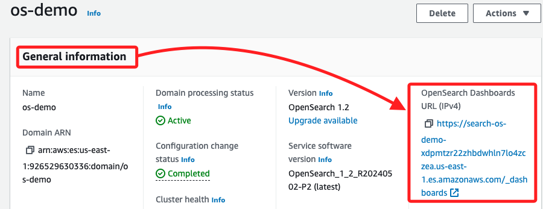
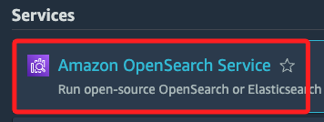
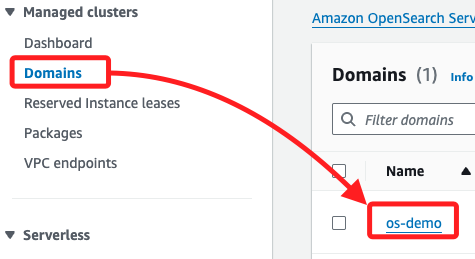
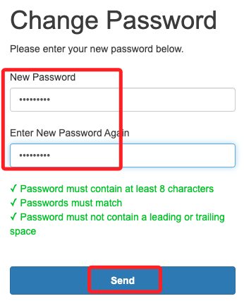
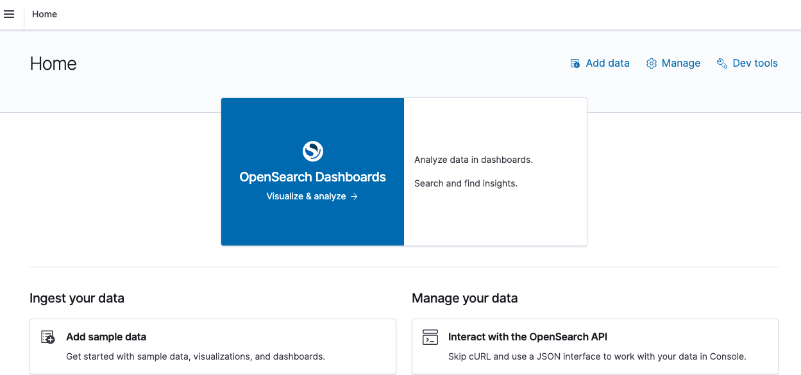
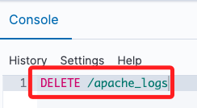
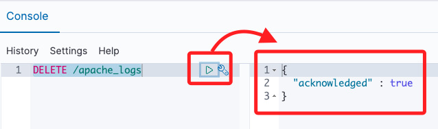
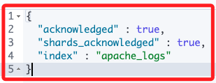

# Task 4：配置 OpenSearch 索引

<br>

## 說明

1. 首先，在 Task 3 中複製了 `OpenSearch Dashboards URL (IPv4)` 鏈接。

    

<br>

2. 或是重新搜尋並進入 `Amazon OpenSearch Service`。

    

<br>

3. 然後在左側點擊 `Domains`，接著進入 `os-demo`；同樣就會進入 `General information` 頁面。

    

<br>

4. 在彈窗中使用帳號 `LabUser`、密碼 `Passw0rd1!` 進行登入。

    

<br>

5. 設定新密碼為 `Passw0rd1!2`；這是依照官方教程指示的密碼。

    

<br>

6. 點擊 `Explore on my own`。

    

<br>

7. 進入 `OpenSearch Dashboards`。

    

<br>

## 刪除現有的 Web 伺服器日誌

1. 展開左上角三橫槓圖標。

    

<br>

2. 點擊下方的 `Dev Tools`。

    

<br>

3. 在 Console 中寫入指令，這會刪除儲存在 `OpenSearch Service EC2` 實例上的 `apache_logs` 索引（）。

    ```bash
    DELETE /apache_logs
    ```

    

<br>

4. 運行指令後，回應如下。

    

<br>

## 使用 REST API 建立 OpenSearch 索引

1. 使用 `PUT` 語句進行建立，貼上以下的語法，然後運行。

    ```sql
    PUT apache_logs
    {
        "settings" : {
            "index" : {
                "number_of_shards" : 10,
                "number_of_replicas" : 0
            }
        },

    "mappings": {
        "properties": {
            "agent": { 
            "type": "text"  
            },
            "browser": {
            "type": "keyword"
            },
            "bytes": {
            "type": "text"
            },
            "city": {
            "type": "keyword"
            },
            "country": {
            "type": "keyword"
            },
            "datetime": {
            "type": "date","format":"dd/MMM/yyyy:HH:mm:ss Z"
            },
            "host": {
            "type": "text"
            },
            "location": {
            "type": "geo_point"
            },
            "referer": {
            "type": "text"
            },
            "os": {
            "type": "keyword"
            },
            "request": {
            "type": "text"
            },
            "response": {
            "type": "text"
            },
            "webpage": {
            "type": "keyword"
            },
            "refering_page": {
            "type": "keyword"
            }
        }
        }
    }
    ```

<br>

2. 得到以下回應；運行 `PUT` 命令成功建立名為 `apache_logs` 的 `OpenSearch 索引`，該索引會隨著網站流量更新，由 `Kinesis Data Firehose` 傳送的伺服器日誌資料填充進 `OpenSearch 叢集`；命令指定了日誌中各欄位的資料類型，用於定義如何儲存和查詢資料；完成後現可生成網頁存取日誌並基於該索引中的資料進行可視化分析。

    

<br>

___

_END_