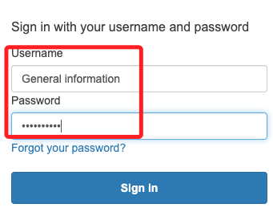

# Task 4：配置 OpenSearch 索引

## 說明

1. 首先，在 Task 3 中複製了 `OpenSearch Dashboards URL (IPv4)` 鏈接。

    

2. 或是搜尋並進入 `Amazon OpenSearch Service`。

3. 然後在左側點擊 `Domains`，接著進入 `os-demo`；同樣就會進入 `General information` 頁面。

4. 在彈窗中使用帳號 `LabUser`、密碼 `Passw0rd1!` 進行登入。

5. 