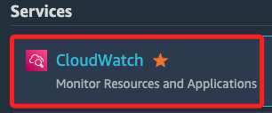
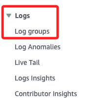
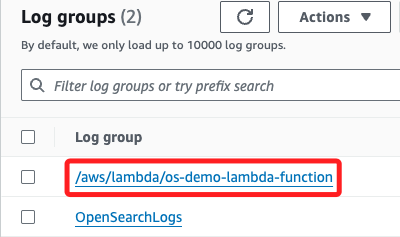
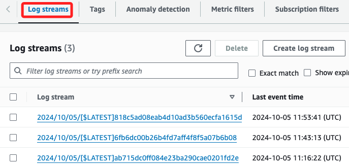
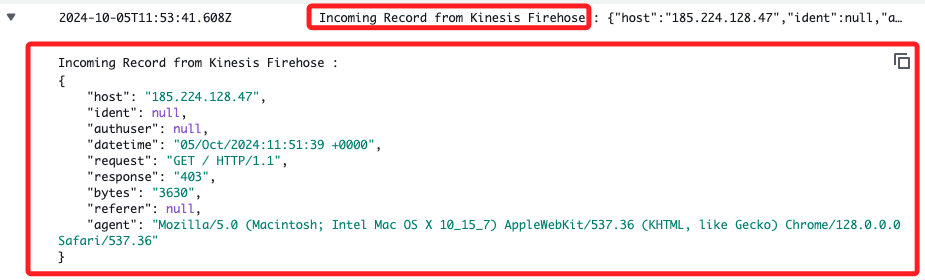
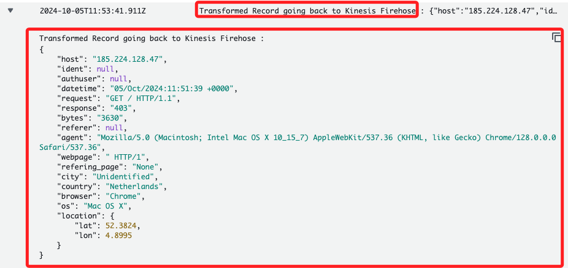
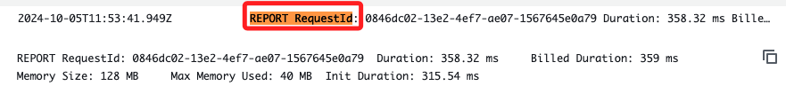

# Task 6：在 CloudWatch 中觀察日誌事件

_接下來的任務是檢視日誌在傳送至 `Kinesis Data Firehose` 並經過 `Lambda` 處理後，所產生的 `CloudWatch Logs` 記錄。在這個 Lab 中，工作流程的事件被合併到名為 `/aws/lambda/aes-demo-lambda-function` 的日誌群組中，並將在此日誌群組中檢視兩個關鍵事件：來自 Kinesis Firehose 的傳入記錄，以及處理後返回 Kinesis Firehose 的轉換記錄。_

 

## 訪問日誌組

1. 進入 `CloudWatch`。

    

 

2. 展開左側的 `Logs` 並點擊 `Log groups`。

    

 

3. 點擊進入其中的 `/aws/lambda/os-demo-lambda-function`。

    

 

4. 可查看下方的 `Log streams`，並任意點擊其中一個。

    

 

5. 展開其中任一前綴為 ` Incoming Record from Kinesis Firehose` 的訊息；可知當 Web 伺服器的存取日誌從 EC2 實例發送並被 Kinesis Data Firehose 接收後，會生成一個 CloudWatch Logs 事件，接著這些存取日誌資料會被傳送至 Lambda，並在 Lambda 函數中進行轉換和處理。

    

 

6. 同樣展開任何一個前綴為 `Transformed Record going back to Kinesis Firehose` 的訊息；顯示一條已被 Lambda 函數轉換後的記錄，準備返回 `Kinesis Firehose`，內容包括一個來自 IP 地址 185.224.128.47 的 HTTP 請求，請求方法為 `GET / HTTP/1.1`，回應狀態碼為 `403`，該請求來自 `荷蘭`，使用 `Chrome` 瀏覽器和 `Mac OS X` 系統，並且包含地理位置的經緯度 `52.3824, 4.8995`。

    

 

7. 最後查看前綴為 `REPORT RequestId` 的任一訊息；訊息提供 `Lambda` 函數執行的詳細報告，顯示請求 ID、執行耗時、函數配置的內存大小、實際使用內存、初始化過程耗時等資訊。

    

 

___

_END_

