# Task 8：創建餅圖可視化

 

## 說明

1. 展開選單，點擊 `Visualize`。

    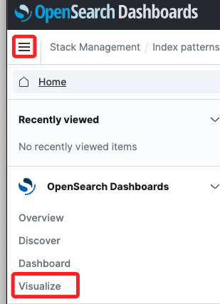

 

2. 點擊 `Create new visualization`。

    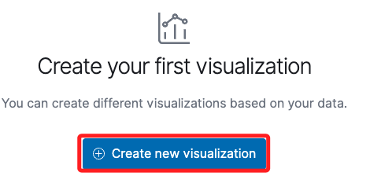

 

3. 選擇餅圖。

    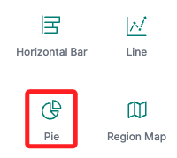

 

4. 點擊 `apache_logs`。

    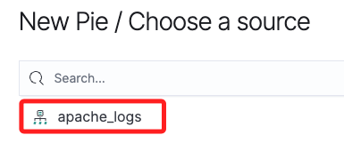

 

5. 右上角這個時間是更新的間隔時間，增加為 `30`；然後點擊 `Update`。

    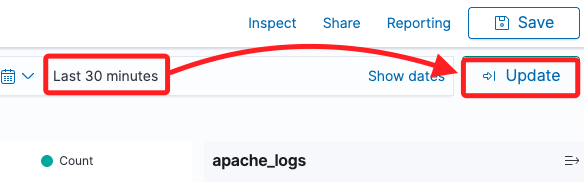

 

## 為網頁建立第一個 Bucket

1. 在右下角 Buckets 區塊中點擊 `+ Add`，然後選擇 `Split slices`。

    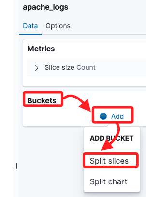

 

2. 依序設定 `Aggregation` 為 `Terms`、`Field` 為 `webpage`、開啟 `Group other values in separate bucket`，其餘採用預設。

    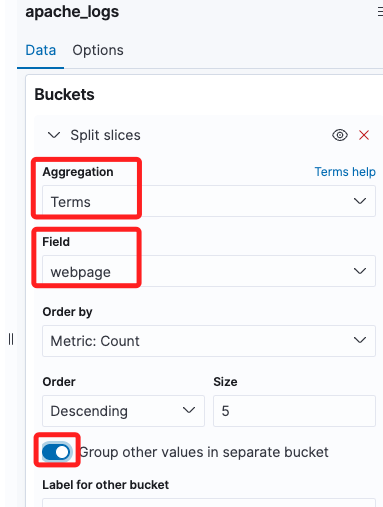

 

3. 滑動到下方，點擊 `+ Add` 再添加一個 Bucket。

    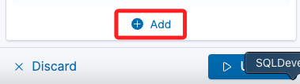

 

4. 重複以上步驟，其中 `Field` 選擇 `browser`，其餘不變，然後點擊 `Update`。

    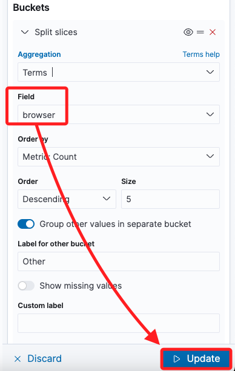

 

5. 這時畫面中央顯示了一個餅圖。

    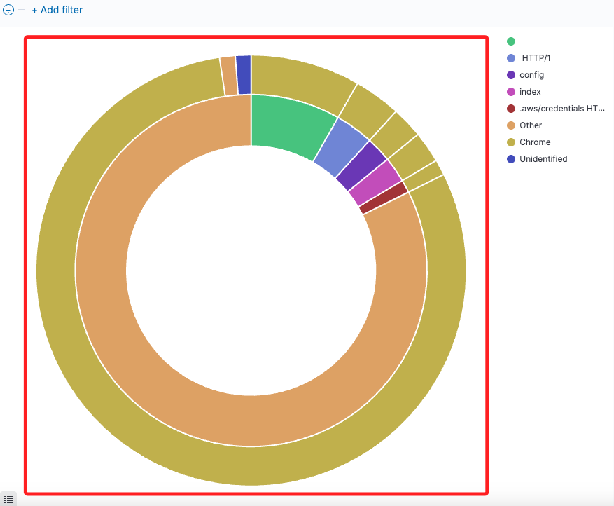

 

## 進階設定

1. 在右側切換到 `Options` 頁籤，進行以下的設定，然後點擊 `Update`。

    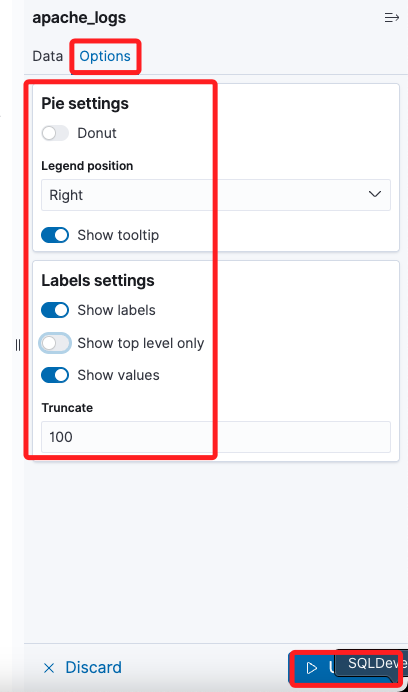

 

2. 顯示如下。

    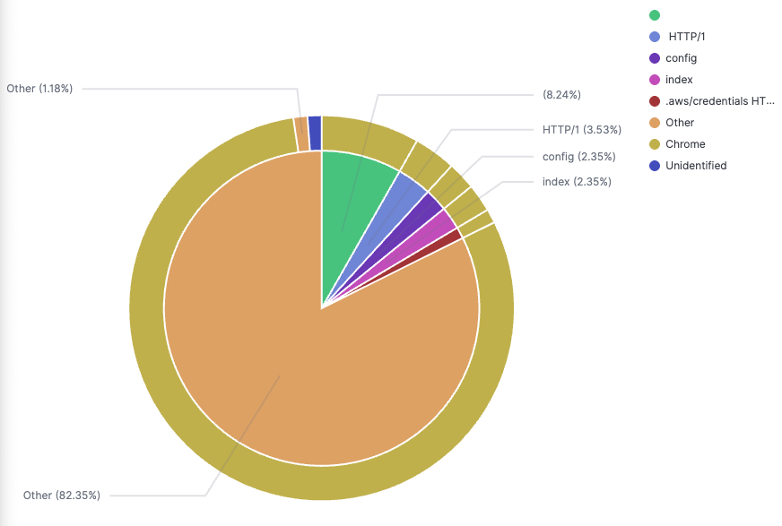

 

## 與圖表互動

1. 可將滑鼠懸停在餅圖的每一部分來查看其中包含的詳細數據，並添加過濾器來僅顯示特定瀏覽器的網頁。

 

2. 還可修改產品篩選條件來包含其他產品，並刪除先前的篩選；最終的餅圖會展示網頁、產品、瀏覽器和操作系統的堆疊數據分析，這樣的圖表能幫助了解網站訪客使用的操作系統和瀏覽器。

 

___

_END_