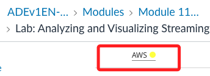
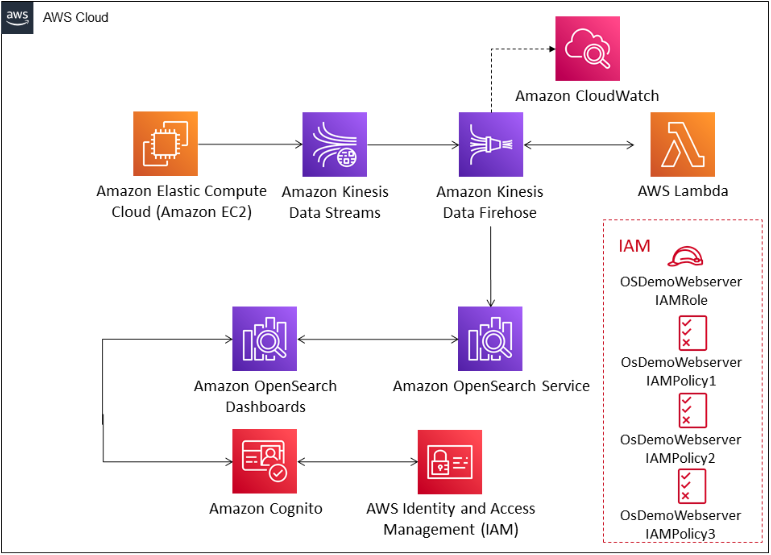
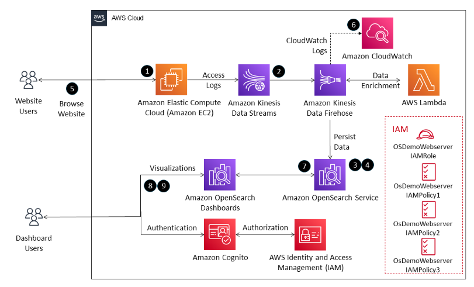
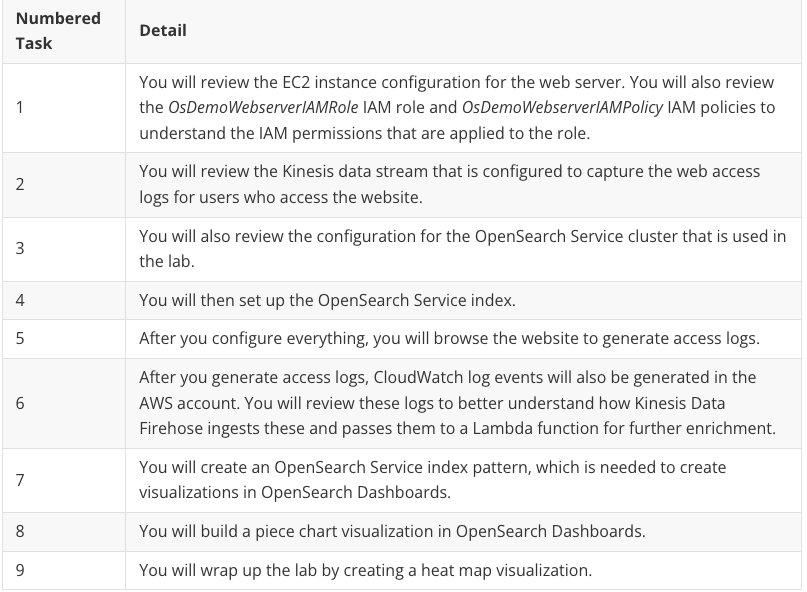
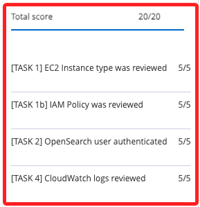

# Lab 介紹

_使用 Kinesis Data Firehose、OpenSearch Service 和 OpenSearch Dashboards 進行串流數據分析與可視化_

 

## 特別提醒

1. 這個 Lab 啟動後一直呈現 `黃燈`，但點擊可以進入，若有其他異狀，將在各 Lab 筆記中作紀錄與說明。

    

 

## 說明

1. 這個 Lab 探討如何處理和分析來自網頁伺服器的實時串流數據，並通過 `OpenSearch Dashboards` 進行數據可視化，將使用 `Amazon Kinesis Data Streams` 從 `EC2` 網頁伺服器收集訪問日誌，並通過 `AWS Lambda` 進行數據處理與增強，最後通過 `OpenSearch Service` 將數據索引，並在 `OpenSearch Dashboards` 上建立可視化報表來進行數據分析。

 

2. 以上這種方法允許企業用戶通過 `Amazon Cognito` 登錄以訪問儀表板，進行即時數據分析，深入了解網站訪客行為。

 

3. 本次 Lab 環境包含下圖所示的資源。

    

 

4. 完成這個 Lab 將會使用以下架構執行多項任務。

    

 

5. 以下表格是與 Lab 架構相關任務的詳細說明。

    

 

## 目標

1. 瞭解並描述 AWS 管理控制台中的實驗基礎設施。

 

2. 將網頁伺服器的訪問日誌數據流入 Amazon Kinesis Data Firehose 和 Amazon OpenSearch Service。

 

3. 使用 CloudWatch 日誌事件觀察數據的收集和轉換過程。

 

4. 在 OpenSearch Service 中建立並索引這些日誌。

 

5. 使用 OpenSearch Dashboards 建立視覺化，如展示操作系統和瀏覽器統計的圓餅圖，以及展示用戶如何到達產品頁面的熱圖。

 

## 完成

 

___

_END_

