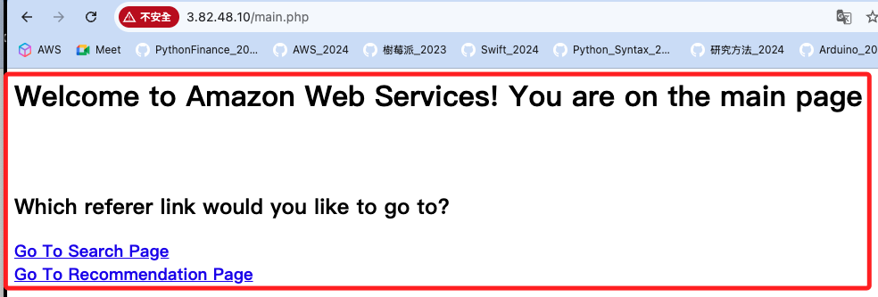

# Task 5：產生Web伺服器存取日誌

_建立索引後，接下來要測試 `基礎架構` 透過 `Kinesis Data Firehose 傳輸流` 將 `Web 伺服器日誌串流` 傳輸到 `OpenSearch 服務` 的能力；開始測試前必須先在 Web 伺服器上產生一些日誌。_

<br>

## 步驟

1. 進入 EC2，複製 `OpenSearch Demo` 的公開 IP。

<br>

2. 替換下列網址的 `<公開-IP>`，然後在瀏覽器中進行訪問。

    ```bash
    http://<公開-IP>/main.php
    ```

<br>

3. 網頁顯示如下；使用多個不同的瀏覽器，或是不同帳號開啟瀏覽器訪問網頁，並進行不同操作；目的是產生不同類型的日誌以便觀察。

    

<br>

___

_END_