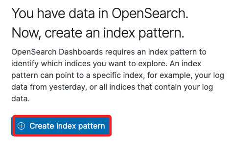
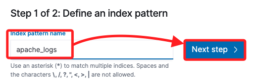
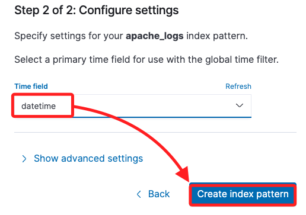
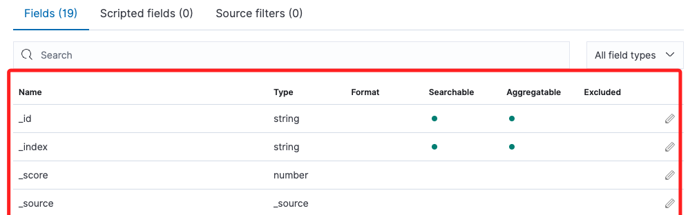

# Task 7：建立 OpenSearch 服務索引模式

 

## 建立索引模式

1. 回到 `OpenSearch` 主控台。

    

 

2. 展開左上角選單，點擊其中的 `Discover`。

    

 

3. 點擊 `Create index pattern`。

    

 

4. 首先輸入名稱 `apache_logs` 並點擊 `Next step`。

    

 

5. 在下拉選單選取 `datatime`，然後點擊右下角的 `Create index pattern`。

    

 

6. `OpenSearch Dashboards` 傳回 `OpenSearch` 服務中記錄的 `欄位` 和 `資料類型` 的列表，並顯示哪些欄位可搜索，如下圖所示。

    

 

___

_END_