# 分析現有資源並載入來源數據

<br>

## 步驟

1. 搜尋並進入。

    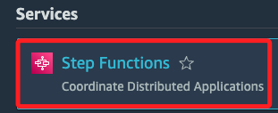

<br>

2. 然後依序開啟以下服務的主控台，每個服務必須在不同頁籤中；這是電腦操作基本技巧，在這不贅述。

    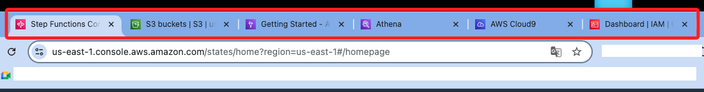

<br>

3. 在 IAM 中搜尋並且進入 `StepLabRole`。

    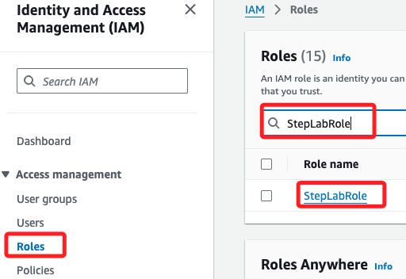

<br>

4. 在 `Permissions` 頁籤中展開並查看政策 `Policy-For-Step`。

    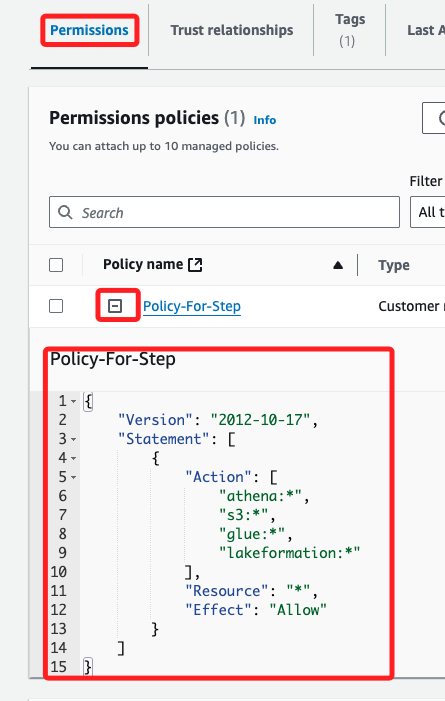

<br>

5. 這個 IAM 政策授權對 Athena、S3、Glue 和 Lake Formation 的所有操作（*）進行完全訪問，這個政策適用於所有資源（*），也就是任何關於這些服務的操作都被允許執行，且不受特定資源的限制。

    ```json
    {
        "Version": "2012-10-17",
        "Statement": [
            {
                "Action": [
                    "athena:*",
                    "s3:*",
                    "glue:*",
                    "lakeformation:*"
                ],
                "Resource": "*",
                "Effect": "Allow"
            }
        ]
    }
    ```

<br>

## 進入 S3

1. 在 Bucket 清單中，選擇前綴為 `gluelab` 的 Bucket。

    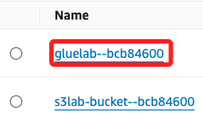

<br>

2. 可先將這個名稱記錄下來，在後續過程中會多次使用到，在這裡是 `gluelab--bcb84600`；特別注意，這在每一次、每個人的 Lab 中都不相同。

    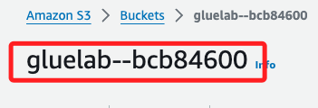

<br>

## 進入 Cloud9

1. 點擊 `Open` 會進入 IDE。

    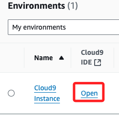

<br>

## 將資料從來源資料集載入到 Bucket

1. 在終端機中運行以下指令，替換其中的 `<Bucket-名稱>`，就是在 S3 中前綴為 `gluelab--` 的名稱。

    ```bash
    mybucket="<FMI_1>"
    echo $mybucket
    ```

    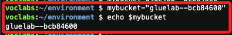

<br>

2. 從 `S3` 指定的 `URL` 下載 `yellow_tripdata_2020-01.csv` 檔案，並將其直接上傳到指定的 `S3 Bucket` 中的 `nyctaxidata/data/` 路徑下，無需將檔案儲存到本地。

    ```bash
    wget -qO- https://aws-tc-largeobjects.s3.us-west-2.amazonaws.com/CUR-TF-200-ACDENG-1/step-lab/yellow_tripdata_2020-01.csv | aws s3 cp - "s3://$mybucket/nyctaxidata/data/yellow_tripdata_2020-01.csv"
    ```

<br>

3. 可前往 S3 查看。

    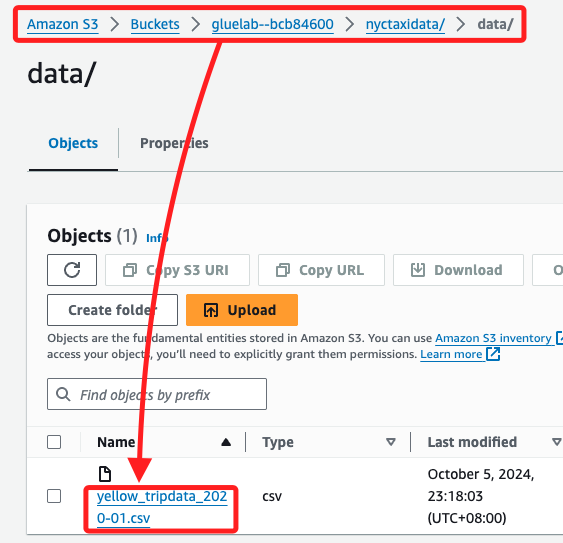

<br>

4. 透過 `wget` 指令從指定的 `URL` 下載名為 `yellow_tripdata_2020-02.csv` 的檔案，並使用管道將下載的內容直接傳輸給 AWS CLI，將此檔案上傳至指定的 `S3 Bucket` 中的路徑 `nyctaxidata/data/yellow_tripdata_2020-02.csv`；這個過程不會在本地儲存檔案，而是將數據直接流式傳輸到 S3 桶，查詢步驟不再贅述。

    ```bash
    wget -qO- https://aws-tc-largeobjects.s3.us-west-2.amazonaws.com/CUR-TF-200-ACDENG-1/step-lab/yellow_tripdata_2020-02.csv | aws s3 cp - "s3://$mybucket/nyctaxidata/data/yellow_tripdata_2020-02.csv"
    ```

<br>

5. 使用 `wget` 命令從指定的遠端 URL 下載 `taxi_zone_lookup.csv` 檔案，並使用管道將下載的內容直接傳輸給 AWS CLI，將該檔案上傳至指定的 Amazon S3 桶中的路徑 `nyctaxidata/lookup/taxi_zone_lookup.csv`。這個過程不會將檔案儲存在本地，而是將數據直接流式傳輸到 S3 桶的 `lookup` 資料夾。

    ```bash
    wget -qO- https://aws-tc-largeobjects.s3.us-west-2.amazonaws.com/CUR-TF-200-ACDENG-1/step-lab/taxi+_zone_lookup.csv | aws s3 cp - "s3://$mybucket/nyctaxidata/lookup/taxi _zone_lookup.csv"
    ```

<br>

## 分析複製資料的結構

_檢查已上傳到 S3 的數據結構_

<br>

1. 使用 AWS 管理控制台或 AWS CLI 檢查 S3 中的資料結構，確認這三個檔案（`yellow_tripdata_2020-01.csv`、`yellow_tripdata_2020-02.csv` 和 `taxi_zone_lookup.csv`）已成功上傳到 S3。

    ```bash
    aws s3 ls s3://$mybucket/nyctaxidata/data/
    aws s3 ls s3://$mybucket/nyctaxidata/lookup/
    ```

    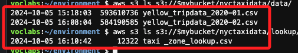

<br>

2. 從 S3 中下載這些檔案來檢查數據結構，確認是否符合在分析中提到的欄位定義。

    ```bash
    aws s3 cp s3://$mybucket/nyctaxidata/data/yellow_tripdata_2020-01.csv .
    aws s3 cp s3://$mybucket/nyctaxidata/data/yellow_tripdata_2020-02.csv .
    aws s3 cp "s3://$mybucket/nyctaxidata/lookup/taxi _zone_lookup.csv" .
    ```

    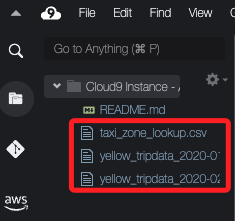

<br>

3. 使用命令列工具如 `cat`、`head` 或 `less` 來查看檔案的前幾行，檢查其結構；檔案的第一行應為欄位名稱。

    ```bash
    head yellow_tripdata_2020-01.csv
    head yellow_tripdata_2020-02.csv
    head "taxi _zone_lookup.csv"
    ```

<br>

## 資料結構分析

1. `taxi_zone_lookup.csv` 該檔案的第一行應定義欄位名稱，表示地區代碼、區域等資料。

    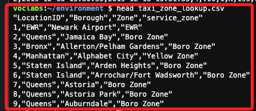

<br>

2. `yellow_tripdata_2020-01.csv` 和 `yellow_tripdata_2020-02.csv` 這兩個檔案的第一行也應該是欄位名稱，定義有關每次出租車行程的詳細資訊。

    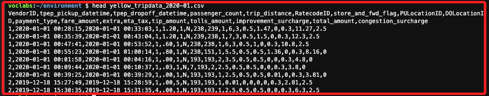

    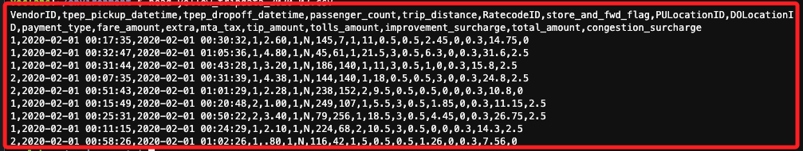

<br>

## 補充

_以下與教程無關，純屬個人筆記，使用 SQL 語句查詢儲存在 S3 中的數據，並進行後續步驟的操作。_

<br>

1. 首先，設置 S3 資料桶名稱為變數，以便在後續命令中使用。

    ```bash
    mybucket=gluelab--bcb84600
    ```

<br>

2. 接下來，在 Athena 中創建 `nyctaxidata` 資料庫。

    ```bash
    aws athena start-query-execution \
    --query-string "CREATE DATABASE nyctaxidata;" \
    --result-configuration OutputLocation=s3://$mybucket/athena/results/
    ```

    _輸出結果_

    ```bash
    {
        "QueryExecutionId": "d4aa5cc6-cb47-4118-8fb5-0c59c8db553a"
    }
    ```

<br>

3. 運行以下 SQL 查詢以創建 Glue 表 `yellow_tripdata_2020_01`，並將其與存儲在 S3 中的數據檔案連接起來。

    ```bash
    aws athena start-query-execution \
    --query-string "CREATE EXTERNAL TABLE nyctaxidata.yellow_tripdata_2020_01 (
        VendorID INT,
        tpep_pickup_datetime STRING,
        tpep_dropoff_datetime STRING,
        passenger_count INT,
        trip_distance DOUBLE,
        RatecodeID INT,
        store_and_fwd_flag STRING,
        PULocationID INT,
        DOLocationID INT,
        payment_type INT,
        fare_amount DOUBLE,
        extra DOUBLE,
        mta_tax DOUBLE,
        tip_amount DOUBLE,
        tolls_amount DOUBLE,
        improvement_surcharge DOUBLE,
        total_amount DOUBLE,
        congestion_surcharge DOUBLE
    )
    ROW FORMAT SERDE 'org.apache.hadoop.hive.serde2.lazy.LazySimpleSerDe'
    WITH SERDEPROPERTIES ('serialization.format' = ',', 'field.delim' = ',')
    LOCATION 's3://$mybucket/nyctaxidata/data/'
    TBLPROPERTIES ('has_encrypted_data'='false');" \
    --result-configuration OutputLocation=s3://$mybucket/athena/results/
    ```

    _輸出結果_：

    ```bash
    {
        "QueryExecutionId": "68adf809-fb34-48c7-b365-db4c5d1adf25"
    }
    ```

<br>

4. 運行以下查詢以查詢 `yellow_tripdata_2020_01` 表中的前 10 筆數據。

    ```bash
    aws athena start-query-execution \
    --query-string "SELECT * FROM nyctaxidata.yellow_tripdata_2020_01 LIMIT 10;" \
    --query-execution-context Database=nyctaxidata \
    --result-configuration OutputLocation=s3://$mybucket/athena/results/
    ```

    _輸出結果_

    ```bash
    {
        "QueryExecutionId": "cf60c2ad-619d-41a3-a7d0-8a9463a55d8d"
    }
    ```

<br>

5. 將生成的查詢執行 ID 存入變數 `QueryExecutionId`。

    ```bash
    QueryExecutionId=cf60c2ad-619d-41a3-a7d0-8a9463a55d8d
    ```

<br>

6. 使用以下命令檢查查詢狀態。

    ```bash
    aws athena get-query-execution --query-execution-id $QueryExecutionId
    ```

<br>

7. 查詢完成後，使用以下命令來獲取查詢結果。

    ```bash
    aws athena get-query-results --query-execution-id $QueryExecutionId
    ```

<br>

___

_END_