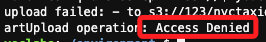
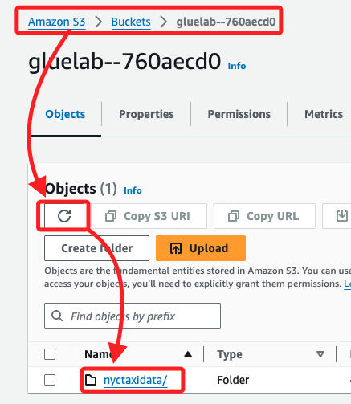

# 分析現有資源並載入來源數據

_[進入 Lab](https://awsacademy.instructure.com/courses/95432/modules/items/8808392)_

<br>

## 步驟

1. 搜尋並進入 `Step Functions`。

    

<br>

2. 然後依序開啟服務 `S3`、`AWS Glue`、`Athena`、`Cloud9`、`IAM` 的主控台，每個服務皆以不同瀏覽器頁面開啟；具體上就是進行搜尋，然後按住 `command` 來點擊服務病開啟瀏覽器，這是電腦操作基本技巧，在這不贅述。

    

<br>

## IAM

1. 在 IAM 的 `Roles` 中搜尋並點擊進入 `StepLabRole`。

    

<br>

2. 進入後，在 `Permissions` 頁籤中展開政策 `Policy-For-Step` 並加以查看。

    

<br>

3. 這個 IAM 政策授權對 `Athena`、`S3`、`Glue` 和 `Lake Formation` 的所有操作（*）進行完全訪問，這個政策適用於所有資源（*），也就是任何關於這些服務的操作都被允許執行，且不受特定資源的限制。

    ```json
    {
        "Version": "2012-10-17",
        "Statement": [
            {
                "Action": [
                    "athena:*",
                    "s3:*",
                    "glue:*",
                    "lakeformation:*"
                ],
                "Resource": "*",
                "Effect": "Allow"
            }
        ]
    }
    ```

<br>

## 進入 S3

1. 在 `Buckets` 清單中，點擊進入前綴為 `gluelab` 的 Bucket。

    

<br>

2. 可先將這個全名記錄下來，在後續過程中會多次使用到，沒記下也沒關係，再次查詢即可，在這裡是 `gluelab--bcb84600`；特別注意，尾綴 `760aecd0` 是自動生成的唯一識別碼，用來確保資源名稱在 AWS 中的唯一性，這在每一次、每個人的 Lab 中都不相同。

    

<br>

## 進入 Cloud9

1. 點擊預設提供實例右側的 `Open` 可進入 IDE。

    

<br>

_將資料從來源資料集載入到 Bucket_

<br>

2. 在終端機中運行以下指令，替換其中的 `<Bucket-名稱>`，就是在 S3 中前綴為 `gluelab--` 的名稱；特別注意，在終端機輸入字串時，除非有空格等字元，否則是否使用引號包覆皆可。

    ```bash
    mybucket=<ucket-名稱>
    echo $mybucket
    ```

    

<br>

3. 運行以下指令，從 `S3` 指定的 `URL` 下載 `yellow_tripdata_2020-01.csv` 檔案，並將其直接上傳到指定的 `S3 Bucket` 中的 `nyctaxidata/data/` 路徑下，無需將檔案儲存到本地；這約略需要 `20` 秒時間，傳輸過程中命令行會鎖住。

    ```bash
    wget -qO- https://aws-tc-largeobjects.s3.us-west-2.amazonaws.com/CUR-TF-200-ACDENG-1/step-lab/yellow_tripdata_2020-01.csv | aws s3 cp - "s3://$mybucket/nyctaxidata/data/yellow_tripdata_2020-01.csv"
    ```

<br>

4. 假如前面步驟輸入的 `Bucket` 名稱有誤，則可能得到 `Access Denied` 的回應。

    

<br>

5. 完成後不會顯示提示，僅會出現新的命令行，切換到 S3 瀏覽頁面查看，點擊進入 `Buckets` 清單中，並點擊正確的對象進入，然後先點擊刷新，就會看到這個資料夾 `nyctaxidata`。

    

<br>

6. 完整路徑如下 `Amazon S3 > Buckets > gluelab--760aecd0 > nyctaxidata > data > 文件名稱`。

    

<br>

7. 與前面步驟使用相同指令來下載 `yellow_tripdata_2020-02.csv` 檔案。

    ```bash
    wget -qO- https://aws-tc-largeobjects.s3.us-west-2.amazonaws.com/CUR-TF-200-ACDENG-1/step-lab/yellow_tripdata_2020-02.csv | aws s3 cp - "s3://$mybucket/nyctaxidata/data/yellow_tripdata_2020-02.csv"
    ```

<br>

8. 再次使用相同指令來下載 `taxi_zone_lookup.csv` 檔案，與前面不同的是存放在子資料夾 `lookup` 中。

    ```bash
    wget -qO- https://aws-tc-largeobjects.s3.us-west-2.amazonaws.com/CUR-TF-200-ACDENG-1/step-lab/taxi+_zone_lookup.csv | aws s3 cp - "s3://$mybucket/nyctaxidata/lookup/taxi _zone_lookup.csv"
    ```

<br>

9. 補充說明 `wget` 指令的參數 `-qO-`，其中 `-q` 表示 `安靜模式`，即不顯示下載進度等信息，而 `-O-` 是將下載文件的內容直接輸出到標準輸出，標準輸出是程序的輸出數據流，預設會顯示在終端，但在這裡它通過管道符號 `|` 傳遞給其他命令進行處理，因此不會將內容保存到本地文件。在這種情況下，下載的文件內容通過管道符號 `|` 被傳遞給 `aws s3 cp` 命令，並將內容上傳到指定的 S3 路徑，實現即時下載和上傳的流程，而不需要暫存到本地磁碟；另外，參數若使用 `-O` 表示將下載的內容寫到指定的文件，單個破折號 `-` 在這裡代表的就是 `標準輸出`。

<br>

## 分析複製資料的結構

_檢查已上傳到 S3 的數據結構_

<br>

1. 使用 AWS 管理控制台或 AWS CLI 檢查 S3 中的資料結構，確認這三個檔案（`yellow_tripdata_2020-01.csv`、`yellow_tripdata_2020-02.csv` 和 `taxi_zone_lookup.csv`）已成功上傳到 S3。

    ```bash
    aws s3 ls s3://$mybucket/nyctaxidata/data/
    aws s3 ls s3://$mybucket/nyctaxidata/lookup/
    ```

    

<br>

2. 從 S3 中下載這些檔案來檢查數據結構，確認是否符合在分析中提到的欄位定義。

    ```bash
    aws s3 cp s3://$mybucket/nyctaxidata/data/yellow_tripdata_2020-01.csv .
    aws s3 cp s3://$mybucket/nyctaxidata/data/yellow_tripdata_2020-02.csv .
    aws s3 cp "s3://$mybucket/nyctaxidata/lookup/taxi _zone_lookup.csv" .
    ```

    

<br>

3. 使用命令列工具如 `cat`、`head` 或 `less` 來查看檔案的前幾行，檢查其結構；檔案的第一行應為欄位名稱。

    ```bash
    head yellow_tripdata_2020-01.csv
    head yellow_tripdata_2020-02.csv
    head "taxi _zone_lookup.csv"
    ```

<br>

## 資料結構分析

1. `taxi_zone_lookup.csv` 該檔案的第一行應定義欄位名稱，表示地區代碼、區域等資料。

    

<br>

2. `yellow_tripdata_2020-01.csv` 和 `yellow_tripdata_2020-02.csv` 這兩個檔案的第一行也應該是欄位名稱，定義有關每次出租車行程的詳細資訊。

    

    

<br>

## 補充

_以下與教程無關，純屬個人筆記，使用 SQL 語句查詢儲存在 S3 中的數據，並進行後續步驟的操作。_

<br>

1. 首先，設置 S3 資料桶名稱為變數，以便在後續命令中使用。

    ```bash
    mybucket=gluelab--bcb84600
    ```

<br>

2. 接下來，在 Athena 中創建 `nyctaxidata` 資料庫。

    ```bash
    aws athena start-query-execution \
    --query-string "CREATE DATABASE nyctaxidata;" \
    --result-configuration OutputLocation=s3://$mybucket/athena/results/
    ```

    _輸出結果_

    ```bash
    {
        "QueryExecutionId": "d4aa5cc6-cb47-4118-8fb5-0c59c8db553a"
    }
    ```

<br>

3. 運行以下 SQL 查詢以創建 Glue 表 `yellow_tripdata_2020_01`，並將其與存儲在 S3 中的數據檔案連接起來。

    ```bash
    aws athena start-query-execution \
    --query-string "CREATE EXTERNAL TABLE nyctaxidata.yellow_tripdata_2020_01 (
        VendorID INT,
        tpep_pickup_datetime STRING,
        tpep_dropoff_datetime STRING,
        passenger_count INT,
        trip_distance DOUBLE,
        RatecodeID INT,
        store_and_fwd_flag STRING,
        PULocationID INT,
        DOLocationID INT,
        payment_type INT,
        fare_amount DOUBLE,
        extra DOUBLE,
        mta_tax DOUBLE,
        tip_amount DOUBLE,
        tolls_amount DOUBLE,
        improvement_surcharge DOUBLE,
        total_amount DOUBLE,
        congestion_surcharge DOUBLE
    )
    ROW FORMAT SERDE 'org.apache.hadoop.hive.serde2.lazy.LazySimpleSerDe'
    WITH SERDEPROPERTIES ('serialization.format' = ',', 'field.delim' = ',')
    LOCATION 's3://$mybucket/nyctaxidata/data/'
    TBLPROPERTIES ('has_encrypted_data'='false');" \
    --result-configuration OutputLocation=s3://$mybucket/athena/results/
    ```

    _輸出結果_：

    ```bash
    {
        "QueryExecutionId": "68adf809-fb34-48c7-b365-db4c5d1adf25"
    }
    ```

<br>

4. 運行以下查詢以查詢 `yellow_tripdata_2020_01` 表中的前 10 筆數據。

    ```bash
    aws athena start-query-execution \
    --query-string "SELECT * FROM nyctaxidata.yellow_tripdata_2020_01 LIMIT 10;" \
    --query-execution-context Database=nyctaxidata \
    --result-configuration OutputLocation=s3://$mybucket/athena/results/
    ```

    _輸出結果_

    ```bash
    {
        "QueryExecutionId": "cf60c2ad-619d-41a3-a7d0-8a9463a55d8d"
    }
    ```

<br>

5. 將生成的查詢執行 ID 存入變數 `QueryExecutionId`。

    ```bash
    QueryExecutionId=<前步驟查詢結果-ID>
    ```

<br>

6. 使用以下命令檢查查詢狀態。

    ```bash
    aws athena get-query-execution --query-execution-id $QueryExecutionId
    ```

<br>

7. 查詢完成後，使用以下命令來獲取查詢結果。

    ```bash
    aws athena get-query-results --query-execution-id $QueryExecutionId
    ```

<br>

___

_END_