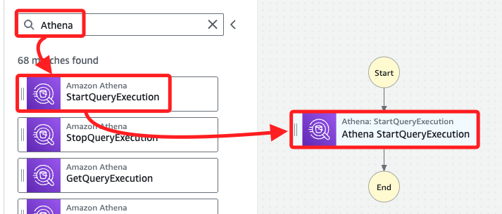
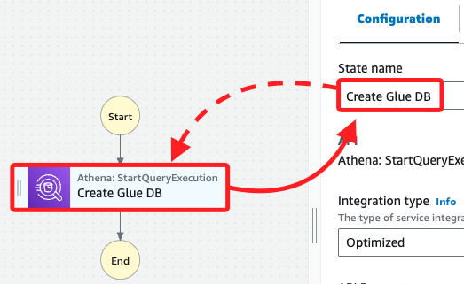
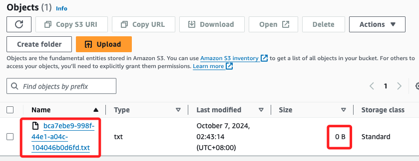
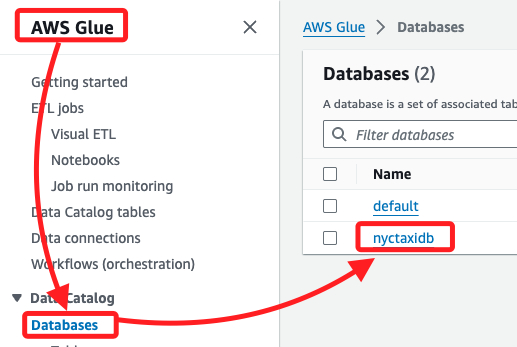

# 建立自動化工作流程

_使用 `Step Functions` 工作流來透過 Athena 檢查 AWS Glue 資料庫是否存在，若資料庫不存在，則自動建立該資料庫。_

<br>

## 建立工作流

1. 進入 `Step Functions` 主控台。

    

<br>

2. 選取 `State machines`，然後點擊 `Create state machine`。

    

<br>

3. 會跳出彈窗顯示範本，特別注意，這裡要點擊 `Cancel` 進入 `Workflow Studio`。

    

<br>

4. 在 `Actions` 頁籤中，在上方搜尋框輸入 `Athena`；這是無伺服器查詢服務，可使用標準 SQL 查詢儲存在 S3 中的數據。

    

<br>

5. 輸入後會自動更新下方選項，將 `StartQueryExecution` 任務拖曳至 `Start` 和 `End` 之間。

    

<br>

6. 在右側的 `Inspector` 面板中，將 `State name` 設為 `Create Glue DB`。

    

<br>

7. 將 `API Parameters` 更新為以下 JSON，並替換其中的 `<替換自己的-S3-Bucket-名稱>` 為前面查詢的 S3 Bucket 名稱。

    ```json
    {
        "QueryString": "CREATE DATABASE if not exists nyctaxidb",
        "WorkGroup": "primary",
        "ResultConfiguration": {
            "OutputLocation": "s3://<替換自己的-S3-Bucket-名稱>/athena/"
        }
    }
    ```

    

<br>

8. 勾選 `Wait for task to complete`，確保在 Athena 完成資料庫建立或檢查後才進行下一步；`Next state` 保持預設的 `Go to end`；然後點擊 `Create` 建立工作流。

    

<br>

9. 在右下角按鍵中，點擊 `View role configuration`；切記不要點擊 `Confirm`，否則會出現權限警告。

    

<br>

## 設定與測試工作流

1. 在 `State machine name` 中輸入 `WorkflowPOC`，然後在 `Execution role` 中選擇角色 `StepLabRole`。

    

<br>

2. 完成設定後點擊右上角的 `Create`；之後要稍作等待。

    

<br>

## 運行工作流

1. 先點擊 `Execute`，這會開啟新的瀏覽頁面。

    

<br>

2. 命名為 `TaskTwoTest`，然後點擊右下角 `Start execution` 開始運行工作流。

    

<br>

3. 工作流運行後，初始狀態會顯示 `In progress`，圖框為藍色。

    

<br>

4. 等待數分鐘直到 `Create Glue DB` 步驟變為綠色，表示任務成功完成，狀態為 `Successed`。

    

<br>

## 驗證結果

1. 在 S3 主控台中，檢查前綴為 `gluelab--` 的 Bucket 是否生成了新的 `athena` 資料夾；資料夾中應包含一個大小為 `0 B` 的空白檔案，表示 Athena 查詢成功執行。

    

<br>

2. 在 Glue 主控台中，進入 `Databases`，檢查是否已成功建立 `nyctaxidb` 資料庫。

    

<br>

3. 可點擊 `nyctaxidb` 進入查看，顯示當前資料庫中沒有任何表；以上成功建立 AWS Glue 資料庫 `nyctaxidb`，並透過 `Step Functions` 自動化了這一過程，後續任務將擴展此工作流以自動建立表。

    

<br>

___

_END_