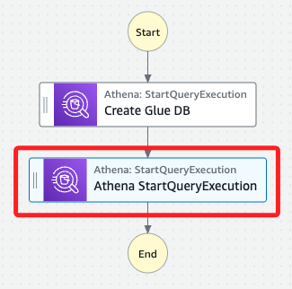

# Task 3：建立任務以檢查 AWS Glue 資料庫中是否存在表

_延續前面步驟，更新工作流，使其能夠檢查剛創建的 AWS Glue 資料庫中是否存在表_

## 新增檢查表的任務

1. 進入 `Step Functions` 主控台，選擇 `WorkflowPOC` 狀態機，然後點擊 `Edit`。


2. 同樣在 `Actions` 面板中搜尋 `Athena`，然後再拖曳一個 `StartQueryExecution` 任務到 `Create Glue DB` 和 `End` 兩個任務之間。



## 配置任務並保存更改

1. 選取新增的 `StartQueryExecution` 任務，在右側面板中，將 `State name` 改為 `Run Table Lookup`。

2. 編輯預設 JSON 代碼，使用以下代碼並替換其中 `<自己的-S3-Bucket-名稱>` 的字串，這部分與前面步驟相同，包含勾選 `Wait for task to complete`、保持 `Next state` 為 `Go to end`，然後點擊右上角的 `Save`，細節不贅述。

    ```json
    {
        "QueryString": "show tables in nyctaxidb",
        "WorkGroup": "primary",
        "ResultConfiguration": {
        "OutputLocation": "s3://<自己的-S3-Bucket-名稱>/athena/"
        }
    }
    ```

3. 。

#### 步驟 3：確認定義並保存狀態機

1. 確認工作流定義的 JSON 應該與以下類似：
   ```json
   {
     "Comment": "A description of my state machine",
     "StartAt": "Create Glue DB",
     "States": {
       "Create Glue DB": {
         "Type": "Task",
         "Resource": "arn:aws:states:::athena:startQueryExecution.sync",
         "Parameters": {
           "QueryString": "CREATE DATABASE if not exists nyctaxidb",
           "WorkGroup": "primary",
           "ResultConfiguration": {
             "OutputLocation": "s3://<your-gluelab-bucket-name>/athena/"
           }
         },
         "Next": "Run Table Lookup"
       },
       "Run Table Lookup": {
         "Type": "Task",
         "Resource": "arn:aws:states:::athena:startQueryExecution.sync",
         "Parameters": {
           "QueryString": "show tables in nyctaxidb",
           "WorkGroup": "primary",
           "ResultConfiguration": {
             "OutputLocation": "s3://<your-gluelab-bucket-name>/athena/"
           }
         },
         "End": true
       }
     }
   }
   ```
2. 當系統提示 IAM 角色可能需要新權限時，選擇 Save anyway 以保存更改。

#### 步驟 4：測試更新的工作流

1. 點擊 Execute，在 Name 欄位中輸入 TaskThreeTest，然後選擇 Start execution。
2. 觀察每個任務的狀態從白色變為藍色再變為綠色，這表示任務成功完成。
3. 在 Events history 部分，可以查看每個任務的執行狀態和執行時間。

#### 步驟 5：檢查結果

1. 工作流完成後，選擇 Run Table Lookup 任務，然後在右側的 Details 面板中點擊 Output 標籤，找到生成的 QueryExecutionId，這會在下一個任務中使用。
2. 在 S3 主控台中，進入 gluelab 資料桶並選擇 athena 資料夾，注意到新生成的文件（可能需要刷新頁面以顯示）。
3. 雖然 `.txt` 文件是空的，但有一個新的元數據文件，AWS Glue 會在內部使用該元數據文件。

### 結論
在這個任務中，你成功更新了工作流，添加了檢查 AWS Glue 資料庫中是否存在表的任務。這是一個關鍵步驟，未來會繼續添加創建表的工作流步驟。