# Task 3：建立任務以檢查 AWS Glue 資料庫中是否存在表

_延續前面步驟，更新工作流，使其能夠檢查剛建立的 AWS Glue 資料庫中是否存在表_

<br>

## 新增檢查表的任務

1. 回到 `Step Functions` 主控台的狀態機清的中，選取前面步驟建立的狀態機 `WorkflowPOC`，然後點擊 `Edit`。

    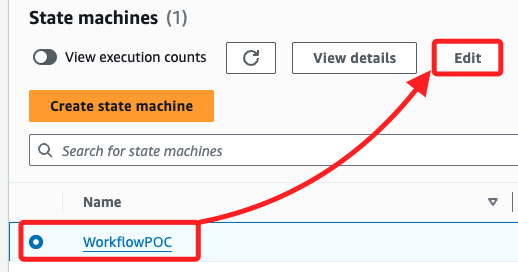

<br>

2. 同樣在 `Actions` 面板中搜尋 `Athena`，然後再拖曳一個 `StartQueryExecution` 任務到 `Create Glue DB` 和 `End` 兩個任務之間。

    

<br>

## 配置任務並保存更改

1. 點擊新增的 `StartQueryExecution` 任務，在右側面板中，將 `State name` 改為 `Run Table Lookup`。

    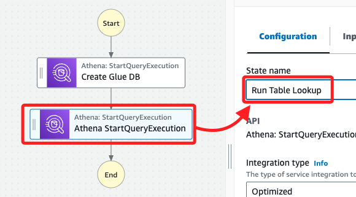

<br>

2. 編輯預設 JSON 代碼，使用以下代碼並替換其中 `<自己的-S3-Bucket-名稱>` 的字串。

    ```json
    {
        "QueryString": "show tables in nyctaxidb",
        "WorkGroup": "primary",
        "ResultConfiguration": {
            "OutputLocation": "s3://<自己的-S3-Bucket-名稱>/athena/"
        }
    }
    ```

<br>

3. 接下來的操作與前面步驟相同，先勾選 `Wait for task to complete`、保持 `Next state` 為 `Go to end`，然後點擊右上角的 `Save`。

    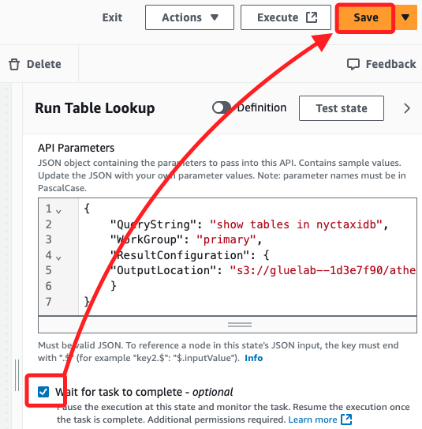

<br>

## 確認定義並保存狀態機

1. 切換上方頁籤到 `{} Code`。

    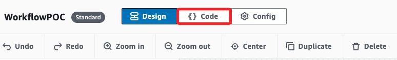

<br>

2. 確認工作流定義的 JSON 內容如下，其中 `<自己的-S3-Bucket-名稱>` 就是 `S3 Bucket` 的名稱。

    ```json
    {
        "Comment": "A description of my state machine",
        "StartAt": "Create Glue DB",
        "States": {
            "Create Glue DB": {
                "Type": "Task",
                "Resource": "arn:aws:states:::athena:startQueryExecution.sync",
                "Parameters": {
                    "QueryString": "CREATE DATABASE if not exists nyctaxidb",
                    "WorkGroup": "primary",
                    "ResultConfiguration": {
                        "OutputLocation": "s3://<自己的-S3-Bucket-名稱>/athena/"
                    }
                },
                "Next": "Run Table Lookup"
            },
            "Run Table Lookup": {
                "Type": "Task",
                "Resource": "arn:aws:states:::athena:startQueryExecution.sync",
                "Parameters": {
                    "QueryString": "show tables in nyctaxidb",
                    "WorkGroup": "primary",
                    "ResultConfiguration": {
                        "OutputLocation": "s3://<自己的-S3-Bucket-名稱>/athena/"
                    }
                },
                "End": true
            }
        }
    }
    ```

<br>

3. 當系統提示 IAM 角色可能需要新權限時，選擇 `Save anyway` 以保存更改。

<br>

## 測試更新的工作流

1. 與之前步驟相同，點擊右上方 `Execute` 開啟新的頁面，在 `Name` 欄位中輸入 `TaskThreeTest`，然後選擇 `Start execution`。

    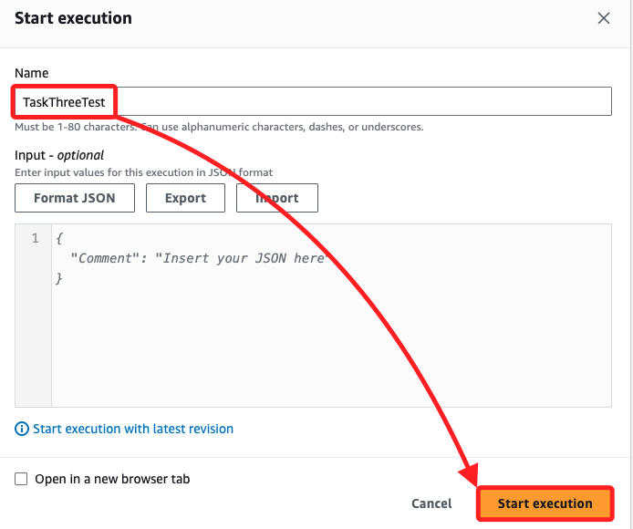

<br>

2. 每個任務的狀態從白色開始然後變為藍色，任務成功完成時會變為綠色，稍作等待。

    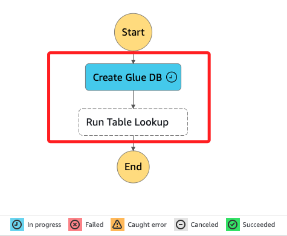

<br>

3. 全部顯示綠色表示完成，可觀察下方 `Events` 中的任務詳情。

    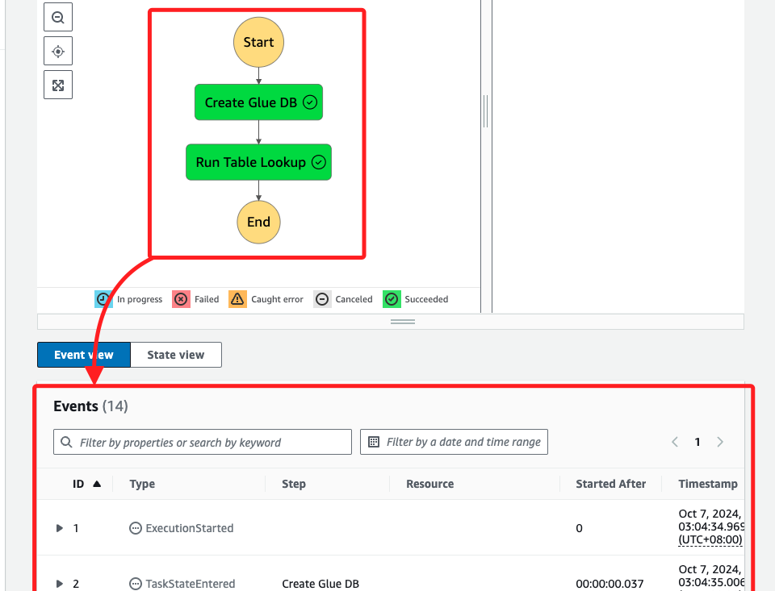

<br>

## 檢查結果

1. 在 `Graph view` 中，點擊任務 `Run Table Lookup`，然後在右側的面板中切換到 `State output` 頁籤，接著在下方的 JSON 文件中找到 Key 為 `QueryExecutionId` 的部分，複製這個值如圖中的 `20c4b956-6577-44f6-b4de-533c87e884b5`，在下一個任務中會需要使用。

    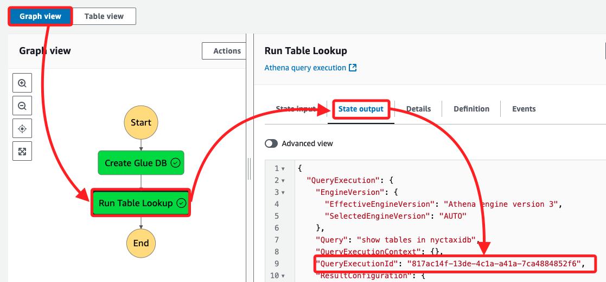

<br>

1. 進入 S3 主控台 `gluelab` Bucket 的 athena 資料夾，刷新後可發現新生成了文件。

    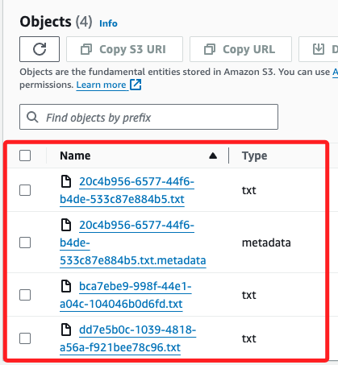

<br>

3. 其中的 `metadata` 已有部分數據，而其他 `.txt` 文件仍是空的。

    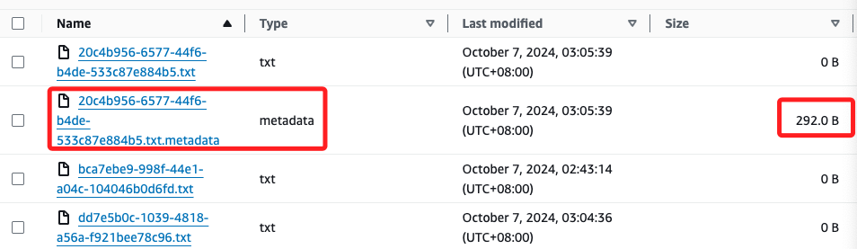

<br>

## 使用 Cloud9 查看

1. 可進入 Cloud9 運行指令查看，從輸出可知，這是經過編碼或加密的數據，而不是可讀的文本格式，是 AWS Athena 或 Glue 執行任務時生成的內部元數據；關於路徑的輸入，可在 S3 服務中查詢，不再贅述。

    ```bash
    aws s3 cp s3://<替換-S3-gluelab-名稱>/athena/<替換為-metadata-名稱> - | cat
    ```

    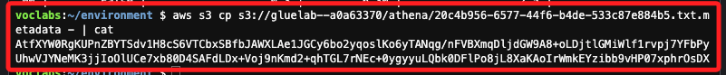

<br>

___

_END_