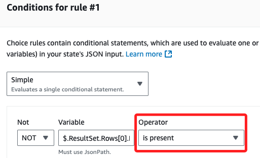
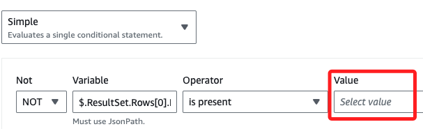
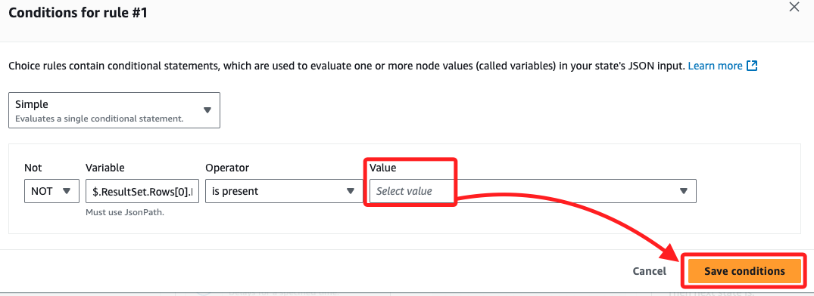
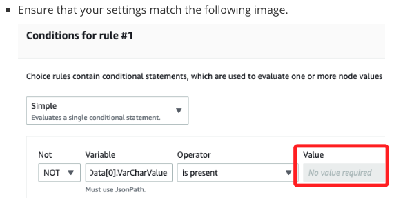

# Task 4：根據 AWS Glue 表是否存在向工作流程新增路由邏輯

_在工作流中添加 _判斷 Glue 中是否存在資料庫表的邏輯_，並依此決定工作流的路徑；這個 Task 會使用到前一個步驟中 `Run Table Lookup` 返回的 ID，並基於結果進行不同的流程選擇。_

<br>

## 更新工作流以查詢結果

1. 在 `Step Functions` 主控台中選擇 `WorkflowPOC` 狀態機，點擊 `Edit` 進行編輯。

    

<br>

2. 在 `Actions` 面板中，搜尋 `Athena`，將 `GetQueryResults` 任務拖到 `Run Table Lookup` 和 `End` 兩個任務之間；特別注意，不要使用 `GetQueryExecution` 任務。

    

<br>

## 配置 GetQueryResults 任務

1. 選擇剛加入的任務 `GetQueryResults`，在右側 `Inspector` 面板中，將 `State name` 改為 `Get lookup query results`。

    

<br>

2. 將 API Parameters 替換為以下代碼，這會傳遞前一個任務的查詢執行 ID 作為輸入。

    ```json
    {
        "QueryExecutionId.$": "$.QueryExecution.QueryExecutionId"
    }
    ```

<br>

3. 特別注意，這次無需勾選 `Wait for task to complete`，因為這個任務不需要內部輪詢結果，可先進行 `Save`；然後點擊上方頁籤切換到 `{ } Code`。

    

<br>

4. 確認 JSON 定義如下，並檢查其中 `<替換-S3-Bucket-名稱>` 是否自動填入正確的名稱；確認無誤點擊右上角 `Save`。

    ```json
    {
        "Comment": "A description of my state machine",
        "StartAt": "Create Glue DB",
        "States": {
            "Create Glue DB": {
                "Type": "Task",
                "Resource": "arn:aws:states:::athena:startQueryExecution.sync",
                "Parameters": {
                    "QueryString": "CREATE DATABASE if not exists nyctaxidb",
                    "WorkGroup": "primary",
                        "ResultConfiguration": {
                            "OutputLocation": "s3://<替換-S3-Bucket-名稱>/athena/"
                        }
                },
                "Next": "Run Table Lookup"
            },
            "Run Table Lookup": {
                "Type": "Task",
                "Resource": "arn:aws:states:::athena:startQueryExecution.sync",
                "Parameters": {
                    "QueryString": "show tables in nyctaxidb",
                    "WorkGroup": "primary",
                    "ResultConfiguration": {
                        "OutputLocation": "s3://<替換-S3-Bucket-名稱>/athena/"
                    }
                },
                "Next": "Get lookup query results"
            },
            "Get lookup query results": {
                "Type": "Task",
                "Resource": "arn:aws:states:::athena:getQueryResults",
                "Parameters": {
                    "QueryExecutionId.$": "$.QueryExecution.QueryExecutionId"
                },
                "End": true
            }
        }
    }
    ```

<br>

## 添加選擇狀態

1. 切換回到 `Design`。

    

<br>

2. 將 `Actions` 頁籤切換到 `Flow`。

    

<br>

3. 將 `Choice` 狀態拖到 `Get lookup query results` 與 `End` 任務之間。

    

<br>

4. 選中 `Choice`，將 `State name` 更改為 `ChoiceStateFirstRun`。

    

<br>

5. 在右側的 `Choice Rules` 區塊中，點擊 `Rule #1` 右側的 `edit` 圖標。

    

<br>

6. 接著點擊 `Add conditions`。

    

<br>

7. 在彈窗中，保持預設的 `Simple`。

    

<br>

8. 在下方的 `Not` 下拉選單中，設為 `NOT`。

    

<br>

9. 在 `Variable` 欄位中輸入以下語句。

    ```bash
    $.ResultSet.Rows[0].Data[0].VarCharValue
    ```

<br>

10. `Operator` 選擇 `is present`；

    

<br>

## 特別注意接下來的步驟

1. 在 `Value` 的部分與教程顯示的並不相同，這裡提示要 `Select Value`。

    

<br>

2. 此時若直接點擊 `Save conditions` 很可能會自動帶入值，這裡先按照官網教程操作，若有錯誤再回來處理；點擊右下角 `Save conditions`。

    

<br>

3. 再次點擊 `Edit` 進入查看。

    

<br>

4. 可先任意選其他的 Operator。

    

<br>

5. 然後再點選一次 `is present`，並確認 `Value` 的值是空的，然後再點擊一次右下角 `Save conditions`。

    

<br>

6. 假如依舊出錯，可以將其設定為 `true` 試試。

    

<br>

## 添加兩個 Pass 狀態

_回到工作流_

<br>

1. 在 `ChoiceStateFirstRun` 狀態的左側是一個標記為 `not...` 的方塊，在沿著箭頭下的方塊中，拖動並加入一個 `Pass` 狀態。

    

<br>

2. 在右側將 `State name` 設為 `REPLACE ME TRUE STATE`；特別注意，這是一個臨時名稱，稍後會更新。

    

<br>

3. 在 `ChoiceStateFirstRun` 狀態的右側是一個標記為 `Default` 的方塊，與前一個步驟相同，在沿著箭頭下的方塊中拖曳並加入另一個 `Pass` 狀態，然後將 `State name` 設為 `REPLACE ME FALSE STATE`。

    

<br>

4. 稍作檢查目前的工作流畫布是否如下，確認無誤即可點擊右上角 `Save`。

    

<br>

## 邏輯解釋

1. 當工作流執行並且 `Get lookup query results` 任務完成後，`ChoiceStateFirstRun` 狀態將根據最後一次查詢的結果進行評估；如果查詢未找到表（根據 `$.ResultSet.Rows[0].Data[0].VarCharValue` 邏輯判斷），則工作流將沿 `REPLACE ME TRUE STATE` 路徑進行，在後續任務中會替換此狀態來建立表。

<br>

2. 如果查詢找到了表，則工作流將沿 `REPLACE ME FALSE STATE` 路徑進行，稍後將此狀態替換為檢查新數據（如 2 月的出租車數據）並將其插入到現有的表中。

<br>

3. 至此，這個任務完成在工作流中加入了一個選擇狀態，用來評估查詢結果並根據表的存在性決定下一步的工作流路徑，後續將會替換這些臨時狀態以執行具體操作。

<br>

___

_END_