# Task 5：為 Yellow Taxi 數據建立 AWS Glue 表

_任務目的是在工作流程中加入邏輯，以在 `Glue` 資料庫中建立表，當資料庫中不存在表時進行該操作。_

## 新增 Athena StartQueryExecution 任務以建立表

1. 切換回到 `Actions` 頁籤，搜尋 `Athena`，將 `StartQueryExecution` 任務拖曳到 `ChoiceStateFirstRun` 與 `REPLACE ME TRUE STATE` 之間；特別注意，拖曳過程中無需理會提示藍線是否顯示於 `not ... 方塊` 之上，完成如下。

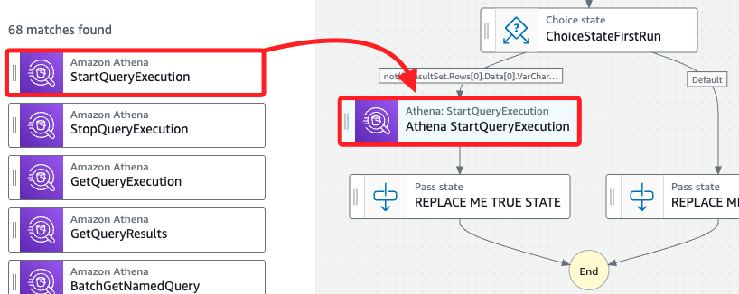

2. 接著選取新加入的任務 `StartQueryExecution`，在右側 `State name` 框中寫入新的名稱 `Run Create data Table Query`，保持下方 `Integration type` 為 `Optimized`。

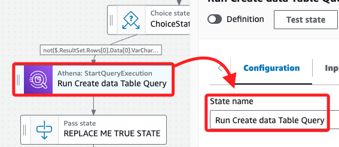

3. 修改 `API Parameters` 預設 JSON 的內容如下，並替換 `<替換-S3-Bucket-名稱>` 為實際的 S3 Bucket名稱。

    ```json
    {
        "QueryString": "CREATE EXTERNAL TABLE nyctaxidb.yellowtaxi_data_csv(  vendorid bigint,   tpep_pickup_datetime string,   tpep_dropoff_datetime string,   passenger_count bigint,   trip_distance double,   ratecodeid bigint,   store_and_fwd_flag string,   pulocationid bigint,   dolocationid bigint,   payment_type bigint,   fare_amount double,   extra double,   mta_tax double,   tip_amount double,   tolls_amount double,   improvement_surcharge double,   total_amount double,   congestion_surcharge double) ROW FORMAT DELIMITED   FIELDS TERMINATED BY ',' STORED AS INPUTFORMAT   'org.apache.hadoop.mapred.TextInputFormat' OUTPUTFORMAT   'org.apache.hadoop.hive.ql.io.HiveIgnoreKeyTextOutputFormat' LOCATION  's3://<替換-S3-Bucket-名稱>/nyctaxidata/data/' TBLPROPERTIES (  'skip.header.line.count'='1')",
        "WorkGroup": "primary",
        "ResultConfiguration": {
            "OutputLocation": "s3://<替換-S3-Bucket-名稱>/athena/"
        }
    }
    ```

4. 因為 API Parameters 輸入框並不會自動換行，所以僅會顯示如下，可向右滑動進行修改與查看；這個查詢會使用 `Athena` 的 `CREATE EXTERNAL TABLE` 語句建立一個指向 `S3 Bucket` 的 `Glue` 表，定義了數據的列和數據類型。

    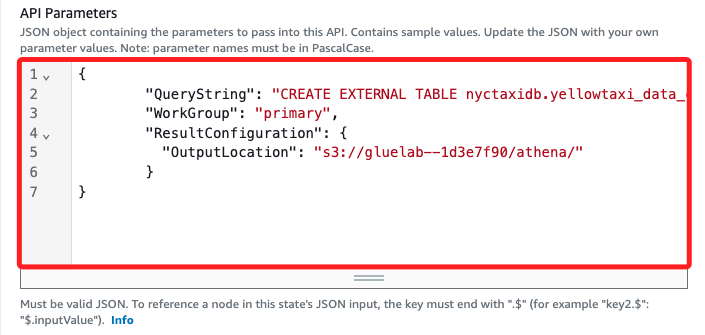

5. 勾選 `Wait for task to complete`，確保表完全建立後才繼續執行工作流程，並在 `Next state` 中選擇 `Go to end`。

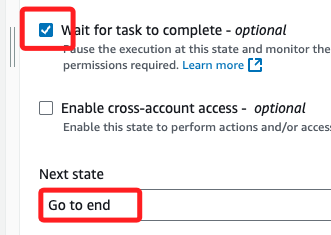

6. 在畫布中，手動刪除狀態 `REPLACE ME TRUE STATE`；選取並點擊 `DELETE` 按鍵即可，或點擊右鍵選擇 `Delete state`。

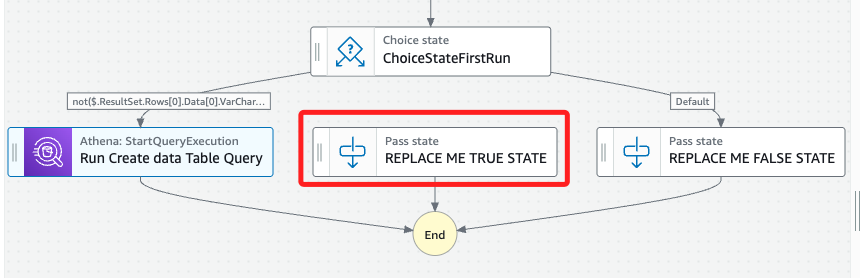

7. 點擊 `Save` 保存工作流。

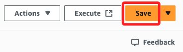

## 測試工作流程

1. 選擇 `Execute`。

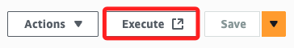

2. 將 `Name` 設為 `TaskFiveTest`，然後選擇 `Start execution` 開始執行工作流。

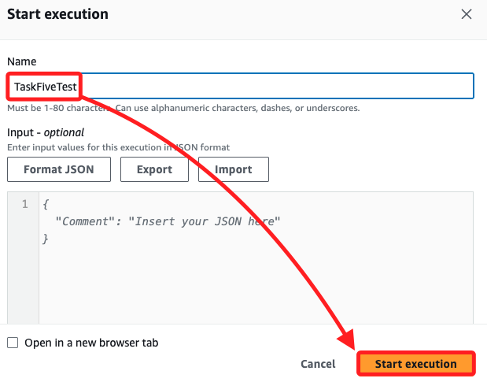

3. 與前面步驟相同，等待工作流中每個步驟從白色變為藍色，再變為綠色，代表任務成功執行；此次運行不會建立新資料庫，但因為資料庫中找不到表，工作流將執行 `Run Create data Table` Query 任務來建立表。

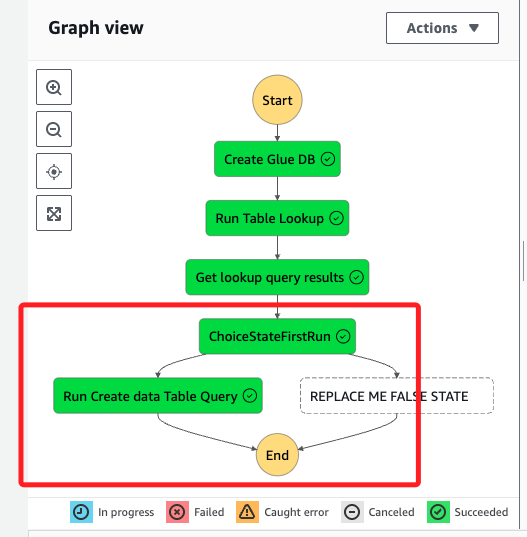

## 驗證表的建立

1. 進入 `S3` 主控台的 `gluelab` 中的 `athena` 資料夾，該資料夾中有新的元數據文件

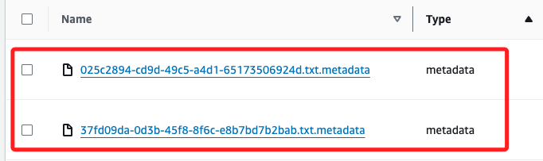

2. 另外還有一些空的文本文件，這些空文件是 `Step Functions` 任務的基本輸出，可予以忽略。

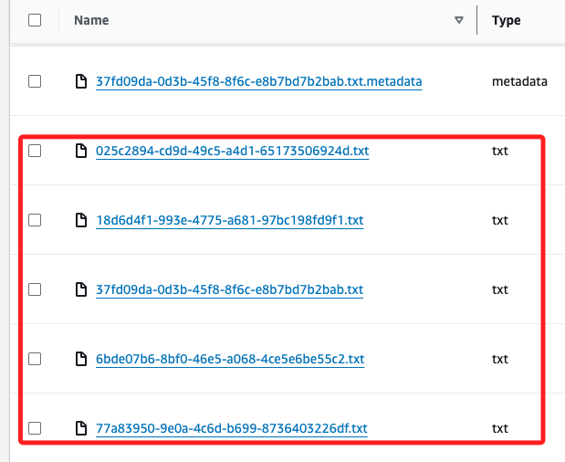

3. 在 `Glue` 主控台中選擇 `Tables`，可以看到一個名為 yellowtaxi_data_csv 的表已存在。這是工作流運行時由 Athena 建立的 Glue 表。


4. 點擊表的鏈接查看詳細的結構，確認表格的架構定義是否正確。

#### 步驟 4：再次運行工作流測試另一條路徑

1. 在 Step Functions 主控台中，選擇 WorkflowPOC 狀態機並點擊 Start execution。
2. 將執行名稱設為 NewTest 並再次選擇 Start execution。
3. 等待工作流成功執行，這次會檢查是否已存在該表，應選擇另一條邏輯路徑並調用 REPLACE ME FALSE STATE 狀態。
4. 此次運行不會重新建立資料庫或覆寫已建立的表，但會在 S3 中生成一些包含更新的 AWS Glue 元數據的輸出文件。

### 結論
本任務成功建立了指向 Yellow Taxi 數據的 AWS Glue 表，並將其整合到工作流中，當資料庫中不存在表時自動建立。此外，工作流的另一條邏輯路徑確保在表已存在時，不會重新建立表。