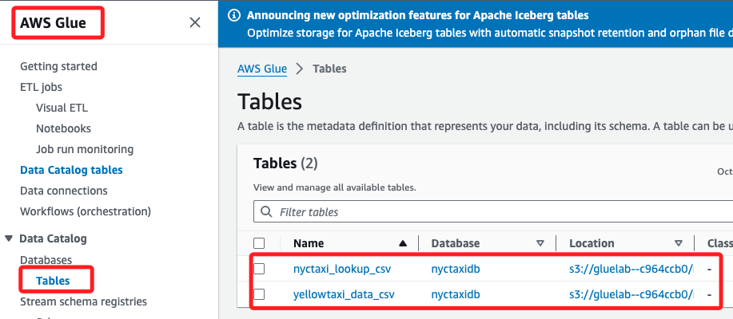
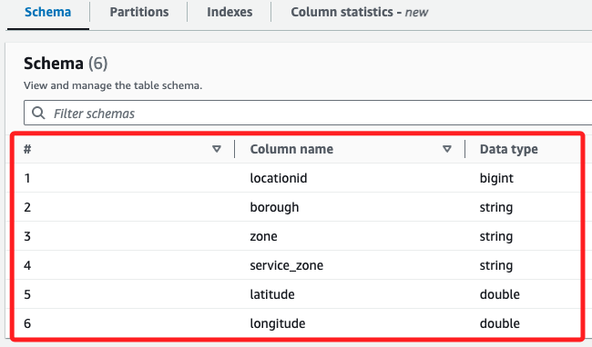

# 為地點查詢數據建立 Glue 表

_任務目標是更新並運行 `Step Functions` 工作流，建立另一個 Glue 表來引用存儲在 S3 中的 `taxi _zone_lookup.csv` 文件，在後續任務中，將連結表 `yellow taxi data` 分析數據。_

<br>

## 建立 lookup 表

_更新工作流_

<br>

1. 在 `Step Functions` 控制台中打開 `WorkflowPOC` 狀態機進行編輯。

<br>

2. 在 `Actions` 面板中搜尋 `Athena`，將任務 `StartQueryExecution` 拖曳至 `Run Create data Table Query` 任務與 `End` 任務之間。

    

<br>

3. 選取該 `StartQueryExecution` 任務，並將 `State name` 更改為 `Run Create lookup Table Query`。

    

<br>

4. 修改 `API Parameters` 預設 JSON 內容，並替換 `<替換-S3-Bucket-名稱>`。

    ```json
    {
        "QueryString": "CREATE EXTERNAL TABLE nyctaxidb.nyctaxi_lookup_csv(  locationid bigint,   borough string,   zone string,   service_zone string,   latitude double,   longitude double) ROW FORMAT DELIMITED   FIELDS TERMINATED BY ',' STORED AS INPUTFORMAT   'org.apache.hadoop.mapred.TextInputFormat' OUTPUTFORMAT   'org.apache.hadoop.hive.ql.io.HiveIgnoreKeyTextOutputFormat' LOCATION  's3://<替換-S3-Bucket-名稱>/nyctaxidata/lookup/' TBLPROPERTIES (  'skip.header.line.count'='1')",
        "WorkGroup": "primary",
        "ResultConfiguration": {
            "OutputLocation": "s3://<替換-S3-Bucket-名稱>/athena/"
        }
    }
    ```

<br>

5. 勾選 `Wait for task to complete`，然後點擊 `Save`。

    

<br>

## 刪除現有的 AWS Glue 表

1. 進入 `Glue` 控制台的 `Tables` 頁面，選擇表 `yellowtaxi_data_csv` 點擊 `Delete`。

    

<br>

## 運行最新的工作流

1. 在 `Step Functions` 控制台中，按照前幾步的方式，運行 `WorkflowPOC` 狀態機，並將測試命名為 `TaskSixTest`。

    

<br>

2. 運行工作流，出現以下錯誤。

    

<br>

3. 依據錯誤訊息顯示 `TABLE_NOT_FOUND`，並且是針對 `nyctaxi_lookup_csv` 表的。

    

<br>

## 使用 Cloud9

_特別注意，這並非教程指引，而是自己進行的排除，以利接續後面的操作_

<br>

1. 使用以下指令在 Athena 中運行查詢來創建 nyctaxi_lookup_csv 表；要替換以下 `<替換-S3-Bucket>` 的語句。

    ```sql
    aws athena start-query-execution \
    --query-string "CREATE EXTERNAL TABLE nyctaxidb.nyctaxi_lookup_csv(  
        locationid bigint,   
        borough string,   
        zone string,   
        service_zone string,   
        latitude double,   
        longitude double) 
    ROW FORMAT DELIMITED   
    FIELDS TERMINATED BY ',' 
    STORED AS INPUTFORMAT 'org.apache.hadoop.mapred.TextInputFormat' 
    OUTPUTFORMAT 'org.apache.hadoop.hive.ql.io.HiveIgnoreKeyTextOutputFormat' 
    LOCATION 's3://<你的S3-Bucket>/nyctaxidata/lookup/' 
    TBLPROPERTIES ('skip.header.line.count'='1');" \
    --result-configuration OutputLocation=s3://<替換-S3-Bucket>/athena/results/
    ```

    

<br>

2. 使用以下指令查詢。

    ```sql
    aws athena get-query-execution --query-execution-id <前一個步驟取得的-ID>
    ```

<br>

3. 再運行一次。

    

<br>

4. 進入 `AWS Glue` 控制台，打開 `Tables` 頁面，確認現在有兩個表 `yellowtaxi_data_csv` 和 `nyctaxi_lookup_csv`。


<br>

___

_END_