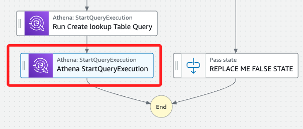
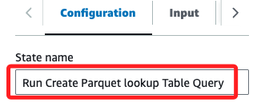

# Task 7：優化數據格式並使用壓縮技術

_任務目標是優化資料表格，使其更高效，具體來說，是將數據存儲格式修改為 `Parquet`，並使用 `Snappy` 壓縮技術；這樣的更新將有助於更快且具成本效益的數據操作。_

<br>

## 說明

1. 由於出租車數據涵蓋多年且隨著時間不斷更新，因此將數據按時間序列進行分段存儲是合理的選擇。

<br>

2. 此步驟將使用 `nyctaxi_lookup_csv` 表作為來源，建立與其具有相同欄位名稱的 `Parquet` 版本表，並聲明 `Snappy` 作為壓縮類型。

<br>

## 更新工作流以建立具 Snappy 壓縮的 Parquet 表

_在 `Step Functions` 主控台中，使用與之前步驟相同的方法開啟 `WorkflowPOC` 狀態機，進入 `Workflow Studio`。_

<br>

1. 在 `Actions` 面板中，搜尋 `athena`。

2. 將 `StartQueryExecution` 任務拖到 `Run Create lookup Table Query` 與 `End` 任務之間。



3. 同時在右側 `State name` 中更名為 `Run Create Parquet lookup Table Query`。



4. 將下方 `API Parameters` 的預設 JSON 代碼替換為以下內容，並將兩處 `<替換-S3-Bucket>` 替換為實際的 `S3 Bucket` 名稱。

    ```json
    {
        "QueryString": "CREATE table if not exists nyctaxidb.nyctaxi_lookup_parquet WITH (format='PARQUET',parquet_compression='SNAPPY', external_location = 's3://<替換-S3-Bucket>/nyctaxidata/optimized-data-lookup/') AS SELECT locationid, borough, zone , service_zone , latitude ,longitude  FROM nyctaxidb.nyctaxi_lookup_csv",
        "WorkGroup": "primary",
        "ResultConfiguration": {
          "OutputLocation": "s3://<替換-S3-Bucket>/athena/"
        }
    }
    ```

5. 選擇 `Wait for task to complete`（可選），確保表格完全建立後再進行下一步。

6. 在 `Next state` 中，保持 `Go to end` 選項。

7. 點擊 `Save` 保存工作流。

## 測試並驗證結果

1. 在 `AWS Glue` 主控台的導航面板中，選擇 `Tables`。

2. 刪除 `AWS Glue` 資料庫中的兩個表，這將確保工作流在下次執行時選擇正確的路徑。

3. 在 `Step Functions` 主控台中，使用與之前相同的方法運行 `WorkflowPOC` 狀態機。將測試命名為 `TaskSevenTest`。

4. 等待工作流成功執行完成。下圖顯示已完成的工作流。

    

5. 在 `AWS Glue` 主控台中檢查，確認已成功建立新的 `nyctaxi_lookup_parquet` 表。

6. 查看表的結構，下圖顯示了表的結構範例。

    

---

至此，已成功建立具 Snappy 壓縮的 Parquet 格式 lookup 表。在接下來的步驟中，還會建立另一個 Parquet 表，然後將這兩個表的數據進行結合。