# Task 11：為資料注入新增工作流程

_將 `2 月` 的數據加入工作流程；使用 `Step Functions` 的 `映射（Map）` 狀態來檢查 `Glue` 中的所有表格，並針對符合條件的表執行 SQL 查詢以插入 2 月份的數據。_

<br>

## 新增 Map 狀態到工作流程

1. 在 Step Functions 主控台中啟動狀態機的 `WorkflowPOC`，接著在 `Actions` 面板中，切換到頁籤 `Flow`。

   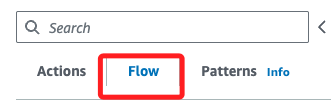

<br>

2. 將狀態 `Map` 拖曳到 `REPLACE ME FALSE STATE` 任務與 `End` 任務之間。

   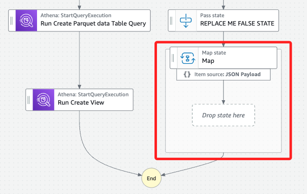

<br>

3. 刪除原本的 `REPLACE ME FALSE STATE` 任務。

   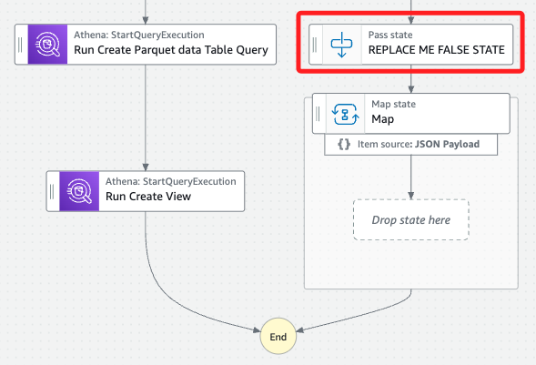

<br>

4. 選取 Map 狀態後，將 State name 更改為 `Check All Tables`。

   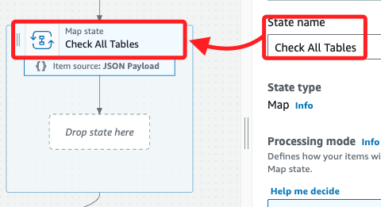

<br>

5. 勾選 `Provide a path to items array`，勾選後會增加一個輸入欄位中，填入 `$.Rows`。

   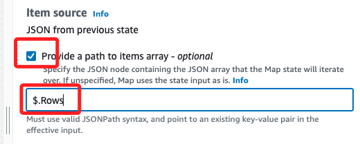

<br>

6. 選擇 `Input` 頁籤，勾選 `Filter input with InputPath`，並在新增的欄位中輸入 `$.ResultSet`；此 `InputPath` 定義了每次迭代中將要分析的數據；官方指引在此特別提示不要進行儲存變更。

   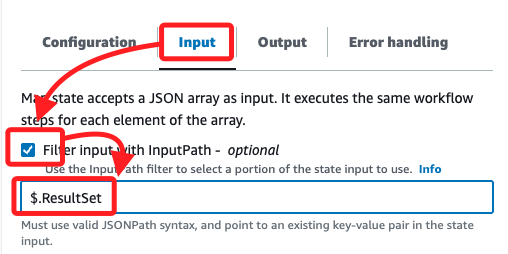

<br>

## 新增 Choice 狀態

1. 切換到 `Flow` 頁籤，將 `Choice` 狀態拖曳到 `Check All Tables` 任務後的 `Drop state here`。

   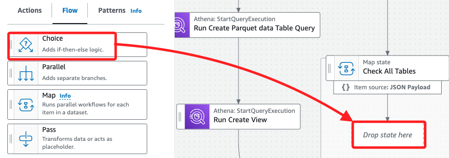

<br>

2. 選取 `Choice` 狀態並更名為 `CheckTable`。

   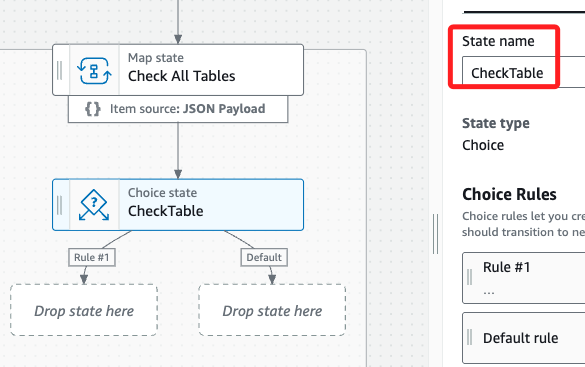

<br>

3. 在 Choice Rules 區塊中，點擊 `Rule #1` 右側的編輯圖標進行配置。

   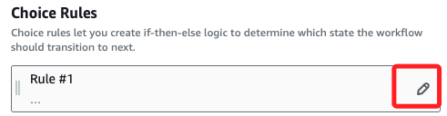

<br>

4. 接著點擊 `Add conditions`。

   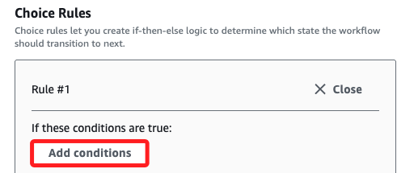

<br>

5. 保持預設的 `Simple` 條件及保持 `Not` 空白，在 `Variable` 欄位中輸入以下語句。

   ```bash
   $.Data[0].VarCharValue
   ```

<br>

6. 在 `Operator` 中選擇 `matches string`，並在 `Value` 中輸入 `*data_parquet`；然後點擊 `Save conditions`。

   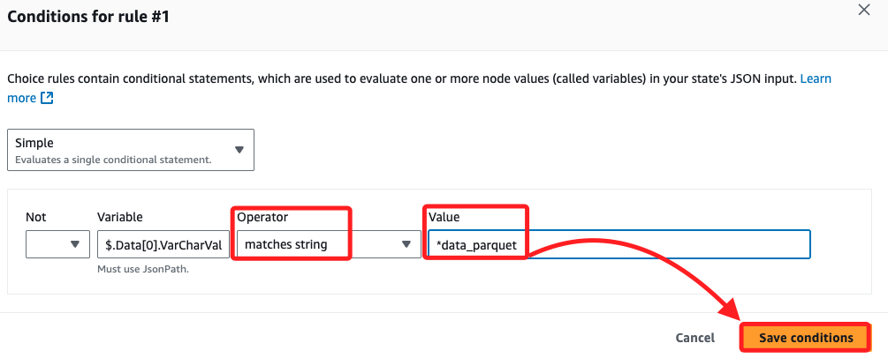

<br>

7. 這個邏輯會遍歷所有 `AWS Glue` 表名稱，檢查名稱是否匹配 `data_parquet` 結尾的表格；這樣即可定位唯一符合條件的表格，即 `yellowtaxi_data_parquet`。

<br>

## 新增 Pass 狀態並配置預設邏輯

1. 從 `Flow` 面板中，將 `Pass` 狀態拖曳到 `CheckTable` 任務後方 _右側_ 箭頭的 `Default` 標籤下。

   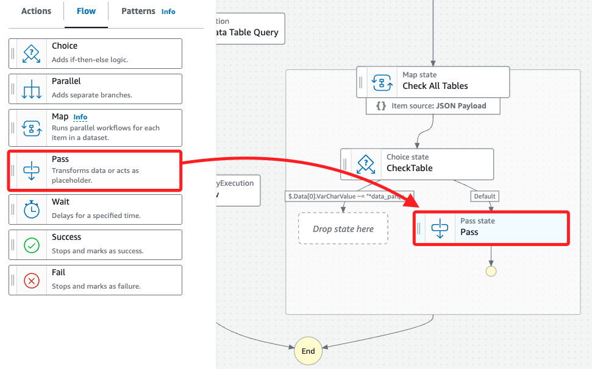

<br>

2. 接著將這個 Pass 更名為 `Ignore File`。

   

<br>

3. 選取視圖畫布中 `CheckTable` 狀態下方箭頭的 `Default` 標籤，在右側的 `Choice Rules` 區塊中，打開 Default rule 詳細信息。

   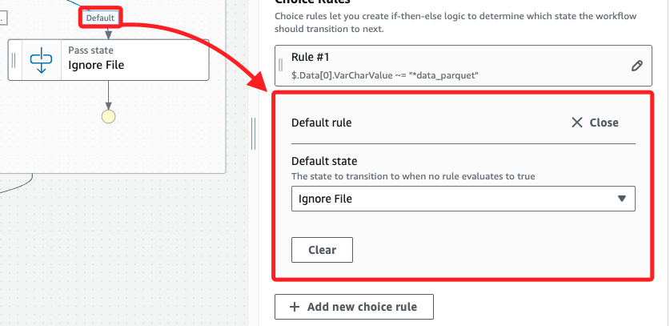

<br>

4. 確認 Default state 設為 `Ignore File`；此預設規則會處理所有不符合條件的 AWS Glue 表，確保只有 `yellowtaxi_data_parquet` 表會進行修改。

   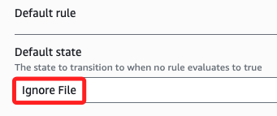

<br>

## 新增 StartQueryExecution 任務以更新 Parquet 表

1. 切換到 `Actions` 頁籤，搜尋 `athena`，將 `StartQueryExecution` 任務拖曳到 `CheckTable` 任務後方左側。

   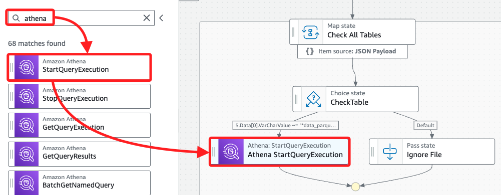

<br>

2. 選取該任務後，將 State name 改為 `Insert New Parquet Data`。

   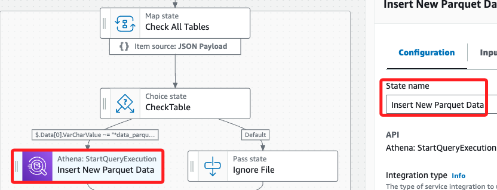

<br>

3. 在 API Parameters 中，將預設的 JSON 代碼替換為以下內容，並替換其中一個字串 `<替換-S3-Bucket>` 為實際的 S3 bucket 名稱。

   ```json
   {
      "QueryString": "INSERT INTO nyctaxidb.yellowtaxi_data_parquet select vendorid,tpep_pickup_datetime,tpep_dropoff_datetime,passenger_count,trip_distance,ratecodeid,store_and_fwd_flag,pulocationid,dolocationid,fare_amount,extra,mta_tax,tip_amount,tolls_amount,improvement_surcharge,total_amount,congestion_surcharge,payment_type,substr(\"tpep_pickup_datetime\",1,4) pickup_year, substr(\"tpep_pickup_datetime\",6,2) AS pickup_month FROM nyctaxidb.yellowtaxi_data_csv where substr(\"tpep_pickup_datetime\",1,4) = '2020' and substr(\"tpep_pickup_datetime\",6,2) = '02'",
      "WorkGroup": "primary",
      "ResultConfiguration": {
         "OutputLocation": "s3://<替換-S3-Bucket>/athena/"
      }
   }
   ```

<br>

4. 勾選 `Wait for task to complete` 並點擊 `Save` 保存工作流程；以上成功將邏輯加入工作流程，使其能自動處理新增月份的數據，並只修改目標 Parquet 表格 `yellowtaxi_data_parquet`。

   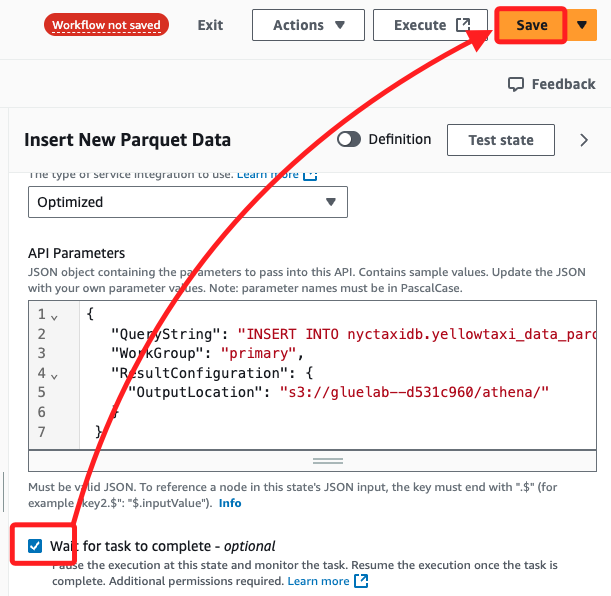

<br>

___

_END_
