# Task 12：測試完整解決方案

_測試已完成的 `POC（概念驗證）` 解決方案，確保其能夠正常運行，並驗證其處理 2 月份數據的功能。_

<br>

## 測試最新的工作流程結果

1. 進入 Step Functions 主控台啟動狀態機 `WorkflowPOC`，點擊右上角 `Execute` 進行測試，並將測試名稱設為 `TaskTwelveTest`，然後點擊 `Start execution`。

    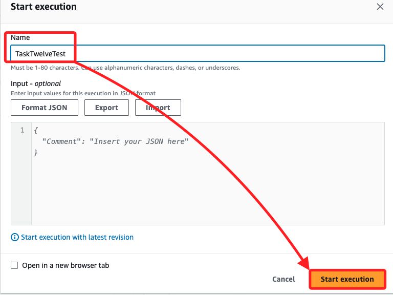

<br>

2. 完成的工作流程如下圖；務必確認所有圖框都已變成綠色，尤其是 `Check All Tables`。

    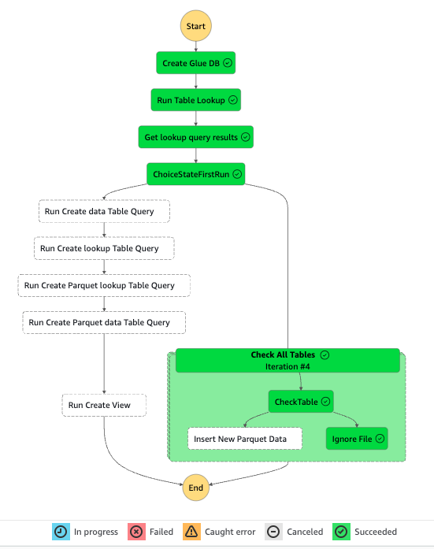

<br>

3. 在 Graph inspector 區段中，可以拖曳位於頁面底部的橫條來調整圖表大小，以便更清晰地查看工作流程圖。

<br>

## 驗證迭代器是否正常工作

_這裡的顯示畫面與官網的教程說明不太吻合，以下將進行比對說明_

<br>

1. 在 `Graph view` 中，選擇步驟 `CheckTable`。

    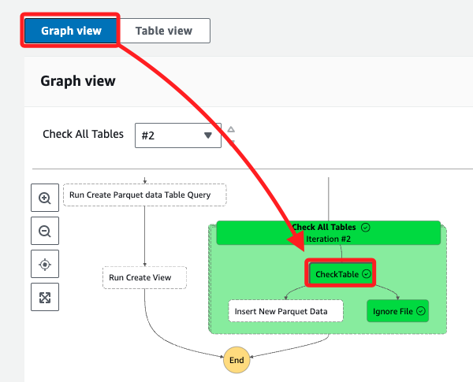

<br>

2. 依據教程說明，頁面頂部應該要出現兩個下拉選單，分別為 `Iteration status` 和 `Index`，以下是官方的圖示。

    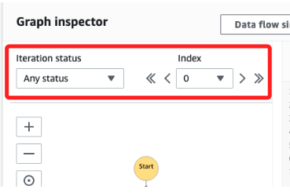

<br>

3. 但實際上，頂部僅有一個 `Check All Tables` 選單，下拉選單中是以井號 `#` 加上數字來表示，這應該就是官方提到的 `Iteration status` 和 `Index` 在當前版本的表現方式；`#0` 代表第一個迭代，`#1` 代表第二次迭代，以此類推，可通過改變這個數字來查看不同的迭代執行情況。

    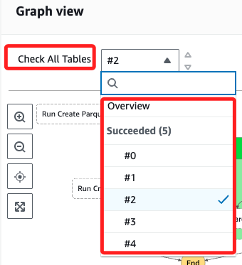

<br>

4. 選取迭代序號後，可在右側的 `Details` 頁籤查看該次迭代狀態；可進行切換，並查看每次迭代的結果。

    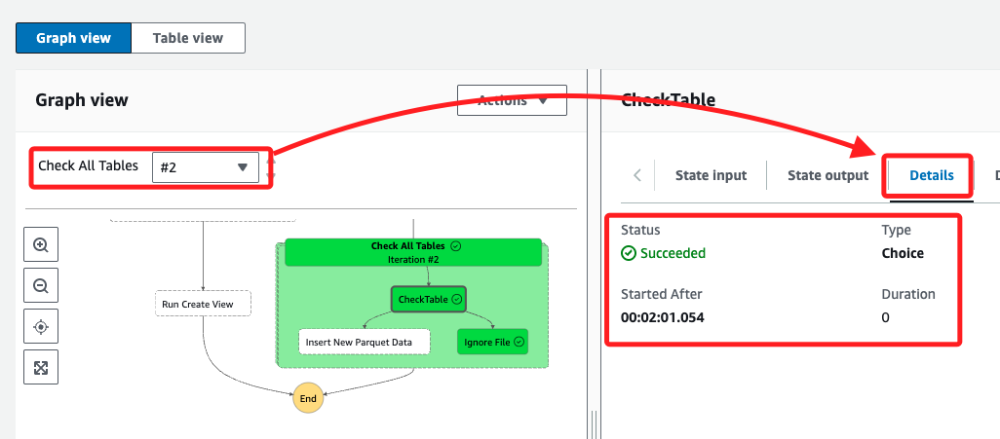

<br>

5. 將 Index 值切換回 `#0`，並選擇 Step input 頁籤，確認顯示的 JSON 代碼如下。

    ```json
    {
        "Data": [
            {
            "VarCharValue": "nyctaxi_lookup_csv"
            }
        ]
    }
    ```

<br>

6. 在 Step input 頁籤中依序變更索引值，直到 `VarCharValue` 的值變為 `yellowtaxi_data_parquet`。

    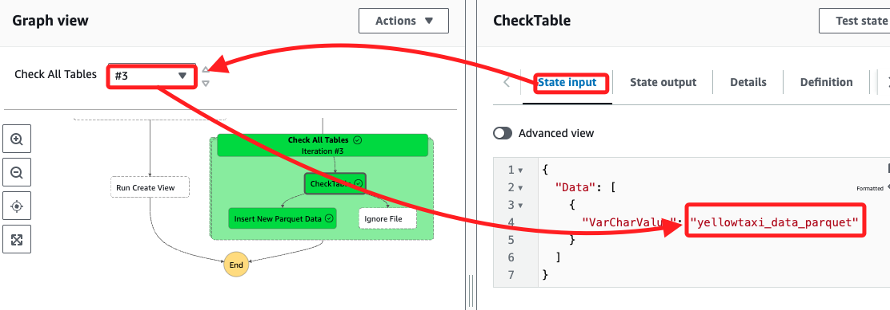

<br>

7. 在視圖中點擊步驟 `Insert New Parquet Data`，然後在右側切換頁籤到 `Step output`，在此處可查看建立檢視表的查詢以及其他步驟的執行細節。

    

<br>

## 在 Athena 控制台中進行測試

1. 進入 Athena 主控台，打開查詢編輯器，並確保資料庫選擇為 `nyctaxidb`。

    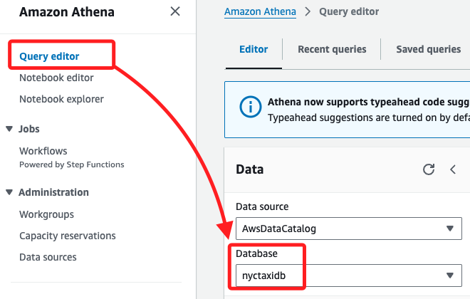

<br>

2. 在 `Views` 區段中，選擇 `yellowtaxi_data_vw` 檢視表右側的三點圖標，然後選擇 Preview View。

    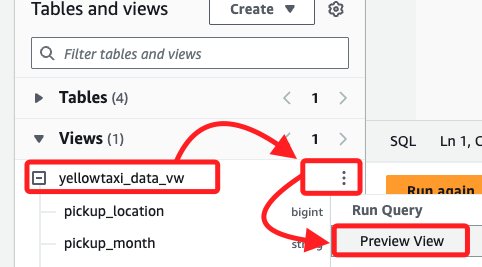

<br>

3. 預覽結果的前 10 條記錄應顯示出來，並確認檢視表現在掃描包含 2 月數據的數據集。

    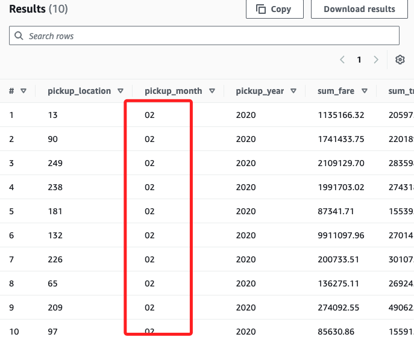

<br>

4. 為驗證 2 月的計程車數據已包含在數據集中，執行以下查詢。

    ```sql
    SELECT * FROM "nyctaxidb"."yellowtaxi_data_vw" WHERE pickup_month = '02'
    ```

<br>

5. 結果共計 `259` 條記錄。

    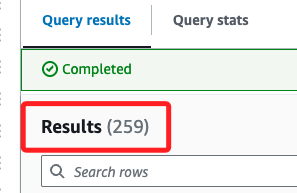

<br>

6. 會顯示前 `100` 條記錄，至此可確認 `2 月` 數據已成功納入查詢結果，成功測試了 ETL 工作流程。

    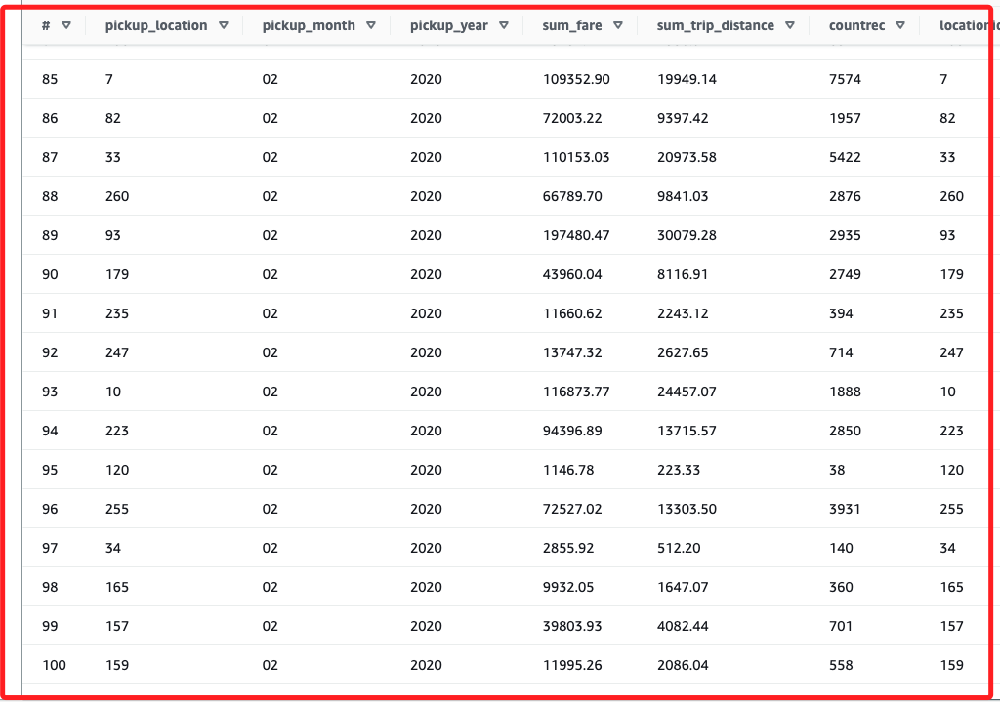

<br>

## 完成

1. 通過。

    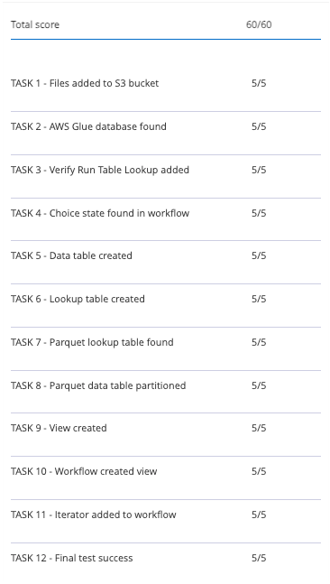

<br>

2. 耗時。

    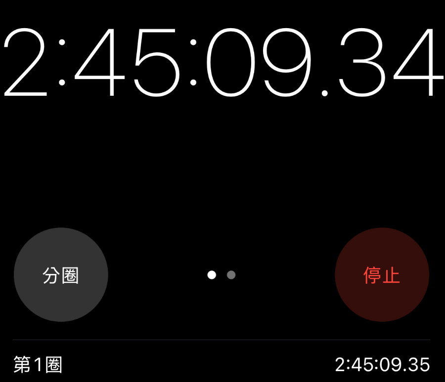

<br>

___

_END_