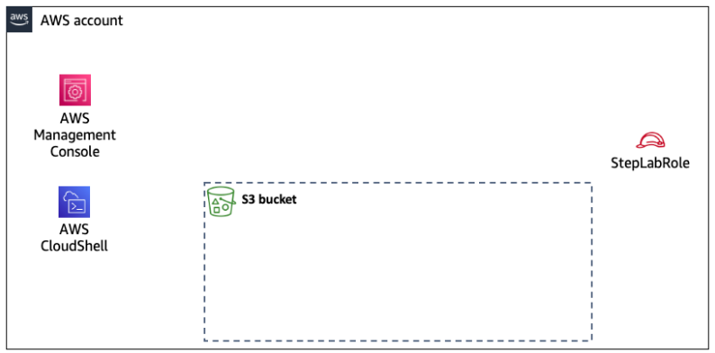
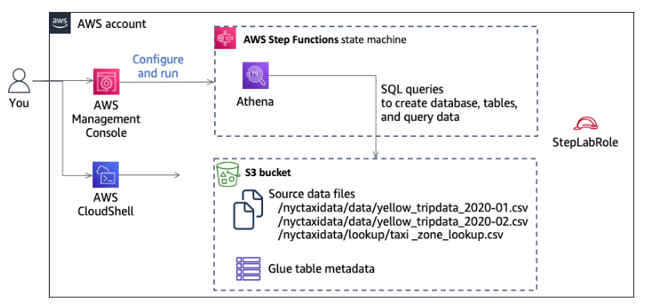

以下是經過修正後的講義內容：

# 主題：使用 Athena 和 Step Functions 架構與編排 ETL 管道

_Building and Orchestrating ETL Pipelines by Using Athena and Step Functions_

 

## 說明

1. 在此 Lab 中，將使用 `AWS Step Functions` 建立一個包含 `Amazon S3`、`AWS Glue Data Catalog` 和 `Amazon Athena` 的 `ETL`（Extract、Transform、Load）管道來處理大規模數據集。

 

2. `Step Functions` 協助自動化業務流程，這些流程通常被稱為 `狀態機`。本次 Lab 將使用 `Step Functions` 建立工作流程，使 `Athena` 執行一系列操作，例如執行查詢檢查 `AWS Glue` 表是否存在。

 

3. `AWS Glue Data Catalog` 提供持久的元數據存儲，包括表定義、結構和其他控制信息，這些信息將支援 ETL 管道的建構。`Athena` 是一個無伺服器的互動式查詢服務，通過標準 SQL 簡化對 `Amazon S3` 中數據的分析。

 

4. 在過程中將設計工作流程，若 AWS Glue 表不存在，系統會透過 Athena 查詢來創建表。如果表已存在，則會執行其他 AWS Glue 查詢，來在 Athena 中創建一個視圖，合併兩個表中的數據。隨後，透過查詢該視圖，能夠在大規模數據集中發現基於時間和位置的分析結果。

    

 

## Scenario

1. 先前已建立一個 `概念驗證（POC）`，展示如何使用 AWS Glue 推斷數據架構並手動調整列名，隨後透過 Athena 查詢數據。然而，每次啟動新項目時，必須執行許多手動步驟，這促使創建一個可重複使用的數據管道，以提高數據處理的啟動效率。

 

2. 本 Lab 的目標是研究紐約市的出租車數據，數據的列名已知，並已為數據導入提供了視圖和 SQL 命令。研究目標是分析 2020 年初紐約市出租車的使用模式。數據將按月份進行分區，並以 Parquet 格式存儲，並使用 Snappy 壓縮技術以提高效能和降低存儲成本。由於這是一個 `概念驗證`，因此可使用硬編碼值來處理列名、分區、視圖和 S3 桶的相關資訊。

 

3. Lab 已提供資源，包括：訪問出租車數據的鏈接、所需的分區（pickup_year 和 pickup_month）、SQL 導入腳本以及用於該項目的 SQL 視圖創建腳本。

    

 

4. 最終將完成第二張圖中所示的架構。

 

___

_END_