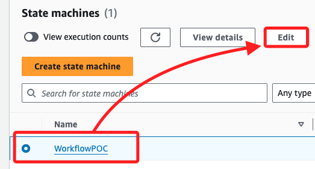
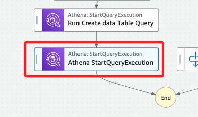
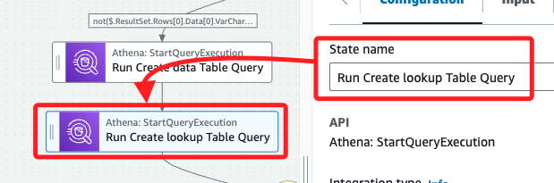
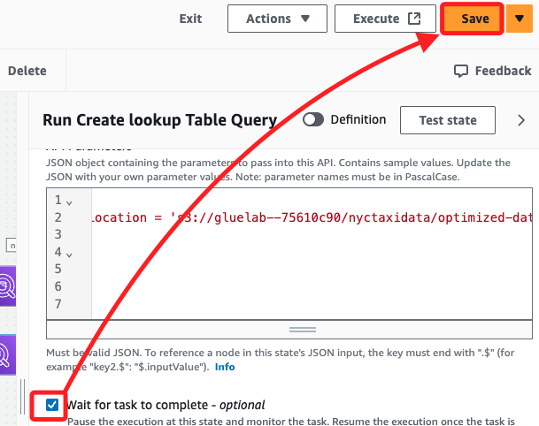
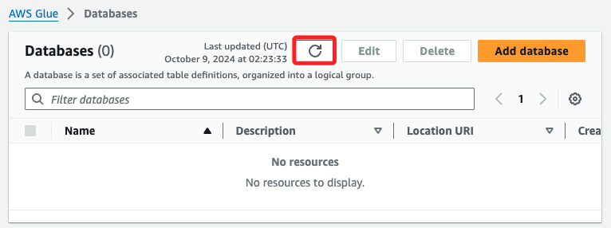

# 為地點查詢數據建立 Glue 表

_任務目標是更新並運行 `Step Functions` 工作流，建立另一個 Glue 表來引用儲存在 S3 中的 `taxi _zone_lookup.csv` 文件，在後續任務中，將連結表 `yellow taxi data` 分析數據。_

<br>

## 建立 lookup 表

_更新工作流_

<br>

1. 在 `Step Functions` 控制台中打開 `WorkflowPOC` 狀態機進行編輯 `Edit`。

    

<br>

2. 在 `Actions` 面板中搜尋 `Athena`，將任務 `StartQueryExecution` 拖曳至 `Run Create data Table Query` 任務與 `End` 任務之間。

    

<br>

3. 選取該 `StartQueryExecution` 任務，並將 `State name` 更改為 `Run Create lookup Table Query`。

    

<br>

4. 修改 `API Parameters` 預設 JSON 內容，並替換 `<替換-S3-Bucket-名稱>`。

    ```json
    {
        "QueryString": "CREATE EXTERNAL TABLE nyctaxidb.nyctaxi_lookup_csv(  locationid bigint,   borough string,   zone string,   service_zone string,   latitude double,   longitude double) ROW FORMAT DELIMITED   FIELDS TERMINATED BY ',' STORED AS INPUTFORMAT   'org.apache.hadoop.mapred.TextInputFormat' OUTPUTFORMAT   'org.apache.hadoop.hive.ql.io.HiveIgnoreKeyTextOutputFormat' LOCATION  's3://<替換-S3-Bucket-名稱>/nyctaxidata/lookup/' TBLPROPERTIES (  'skip.header.line.count'='1')",
        "WorkGroup": "primary",
        "ResultConfiguration": {
            "OutputLocation": "s3://<替換-S3-Bucket-名稱>/athena/"
        }
    }
    ```

<br>

5. 勾選 `Wait for task to complete`，然後點擊 `Save`。

    

<br>

## 刪除現有的 AWS Glue 表

_進入 `Glue` 控制台_

<br>

1. 點擊左側的 `Tables`，先進行 `刷新`。

    

<br>

2. 然後選擇表 `yellowtaxi_data_csv` 點擊 `Delete`。

    

<br>

## 再次運行工作流

_進入 `Step Functions` 控制台_

<br>

1. 按照前幾步的方式，運行 `WorkflowPOC` 狀態機，並將測試命名為 `TaskSixTest`。

    

<br>

2. 工作流完成。

    

<br>

## 進入 Glue 查看

1. 會看到兩個資料表，除了重新建立被刪除的 `yellowtaxi_data_csv`，另外還新建了一個 `nyctaxi_lookup_csv table`。

    

<br>

2. 可點擊資料表進入查看 Schema。

    

<br>

## 其他補充

1. 透過 Cloud9 刪除兩個文件。

    ```bash
    aws glue delete-table --database-name nyctaxidb --name nyctaxi_lookup_csv
    aws glue delete-table --database-name nyctaxidb --name yellowtaxi_data_csv
    ```

<br>

## 完成

1. 確認以上步驟可通過。

    

<br>

___

_END_