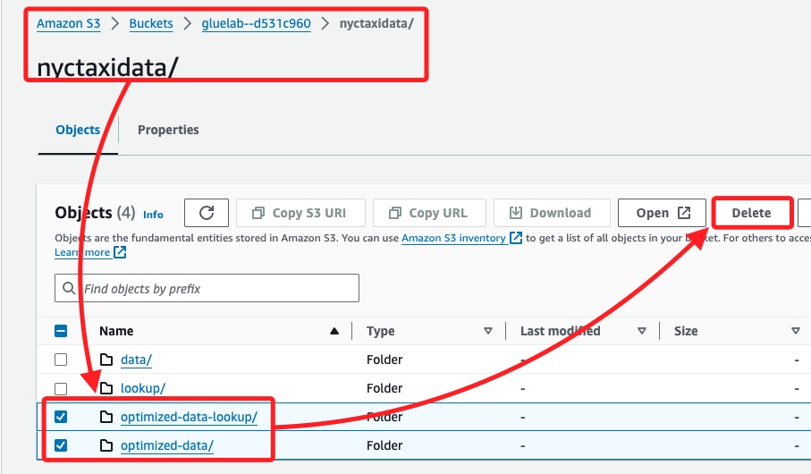

# Task 10：將視圖建立步驟加入 Step Functions 工作流程

_將視圖建立任務加入到現有的工作流程中，確保當資料不存在時，工作流程能自動建立視圖；這樣在新增數據時不需要每次手動重建視圖。_

<br>

## 刪除先前手動建立的視圖

1. 進入在 `S3` 主控台中位於 `gluelab` Bucket 的 `nyctaxidata` 資料夾，刪除名稱中包含 optimized 的所有前綴資料夾。

    

<br>

2. 在 Glue 主控台中，刪除所有五個表。

    

<br>

## 編輯 Step Functions 工作流程

_加入建立視圖的步驟_

<br>

1. 進入 Step Functions 主控台啟動狀態機 `WorkflowPOC`，並在 `Actions` 面板中，搜尋 `Athena`。

<br>

2. 拖曳一個新任務 `StartQueryExecution` 到 `Run Create Parquet data Table Query` 任務與 `End` 任務之間。

    

<br>

3. 重新命名任務為 `Run Create View`。

    

<br>

4. 在 API Parameters 中，將預設的 JSON 代碼替換為以下內容，並替換其中 `<替換-S3-Bucket>` 為實際的 S3 bucket 名稱。

    ```json
    {
        "QueryString": "create or replace view nyctaxidb.yellowtaxi_data_vw as select a.*, lkup.* from (select datatab.pulocationid pickup_location, pickup_month, pickup_year, sum(cast(datatab.total_amount AS decimal(10, 2))) AS sum_fare, sum(cast(datatab.trip_distance AS decimal(10, 2))) AS sum_trip_distance, count(*) AS countrec FROM nyctaxidb.yellowtaxi_data_parquet datatab WHERE datatab.pulocationid is NOT null GROUP BY datatab.pulocationid, pickup_month, pickup_year) a, nyctaxidb.nyctaxi_lookup_parquet lkup WHERE lkup.locationid = a.pickup_location",
        "WorkGroup": "primary",
        "ResultConfiguration": {
            "OutputLocation": "s3://<替換-S3-Bucket>/athena/"
        }
    }
    ```

<br>

5. 勾選 `Wait for task to complete`，這可確保建立視圖的操作完成後才繼續執行下一步；點擊右上角的 `Save` 保存工作流程。

    

<br>

## 測試工作流程

1. 在狀態機 `WorkflowPOC` 右上方點擊 `Execute`，將測試命名為 `TaskTenTest`，然後點擊 `Start execution`。

    

<br>

2. 完成後顯示工作流程如下，其中包含了 `Run Create View` 任務，也就是將建立視圖的任務加入到了工作流程中，構建一個完整的 `ETL 管道 POC`。

    

<br>

3. POC 在使用上，只需替換新的 `bucket` 位置，並根據數據格式更新查詢及分區邏輯，即可輕鬆運行工作流程，唯一未處理的情況是如何處理新加入的時間序列數據，例如新增 2 月份數據；這在後下玉不揍中會進行處理。

<br>

___

_END_