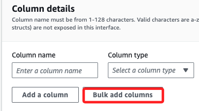
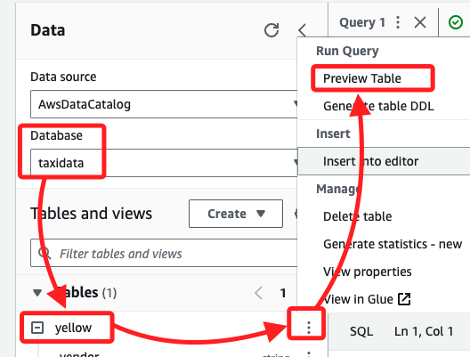
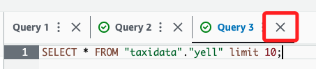

# AWS Athena

_此 Lab 是使用 AWS Athena 和 AWS Glue 來查詢儲存在 Amazon S3 中的數據，包含建立 Glue 資料庫與表格、查詢並優化 Athena 的查詢，以及使用 Athena 視圖來簡化數據分析。_

<br>

## 目標

1. 使用 Athena 查詢編輯器建立 AWS Glue 資料庫與表格。

<br>

2. 使用 Athena 查詢 S3 中的數據集，並進行優化。

<br>

3. 建立 Athena 視圖來簡化數據查詢。

<br>

## 建立並查詢 AWS Glue 資料庫與表格

_進入 Lab 之後_

<br>

1. 進入主控台搜尋並進入 `Athena`。

    

<br>

2. 啟動查詢編輯器。

    

<br>

3. 若重複操作時並未完全退出 Lab，在這可能會直接進入 `Query editor`；假如有強迫症，無法接受就這樣直接進入了 `Query editor`，可點擊 `Amazon Athera` 返回；重新進入一次。

    

<br>

4. 切換到 `Settings` 頁籤，會看到當前所在是 `Query result and encryption settings`，點擊右側的 `Manage`。

    

<br>

4. 在 `Location of query result` 選擇 `Browse S3`。

    

<br>

5. 選取預設的 `S3 Bucket`，點擊右下角 `Choose`。

    

<br>

6. 這個頁面其他部分使用預設值即可，點擊 `Save`。

    

<br>

## 建立 `Glue` 資料庫

1. 切換頁籤到 `Editor`。

    

<br>

2. 在 `Athena` 查詢編輯器中，輸入以下 SQL 指令建立資料庫，點擊下方的 `Run` 執行指令。

    ```sql
    CREATE DATABASE taxidata;
    ```

    

<br>

3. 完成後，下方會顯示完成、成功等資訊。

    

<br>

## 查看

_使用另一個服務 AWS Glue，這裡只是簡單示範如何查看，不細說功能。_

<br>

1. 搜尋並進入 `Glue`。

    

<br>

2. 點擊左側欄中的 `Databases`，接著可在右側 `Databases` 清單中看到前面步驟建立的資料庫 `taxidata`。

    

<br>

## 建立 Glue 表格

_回到 Athena_

<br>

1. 在左側 `Tables and views` 區塊中，展開選單 `Create` 並點擊 `S3 bucket data`。

    

<br>

2. 設定 `表格名稱 (Table name)` 為 `yellow`，`描述 (Description)` 為 `Table for taxi data`；在 `Database configuration` 部分，下拉選單後點擊前面建立的 `taxidata` 資料庫。

    

<br>

3. 輸入 S3 資料位置 `Location of input data set`，並勾選下方的 `I acknowledge ...`；這個路徑是 Lab 環境中固定的數據位置，包含預先準備好的數據集，提供在 Lab 中使用，通過這個路徑來指向該數據，以便在 Athena 表格中查詢；其中 `aws-tc-largeobjects` 是 Bucket 的名稱，而 `CUR-TF-200-ACDSCI-1` 是 Bucket 下的資料夾名稱，`Lab2` 是 Lab 名稱，`yellow` 則是自訂的 table 名稱。

    ```
    s3://aws-tc-largeobjects/CUR-TF-200-ACDSCI-1/Lab2/yellow/
    ```

    

<br>

4. 在選擇數據格式 `Data format` 項目下的 `File format` 為 `CSV`。

    

<br>

5. 在 `Column details` 部分，點擊 `Bulk add columns` 進行快速添加欄位名稱與類型。

    

<br>

6. 在彈窗中輸入以下內容，這是快速添加 `metadata` 的方法；稍作觀察可發現，輸入的並非是資料庫語法，而是欄位與其數據格式。

    ```bash
    vendor string,
    pickup timestamp,
    dropoff timestamp,
    count int,
    distance int,
    ratecode string,
    storeflag string,
    pulocid string,
    dolocid string,
    paytype string,
    fare decimal,
    extra decimal,
    mta_tax decimal,
    tip decimal,
    tolls decimal,
    surcharge decimal,
    total decimal
    ```

<br>

8. 完成後點擊 `Add`。

    

<br>

9. 可在 `Preview table query` 進行語法的預覽，這才是寫入前面欄位數據的語法；然後點擊右下角 `Create Table`；至此完成建立 Glue 資料庫與表格，並導入了 Lab 預設儲存在 S3 的數據。

    

<br>

## 在 Glue table 預覽

1. 在左側 ` Data` 區塊，先點擊刷新圖標。

    

<br>

2. 確認 `Database` 是 `taxidata`，然後 `Tables` 是 `yellow`；點擊 `yellow` 尾部的三個點來展開選單，點擊 `Preview Table`。

    

<br>

3. 此時在 `Query` 視窗中會自動顯示以下語法；這條查詢會從資料庫 `taxidata` 中的 `yellow` 表格中選取所有欄位，並僅返回最多 10 筆資料，可藉此檢查表格中的數據樣本。

    ```sql
    SELECT * FROM "taxidata"."yellow" limit 10;
    ```

<br>

4. 點擊 `Run` 之後，在下方的 `Results` 會顯示前十筆資料。

    

<br>

5. 可點擊 `X` 來關閉查詢。

    

<br>

## 優化 Athena 查詢

1. 透過以下語法建立表格 `jan`，輸入以下 SQL 指令來建立 1 月數據的表格，然後，針對 `jan` 表格運行相似查詢，並比較執行時間與掃描數據量。

    ```sql
    CREATE EXTERNAL TABLE IF NOT EXISTS jan (
        `vendor` string,
        `pickup` timestamp,
        `dropoff` timestamp,
        `count` int,
        `distance` int,
        `ratecode` string,
        `storeflag` string,
        `pulocid` string,
        `dolocid` string,
        `paytype` string,
        `fare` decimal,
        `extra` decimal,
        `mta_tax` decimal,
        `tip` decimal,
        `tolls` decimal,
        `surcharge` decimal,
        `total` decimal
    )
    ROW FORMAT SERDE 'org.apache.hadoop.hive.serde2.lazy.LazySimpleSerDe'
    WITH SERDEPROPERTIES (
        'serialization.format' = ',',
        'field.delim' = ','
    ) 
    LOCATION 's3://aws-tc-largeobjects/CUR-TF-200-ACDSCI-1/Lab2/January2017/'
    TBLPROPERTIES (
        'has_encrypted_data'='false'
    );
    ```

<br>

`************************* 以下尚未實作 ***************************`

2. 執行並比較查詢，首先，針對 `yellow` 表格運行查詢，這些操作將數據按月份分割，並通過 bucketizing 優化查詢性能。

    ```sql
    SELECT count (count) AS "Number of trips", sum (total) AS "Total fares", pickup AS "Trip date"
    FROM yellow WHERE pickup BETWEEN TIMESTAMP '2017-01-01 00:00:00' AND TIMESTAMP '2017-02-01 00:00:01'
    GROUP BY pickup;
    ```

## 使用分區優化查詢

1. 建立分區表格 `creditcard`，執行以下查詢，將數據按付款類型進行分區。

    ```sql
    CREATE TABLE taxidata.creditcard
    WITH (format = 'PARQUET') AS
    SELECT * FROM yellow WHERE paytype = '1';
    ```

1. 比較查詢性能，首先查詢未分區表格 `yellow`，然後查詢分區表格 `creditcard`，比較執行時間和數據掃描量，這些操作使用列式存儲格式（如 Parquet）來優化低基數字段的查詢性能。

    ```sql
    SELECT sum(total), paytype FROM yellow WHERE paytype = '1' GROUP BY paytype;
    ```


## 使用 Athena 視圖

1. 建立信用卡付款的總計視圖。

```sql
CREATE VIEW cctrips AS
SELECT "sum"(fare) "CreditCardFares" FROM yellow WHERE paytype='1';
```

1. 建立並聯合兩個視圖，聯合信用卡與現金付款視圖，並比較總付款，使用 Athena 視圖來簡化查詢，並通過建立聯合視圖來比較多個視圖的數據。

```sql
CREATE VIEW comparepay AS
WITH cc AS (SELECT sum(fare) AS cctotal, vendor FROM yellow WHERE paytype = '1' GROUP BY vendor),
cs AS (SELECT sum(fare) AS cashtotal, vendor FROM yellow WHERE paytype = '2' GROUP BY vendor)
SELECT cc.cctotal, cs.cashtotal FROM cc JOIN cs ON cc.vendor = cs.vendor;
```

## 使用 CloudFormation 建立 Athena 命名查詢

1. 建立 CloudFormation 模板，在 Cloud9 中建立新文件 `athenaquery.cf.yml` 並輸入以下內容。

```yaml
AWSTemplateFormatVersion: 2010-09-09
Resources:
    AthenaNamedQuery:
    Type: AWS::Athena::NamedQuery
    Properties:
        Database: "taxidata"
        Description: "A query that selects all fares over $100.00 (US)"
        Name: "FaresOver100DollarsUS"
        QueryString: > 
        SELECT distance, paytype, fare, tip, tolls, surcharge, total
        FROM yellow WHERE total >= 100.0 ORDER BY total DESC
```

1. 部署模板，執行以下指令來部署 CloudFormation 堆疊，使用 CloudFormation 來建立可重用的 Athena 查詢模板，並將其部署到 AWS。

```bash
aws cloudformation create-stack --stack-name athenaquery --template-body file://athenaquery.cf.yml
```

## 檢視 IAM 策略

1. 檢視 `Policy-For-Data-Scientists`，前往 IAM 控制台，選擇用戶 `mary`，並檢視擁有的策略 `Policy-For-Data-Scientists`；確認了 `DataScienceGroup` 的 IAM 策略，並檢查了該策略對 S3、Glue 和 Athena 的訪問權限。

## 確認 Mary 的查詢訪問權限

1. 使用 Mary 的 IAM 用戶進行測試，使用 AWS CLI 測試 Mary 是否能夠訪問命名查詢；確認了 Mary 可以使用適當的權限訪問並運行 Athena 命名查詢。
```bash
AWS_ACCESS_KEY_ID=$AK AWS_SECRET_ACCESS_KEY=$SAK aws athena get-named-query --named-query-id $NQ
```

## 完成