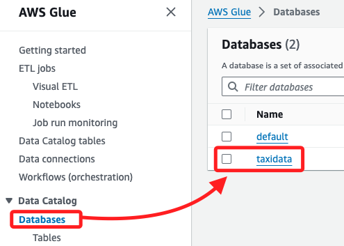
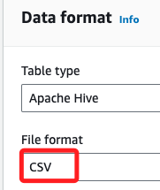
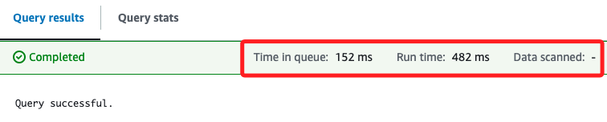
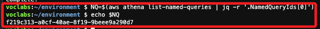

# AWS Athena

_此 Lab 是使用 AWS Athena 和 AWS Glue 來查詢儲存在 Amazon S3 中的數據，包含建立 Glue 資料庫與表格、查詢並優化 Athena 的查詢，以及使用 Athena 視圖來簡化數據分析。_

<br>

## 目標

1. 使用 Athena 查詢編輯器建立 AWS Glue 資料庫與表格。

<br>

2. 使用 Athena 查詢 S3 中的數據集，並進行優化。

<br>

3. 建立 Athena 視圖來簡化數據查詢。

<br>

## 建立並查詢 AWS Glue 資料庫與表格

_進入 Lab 之後_

<br>

1. 進入主控台搜尋並進入 `Athena`。

    

<br>

2. 啟動查詢編輯器。

    

<br>

3. 若重複操作時並未完全退出 Lab，在這可能會直接進入 `Query editor`；假如有強迫症，無法接受就這樣直接進入了 `Query editor`，可點擊 `Amazon Athera` 返回；重新進入一次。

    

<br>

4. 切換到 `Settings` 頁籤，會看到當前所在是 `Query result and encryption settings`，點擊右側的 `Manage`。

    

<br>

4. 在 `Location of query result` 選擇 `Browse S3`。

    

<br>

5. 選取預設的 `S3 Bucket`，點擊右下角 `Choose`。

    

<br>

6. 這個頁面其他部分使用預設值即可，點擊 `Save`。

    

<br>

## 建立 `Glue` 資料庫

1. 切換頁籤到 `Editor`。

    

<br>

2. 在 `Athena` 查詢編輯器中，輸入以下 SQL 指令建立資料庫，點擊下方的 `Run` 執行指令。

    ```sql
    CREATE DATABASE taxidata;
    ```

    

<br>

3. 完成後，下方會顯示完成、成功等資訊。

    

<br>

## 查看

_使用另一個服務 AWS Glue，這裡只是簡單示範如何查看，不細說功能。_

<br>

1. 搜尋並進入 `Glue`。

    

<br>

2. 點擊左側欄中的 `Databases`，接著可在右側 `Databases` 清單中看到前面步驟建立的資料庫 `taxidata`。

    

<br>

## 建立 Glue 表格

_回到 Athena_

<br>

1. 在左側 `Tables and views` 區塊中，展開選單 `Create` 並點擊 `S3 bucket data`。

    

<br>

2. 設定 `表格名稱 (Table name)` 為 `yellow`，`描述 (Description)` 為 `Table for taxi data`；在 `Database configuration` 部分，下拉選單後點擊前面建立的 `taxidata` 資料庫。

    

<br>

3. 輸入 S3 資料位置 `Location of input data set`，並勾選下方的 `I acknowledge ...`；這個路徑是 Lab 環境中固定的數據位置，包含預先準備好的數據集，提供在 Lab 中使用，通過這個路徑來指向該數據，以便在 Athena 表格中查詢；其中 `aws-tc-largeobjects` 是 Bucket 的名稱，而 `CUR-TF-200-ACDSCI-1` 是 Bucket 下的資料夾名稱，`Lab2` 是 Lab 名稱，`yellow` 則是自訂的 table 名稱。

    ```
    s3://aws-tc-largeobjects/CUR-TF-200-ACDSCI-1/Lab2/yellow/
    ```

    

<br>

4. 在選擇數據格式 `Data format` 項目下的 `File format` 為 `CSV`。

    

<br>

5. 在 `Column details` 部分，點擊 `Bulk add columns` 進行快速添加欄位名稱與類型。

    

<br>

6. 在彈窗中輸入以下內容，這是快速添加 `metadata` 的方法；稍作觀察可發現，輸入的並非是資料庫語法，而是欄位與其數據格式。

    ```bash
    vendor string,
    pickup timestamp,
    dropoff timestamp,
    count int,
    distance int,
    ratecode string,
    storeflag string,
    pulocid string,
    dolocid string,
    paytype string,
    fare decimal,
    extra decimal,
    mta_tax decimal,
    tip decimal,
    tolls decimal,
    surcharge decimal,
    total decimal
    ```

<br>

8. 完成後點擊 `Add`。

    

<br>

9. 可在 `Preview table query` 進行語法的預覽，這才是寫入前面欄位數據的語法；然後點擊右下角 `Create Table`；至此完成建立 Glue 資料庫與表格，並導入了 Lab 預設儲存在 S3 的數據。

    

<br>

## 在 Glue table 預覽

1. 在左側 ` Data` 區塊，先點擊刷新圖標。

    

<br>

2. 確認 `Database` 是 `taxidata`，然後 `Tables` 是 `yellow`；點擊 `yellow` 尾部的三個點來展開選單，點擊 `Preview Table`。

    

<br>

3. 此時在 `Query` 視窗中會自動顯示以下語法；這條查詢會從資料庫 `taxidata` 中的 `yellow` 表格中選取所有欄位，並僅返回最多 10 筆資料，可藉此檢查表格中的數據樣本。

    ```sql
    SELECT * FROM "taxidata"."yellow" limit 10;
    ```

<br>

4. 點擊 `Run` 之後，在下方的 `Results` 會顯示前十筆資料。

    

<br>

5. 可點擊個別查詢頁籤右側的 `X` 來關閉查詢。

    

<br>

6. 彈窗中再次點擊 `Close query`。

    

<br>

## 優化 Athena 查詢

1. 在 `Editor` 頁籤中，點擊右側的符號 `+` 添加新的查詢頁籤。

    

<br>

2. 貼上以下語法，並點擊下方的 `Run`；這個語法是在 `Athena` 中建立一個名為 `jan` 的外部表格，該表格讀取儲存在 `S3` 中的 `January 2017` 的 `taxi data`，並且資料格式是 `CSV`，此表格的結構會對應 S3 中文件的欄位和類型。

    ```sql
    CREATE EXTERNAL TABLE IF NOT EXISTS jan (
        `vendor` string,
        `pickup` timestamp,
        `dropoff` timestamp,
        `count` int,
        `distance` int,
        `ratecode` string,
        `storeflag` string,
        `pulocid` string,
        `dolocid` string,
        `paytype` string,
        `fare` decimal,
        `extra` decimal,
        `mta_tax` decimal,
        `tip` decimal,
        `tolls` decimal,
        `surcharge` decimal,
        `total` decimal
    )
    ROW FORMAT SERDE 'org.apache.hadoop.hive.serde2.lazy.LazySimpleSerDe'
    WITH SERDEPROPERTIES (
        'serialization.format' = ',',
        'field.delim' = ','
    ) 
    LOCATION 's3://aws-tc-largeobjects/CUR-TF-200-ACDSCI-1/Lab2/January2017/'
    TBLPROPERTIES (
        'has_encrypted_data'='false'
    );
    ```

<br>

3. 完成後在左側 Tables 中會添加一個 Table `jan`。

    

<br>

4. 再次點擊 `+` 添加查詢頁籤進行查詢與比較；先對 `yellow` 表格運行查詢，這些操作將數據按月份分割，並通過 `bucketizing` 優化查詢性能。

    ```sql
    SELECT 
        COUNT(count) AS "Number of trips", 
        SUM(total) AS "Total fares", 
        pickup AS "Trip date"
    FROM 
        yellow
    WHERE 
        pickup BETWEEN TIMESTAMP '2017-01-01 00:00:00' AND TIMESTAMP '2017-02-01 00:00:01'
    GROUP BY 
        pickup;
    ```

<br>

5. 在 `Query results` 頁籤中會看到相關的執行資訊，`Time in queue: 64 ms` 是查詢開始執行前等待的時間，也就是查詢被執行前在隊列中的等待時間為 64 毫秒（ms）；`Run time: 10.354 sec` 是查詢的實際執行時間，也就是查詢開始執行到完成所花費的時間；
`Data scanned: 9.32 GB` 表示查詢過程中掃描了 9.32 GB 的數據，這是 Athena 根據查詢條件從 S3 中讀取並處理的數據量；特別注意，`Athena` 的查詢成本是基於掃描的數據量計算，因此這個數據量會影響查詢的費用。

    

<br>

6. 接著，從 `jan` 表中檢索數據，並對其進行分組和計算。

    ```sql
    SELECT count (count) AS "Number of trips" ,
        sum (total) AS "Total fares" ,
        pickup AS "Trip date"
    FROM jan
    GROUP BY pickup;
    ```

<br>

7. 查詢資訊如下，在之前的查詢中是針對 `yellow` 表進行的，而這次查詢針對 `jan` 表，`yellow` 表包含了整個 `2017` 年的數據，且查詢的條件是 `2017/01/01` 到 `2017/02/01` 的行程數據，而新查詢的 `jan` 表只包含 `2017/01` 的數據，也就是表中的數據已經提前按月份進行了分離；特別注意，前面查詢的數據量是來自整個 `yellow` 表，雖然查詢的範圍也只限定在 `1 月`，但還是需要從整個 `2017 年` 的數據中過濾出結果，因此掃描的數據量更大。

    

<br>

## 使用分區優化查詢

1. 執行以下語句建立新的分區表格 `creditcard`，將數據按付款類型進行分區。

    ```sql
    CREATE TABLE taxidata.creditcard
    WITH (
        format = 'PARQUET'
    ) AS
        SELECT * FROM yellow
        WHERE paytype = '1';
    ```

<br>

2. 執行結果如下；接下來將比較對 `yellow` 表中的 `nonpartitioned` 資料和 `creditcard` 表中的 `partitioned` 資料執行查詢的效能。

    

<br>

3. 運行以下語句進行查詢性能比較。

    ```sql
    SELECT sum(total), paytype FROM yellow
        WHERE paytype = '1'
        GROUP BY paytype;
    ```

    _查詢結果_

    

<br>

4. 若要查詢 `信用卡` 表中的分區數據，可在新的查詢標籤中執行下列查詢。

    ```sql
    SELECT sum (total), paytype FROM creditcard
        WHERE paytype = '1'
        GROUP BY paytype;
    ```

    _查詢結果_

    

<br>

## 使用 Athena 視圖

1. 建立信用卡付款的總計視圖。

    ```sql
    CREATE VIEW cctrips AS
        SELECT "sum"("fare") "CreditCardFares"
        FROM yellow
        WHERE ("paytype"='1');
    ```

    

<br>

2. 若要建立現金支付票價總美元價值的視圖，請執行下列查詢。

    ```sql
    CREATE VIEW cashtrips AS
        SELECT "sum"("fare") "CashFares"
        FROM yellow
        WHERE ("paytype"='2');
    ```

<br>

3. 運行以上兩個語法之後，可看到左側的 `Views` 中已經添加兩個對象。

    

<br>

4. 若要從 cctrips 檢視中選擇所有記錄，請執行下列查詢。

    ```sql
    Select * from cctrips;
    ```

    _結果_

    ```bash
    Time in queue:66 ms
    Run time:7.804 sec
    Data scanned:9.32 GB
    ```

<br>

5. 若要從 cashtrips 檢視中選擇所有記錄，請執行下列查詢；以上是建立一個連接兩個不同視圖中的資料的視圖，使用這個新視圖來比較兩個供應商的信用卡付款與現金付款的總收入。

    ```sql
    Select * from cashtrips;
    ```

    _結果_

    ```bash
    Time in queue:79 ms
    Run time:7.733 sec
    Data scanned:9.32 GB
    ```

<br>

## 建立並聯合兩個視圖

1. 聯合信用卡與現金付款視圖，並比較總付款，使用 Athena 視圖來簡化查詢，並通過建立聯合視圖來比較多個視圖的數據。

    ```sql
    CREATE VIEW comparepay AS
    WITH
        cc AS (
            SELECT SUM(fare) AS cctotal, vendor
            FROM yellow
            WHERE paytype = '1'
            GROUP BY paytype, vendor
        ),
        cs AS (
            SELECT SUM(fare) AS cashtotal, vendor, paytype
            FROM yellow
            WHERE paytype = '2'
            GROUP BY paytype, vendor
        )
    SELECT 
        cc.cctotal, 
        cs.cashtotal
    FROM 
        cc
    JOIN 
        cs
    ON 
        cc.vendor = cs.vendor;
    ```

    _效率資訊_

    ```bash
    Time in queue:83 ms
    Run time:538 ms
    Data scanned:-
    ```

<br>

2. 從左側觀察建立的 Views。

    

<br>

## 預覽結果

1. 在左側下方的 `Views` 區塊中，展開 `comparepay` 右側三點後點擊 `Preview View`。

    

<br>

2. 如果有提示，勾選後點擊 `Open query`；如果沒提示會直接運行查詢。

    

<br>

3. 結果如下。

    

<br>

## 使用 CloudFormation 建立 Athena 命名查詢

1. 接下來要利用 `CloudFormation` 建立 `Amazon Athena` 的命名查詢，並分享給其他 AWS 帳戶的部門使用；以下查詢從 `yellow` 表中選取了 `行程距離（distance）`、`支付類型（paytype）`、`車資（fare）`、`小費（tip）`、`過路費（tolls）`、`附加費（surcharge）` 和 `總金額（total）` 這些欄位，並過濾出 `總金額大於等於 100` 的行程記錄；結果將按 `總金額（total）` 從 `高到低排序（DESC 代表降序排列）`。

    ```sql
    SELECT 
        distance, 
        paytype, 
        fare, 
        tip, 
        tolls, 
        surcharge, 
        total 
    FROM 
        yellow 
    WHERE 
        total >= 100.0 
    ORDER BY 
        total DESC;
    ```

    _結果如下_

    

<br>

## 使用 Cloud9

1. 搜尋並進入 `Cloud9`；這是 Lab 已經準備好的環境。

    

<br>

2. 選取並開啟 IDE。

    

<br>

3. 展開左上角的 `File`，點擊 `New File` 建立新文件。

    

<br>

4. 同在 `File` 中將文件儲存 `Save as`，命名為 `athenaquery.cf.yml`。

    

<br>

5. 在腳本中貼上以下內容，貼上後記得儲存文件；特別注意，`CloudFormation` 模板使用的 `YAML` 格式對於縮排的規範是非常嚴格的，必須正確排版。

    ```yaml
    AWSTemplateFormatVersion: 2010-09-09
    Resources:
        AthenaNamedQuery:
            Type: AWS::Athena::NamedQuery
            Properties:
                Database: "taxidata"
                Description: "A query that selects all fares over $100.00 (US)"
                Name: "FaresOver100DollarsUS"
                QueryString: > 
                    SELECT distance, paytype, fare, tip, tolls, surcharge, total
                    FROM yellow 
                    WHERE total >= 100.0 
                    ORDER BY total DESC
    ```

<br>

6. 驗證模板語法是否正確，如果格式正確會輸出 `Parameters: []` 表示模板驗證通過。

    ```bash
    aws cloudformation validate-template --template-body file://athenaquery.cf.yml
    ```

    

<br>

7. 部署模板，執行以下指令來部署 CloudFormation 堆疊，使用 CloudFormation 來建立可重用的 Athena 查詢模板，並將其部署到 AWS。

    ```bash
    aws cloudformation create-stack --stack-name athenaquery --template-body file://athenaquery.cf.yml
    ```

    _完成後顯示_

    ```bash
    {
        "StackId": "arn:aws:cloudformation:us-east-1:423809875316:stack/athenaquery/eb2010e0-80c3-11ef-b2e9-0e80309c6219"
    }
    ```

<br>

8. 檢查堆疊的建立狀態。

    ```bash
    aws cloudformation describe-stacks --stack-name athenaquery
    ```

    

<br>

9. 使用以下命令來列出 Athena 中的命名查詢，確認查詢是否已經建立。

    ```bash
    aws athena list-named-queries
    ```

    

<br>

10. 手動複製前一個步驟取得的 ID 來執行查詢，這個指令會返回查詢的詳細信息，可以使用此查詢進行數據分析。

    ```bash
    aws athena get-named-query --named-query-id <QueryID>
    ```

    

<br>

## 儲存 bash 指令的查詢結果

_在終端機操作中，如果有連續操作時，儲存前步驟的輸出作為後續的輸入，可讓操作更為迅速_

<br>

1. 在 bash 指令中，若想要將以下查詢的 ID 儲存數值到變數。

    

<br>

2. 第一種方式，使用土法煉鋼將值寫入變數中。

    ```bash
    NQ=<查詢結果>
    ```

<br>

3. 然後查詢時或使用時，在變數前面加上取值運算子 `$` 即可；例如將值輸出。

    ```bash
    echo $NQ
    ```

    

<br>

4. 更進階的方式是使用 `jq` 工具來解析 JSON 輸出；先執行以下命令來安裝 `jq`。

    ```bash
    # 如果使用 Amazon Linux
    sudo yum install jq -y
    # 如果使用 Ubuntu
    sudo apt-get install jq
    ```

    

<br>

5. 使用以下指令將 NamedQueryId 存入 NQ 變數；其中 `aws athena list-named-queries` 是列出所有的 Athena 命名查詢的指令，
`jq -r '.NamedQueryIds[0]'` 是使用 `jq` 來解析 `JSON`，提取第一個 `NamedQueryId` 後以原始字串形式輸出，`NQ=$(...)` 是將指令輸出的結果賦值給變數 `NQ`。

    ```bash
    NQ=$(aws athena list-named-queries | jq -r '.NamedQueryIds[0]')
    ```

<br>

6. 接著使用指令 `echo $NQ` 進行查詢，結果如下。

    

<br>

## 檢視 IAM 策略

_Lab 已建立好查詢的 IAM 策略，自己是無法在 Lab 中建立 IAM 策略的_

<br>

1. 進入 IAM。

    

<br>

2. 點擊左側的 `Users`，可看到已有兩個 User。

    

<br>

3. 點擊 `mary` 進入，可看到政策 `Policy-For-Data-Scientists`。

    

<br>

4. 點擊 `Policy-For-Data-Scientists` 進一步檢視該策略對相關服務如 S3、Glue 和 Athena 的訪問權限。

    

<br>

## 確認 Mary 的查詢訪問權限

1. 進入 `CloudFormation`。

    

<br>

2. 點擊 `Stacks`，然後在右側清單中選取 Lab 環境所建立的 Stack，點擊進入。

    

<br>

3. 切換到 `Outputs` 頁籤，可以看到 `mary` 的 `MarysAccessKey`、`MarysSecretAccessKey`，將值複製備用。

    

<br>

4. 使用 Mary 的 IAM 用戶進行測試，使用 AWS CLI 測試 Mary 是否能夠訪問命名查詢；確認了 Mary 可以使用適當的權限訪問並運行 Athena 命名查詢。

    ```bash
    AWS_ACCESS_KEY_ID=$AK
    AWS_SECRET_ACCESS_KEY=$SAK
    aws athena get-named-query --named-query-id $NQ
    ```

<br>

## 完成

_Submit && End Lab_


<br>

___

_END_