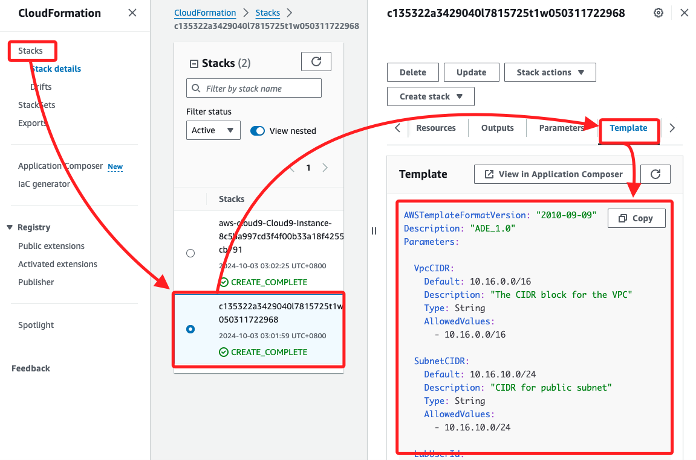
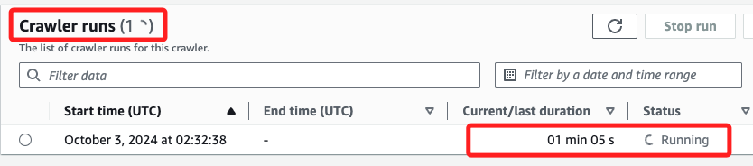

# ETL

_Extract、Transform、Load，提取、轉換、加載；使用 AWS Glue 對數據集進行 ETL 操作_

<br>

## 任務 1，使用 AWS Glue 爬網程式處理 GHCN-D 資料集

_可能不知道需要分析的數據結構，可將 AWS Glue 指向存儲在 AWS 上的數據，該服務將會將相關的元數據存儲在 AWS Glue Data Catalog 中，可通過建立爬網程式來實現這一點，該程式會檢查數據源並根據數據推斷結構。_

<br>

1. 配置並建立 AWS Glue 爬網程式。

<br>

2. 運行爬網程式以提取、轉換和加載數據到 AWS Glue 資料庫中。

<br>

3. 查看爬網程式建立的表格的元數據。

<br>

4. 編輯表格的結構。

<br>

## 配置並建立 AWS Glue 爬網程式

_配置並建立一個爬網程式來發現 `GHCN-D` 資料集的結構，並從中提取數據_

<br>

1. 搜尋並進入 `Glue`。

    

<br>

2. 在左側欄位的 `Databases` 下選擇 `Tables`。

    

<br>

3. 選擇使用爬網程式添加表格 `Add tables using crawler`。

    

<br>

4. 在 `Name` 命名為 `Weather`，其餘按預設即可，點擊下方的 `Next`。

    

<br>

5. 點擊添加數據源 `Add a data source`

    

<br>

6. `Data source` 使用預設的 `S3`，`Location of S3 data` 選擇 `In a different account`。

    

<br>

7. `S3 path` 輸入以下公開資料集的 `S3 Bucket`。

    ```bash
    s3://noaa-ghcn-pds/csv/by_year/
    ```

    

<br>

8. `Subsequent crawler runs` 使用預設的 `Crawl all sub-folders` 爬網所有子文件夾；然後點擊右下角 `Add an S3 data source`。

    

<br>

9. 接下來這個頁面 `Choose data sources and classifiers`，選擇 `Next`。

    

<br>

10. 在 `Existing IAM role` 中，選擇 `gluelab`。

    

<br>

## 關於 Role

1. 特別說明，這個 Role 是在 Lab 中已經預設並提供使用的，詳細內容可前往 `CloudFormation` 查看，進入後點擊 `Stack details`，選擇對應的 Stack，並切換到 `Template` 頁籤就可查看。

    

<br>

## 回到 Glue

1. 點擊 `Next` 後會進入 `Set output and scheduling`，選擇 `Add database`；會自動開啟新的頁面。

    

<br>

2. 在新開啟的頁面中，為資料庫命名 `weatherdata`，然後點擊 `Create database`。

    

<br>

3. 會自動回到 Databases 清單中，可看到建立的資料庫 ``。

    

<br>

## 返回 `Set output and scheduling`

_手動切換頁面到前面步驟的畫面中_

<br>

1. 返回頁面中，可先手動刷新頁面。

    

<br>

2. 下拉 `Target database` 選單，選擇前面步驟建立的 `weatherdata` 資料庫作為目標資料庫。

    

<br>

3. 在最下方的 `Crawler schedule` 區塊，將 `Frequency` 保留預設的 `On demand`；然後點擊 `Next`。

    

<br>

4. 可瀏覽一下爬網程式相關配置，確認無誤後點擊 `Create crawler`。

    

<br>

## 運行爬網程式

1. 在 `Weather` 頁面中，可點擊 `Run crawler` 啟動爬往程式。

    

<br>

2. 或是在 `Crawlers` 頁面中，選擇剛建立的 `Weather` 爬網程式，然後點擊 `Run`。

    

<br>

3. 運行時爬網程式的狀態會更改為 `Running`，這個過程約耗時三分鐘。

    

<br>

1. 過程中還會顯示 `Stopping` 不用擔心，完成時狀態會變更為 `Ready`。

    

<br>

## 查看 AWS Glue 建立的元數據

1. 在左側導航窗格中，選擇 `Databases`，接著點擊 `weatherdata` 資料庫的鏈接。

    

<br>

2. 在 `Tables` 部分，選擇 `by_year` 鏈接。

    

<br>

3. 查看爬網程式捕獲的元數據，並查看表格中檢測到的列。

    

<br>

## 編輯表格結構

1. 展開頁面右上角的 `Actions`，選擇 `Edit schema`。

    

<br>

2. 修改列名稱，根據以下表格進行更改：`id` 改為 `station`、`date` 改為 `date`、`element` 改為 `type`、`data_value` 改為 `observation`、`m_flag` 改為 `mflag`、`q_flag` 改為 `qflag`、`s_flag` 改為 `sflag`、`obs_time` 改為 `time`；特別注意，AWS Glue 只支持小寫的列名稱，完成時點擊 `Save ...`。

    

<br>

___

_END_