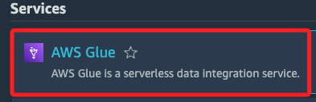
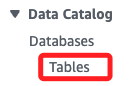
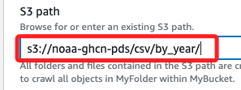
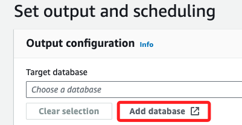
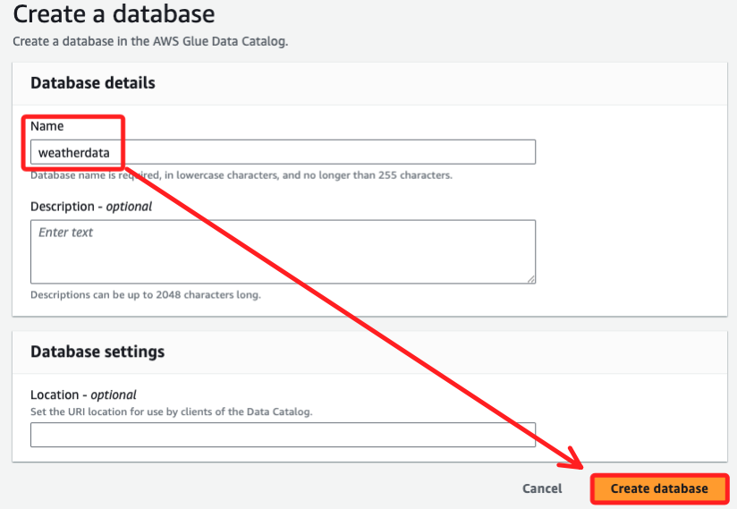
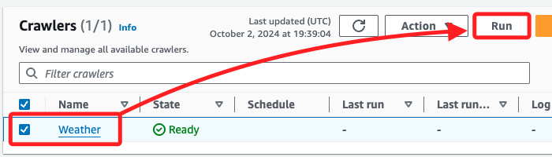

# ETL

_使用 AWS Glue 對數據集進行 ETL 操作_

<br>

## 任務 1，使用 AWS Glue 爬網程式處理 GHCN-D 資料集

_可能不知道需要分析的數據結構，可將 AWS Glue 指向存儲在 AWS 上的數據，該服務將會將相關的元數據存儲在 AWS Glue Data Catalog 中，可通過創建爬網程式來實現這一點，該程式會檢查數據源並根據數據推斷結構。_

<br>

1. 配置並創建 AWS Glue 爬網程式。

<br>

2. 運行爬網程式以提取、轉換和加載數據到 AWS Glue 數據庫中。

<br>

3. 查看爬網程式創建的表格的元數據。

<br>

4. 編輯表格的結構。

<br>

## 配置並創建 AWS Glue 爬網程式

_配置並創建一個爬網程式來發現 `GHCN-D` 資料集的結構，並從中提取數據_

<br>

1. 搜尋並進入 `Glue`。

  

<br>

2. 在左側欄位的 `Databases` 下選擇 `Tables`。

  

<br>

3. 選擇使用爬網程式添加表格 `Add tables using crawler`。

  

<br>

4. 在 `Name` 命名為 `Weather`，其餘按預設即可，點擊下方的 `Next`。

  

<br>

5. 點擊添加數據源 `Add a data source`

  

<br>

6. `Data source` 使用預設的 `S3`，`Location of S3 data` 選擇 `In a different account`（在不同的帳戶中）。

  

<br>

7. `S3 path` 輸入以下公開資料集的 `S3 Bucket`。

  ```bash
  s3://noaa-ghcn-pds/csv/by_year/
  ```

  

<br>

8. `Subsequent crawler runs` 使用預設的 `Crawl all sub-folders`（爬網所有子文件夾）；然後點擊右下角 `Add an S3 data source`（添加 S3 數據源）。

  

<br>

9. 接下來這個頁面 `Choose data sources and classifiers`，選擇 `Next`。

  

<br>

10. 在 `Existing IAM role` 中，選擇 `gluelab`。

  

<br>

11. 特別說明，這個 Role 在 Lab 中已經預設並提供使用，詳細內容可前往 `CloudFormation` 查看，進入後點擊 `Stack details`，選擇對應的 Stack，並切換到 `Template` 頁籤就可查看。

  

<br>

## 回到 Glue

1. 點擊 `Next` 後會進入 `Set output and scheduling`，選擇 `Add database`。

  

<br>

2. 會開啟新的瀏覽器頁面，為數據庫命名 `weatherdata`，然後選擇 `Create database`。

  

<br>

3. 返回前面步驟的頁面中，先刷新頁面。

  

<br>

4. 接著下拉選單並選擇剛創建的 `weatherdata` 數據庫作為目標數據庫。

  

<br>

5. 在 `Crawler schedule` 部分，將 `Frequency` 保留默認的 `On demand`；然後點擊 `Next`。

  

<br>

6. 確認爬網程式相關配置，點擊 `Create crawler`。

  

<br>

## 運行爬網程式

1. 在 `Crawlers` 頁面中，選擇剛創建的 `Weather` 爬網程式，然後點擊 `Run`。

  

<br>

2. 爬網程式狀態將更改為 `Running`，這個過程約耗時三分鐘，完成時狀態會變更為 `Ready`。

  

<br>

<br>

#### 查看 AWS Glue 創建的元數據

1. 在左側導航窗格中，選擇 Databases（數據庫）。
2. 點擊 `weatherdata` 數據庫的鏈接。
3. 在 Tables 部分，選擇 `by_year` 鏈接。
4. 查看爬網程式捕獲的元數據，並查看表格中檢測到的列。

#### 編輯表格結構

1. 在頁面右上角的 Actions（操作）菜單中，選擇 Edit schema（編輯結構）。
2. 修改列名稱，根據以下表格進行更改：
   - `id` 改為 `station`
   - `date` 改為 `date`
   - `element` 改為 `type`
   - `data_value` 改為 `observation`
   - `m_flag` 改為 `mflag`
   - `q_flag` 改為 `qflag`
   - `s_flag` 改為 `sflag`
   - `obs_time` 改為 `time`

   - 提示：AWS Glue 只支持小寫的列名稱。

3. 選擇 Update schema（更新結構）。

#### 任務 1 總結
在這個任務中，你使用控制台創建了一個 AWS Glue 爬網程式，並指向了存儲在 S3 存儲桶中的數據。爬網程式發現了數據並將相關元數據（包括表格定義和結構）存儲在 AWS Glue Data Catalog 中。這樣可以快速檢查數據源並推斷其結構。團隊可以使用爬網程式來快速檢查數據源，減少手動創建數據庫結構的步驟。

### 任務 2: 使用 Athena 查詢表格
現在，你已經創建了 Data Catalog，接下來可以使用 Athena 進一步查詢數據。

1. 配置 S3 存儲桶以存儲 Athena 查詢結果。
2. 在 Athena 中預覽數據庫表格。
3. 為 1950 年之後的數據創建表格。
4. 對選定數據運行查詢。

首先，打開 Athena 控制台，並確保結果存儲到指定的 S3 存儲桶中，然後運行查詢。

---

我已經完成任務 1 的翻譯，接下來你可以告訴我是否需要進一步翻譯其餘任務的步驟。