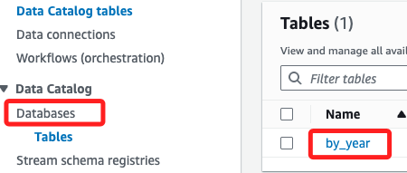

# ETL

_使用 AWS Glue 對數據集進行 ETL 操作_

<br>

## 任務 2，使用 Athena 查詢表格

_已經建立了 `Data Catalog`，可以進一步使用 Athena 來查詢數據_

<br>

1. 配置一個 S3 Bucket來存儲 Athena 查詢結果。

<br>

2. 在 Athena 中預覽資料庫表格。

<br>

3. 為 1950 年之後的數據建立一個表格。

<br>

4. 對選定數據運行查詢。

<br>

## 配置 S3 Bucket來存儲 Athena 查詢結果

1. 在左側欄中的 `atabases` 下點擊 `Tables`；然後點擊進入 `by_year`。

    

<br>

2. 展開右上角的 `Actions` 並選擇 `View data`。

    

<br>

3. 出現彈窗警告將被重定向至 `Athena` 控制台，點擊 `Proceed` 前往，這時會開啟新的網頁頁籤。

    

<br>

4. 在新開啟的 `Athena` 主控台中，切換頁籤到 `Settings`，然後點擊 `Manage`。

    

<br>

5. 點擊 `Location of query result - optional` 右側的 `Browse S3`。

    

<br>

6. 勾選名稱前綴為 `data-science-bucket-XXXXXX` 的 Bucket，切勿選擇前綴為 `glue-1950-bucket` 的 Bucket；然後點擊右下方 `Choose`。

    

<br>

7. 保留其他預設的設置，然後點擊右下角的 `Save`。

    

<br>

## 在 Athena 中預覽表格

1. 切換頁籤為 `Editor`，在 `Data` 區塊中，確認 `Data source` 為 `AwsDataCatalog`、`Database` 為 `weatherdata`；確認後，點擊 `Tables` 內 `by_year` 右側的三點圖標展開選單，點擊其中的 `Preview Table`；如需查看該表格中的列名稱及其數據類型，可選擇表格名稱左側的圖標。

    

<br>

2. 預設的查詢語法會顯示 `weatherdata` 表格的前 10 條記錄；點擊下方 `Run` 運行查詢。

    ```sql
    SELECT * FROM "weatherdata"."by_year" limit 10;
    ```

<br>

3. 特別注意，運行後可對 `運行時間(Run time)` 和 `查詢掃描的數據量（Data scanned）` 進行觀察，因為在開發應用程式時，減少資源消耗來優化成本是很重要的議題。

    

<br>

## 為 1950 年之後的數據建立表格

1. 首先，需要檢索預設建立的存儲數據的 S3 Bucket 名稱；搜尋並進入 `S3` 服務。

    

<br>

2. 點擊 `Buckets`，在下方清單中會看到前綴為 `glue-1950-bucket` 的 Bucket，複製完整名稱備用。

    

<br>

## 返回 Athena 查詢編輯器

1. 返回 `Athena` 主控台，開啟新的查詢頁籤，或對當前頁籤進行編輯。

    

<br>

2. 複製以下查詢語並貼到頁籤中，接著替換語句中的 `<glue-1950-bucket 完整名稱>` 為前面步驟查詢到的名稱，貼上時不包含尖鉤括號。

    ```sql
    CREATE table weatherdata.late20th
    WITH (
        format='PARQUET',
        external_location='s3://<glue-1950-bucket 完整名稱>/lab3'
    ) AS SELECT date, type, observation 
    FROM by_year
    WHERE date/10000 BETWEEN 1950 AND 2015;
    ```

<br>

3. 例如這裡查詢到的是 `glue-1950-bucket--231561d0`，所以編輯如下。

    

<br>

4. 點擊 `Run`；同樣地，可觀察運行時間等資訊。

    

<br>

5. 如需預覽結果，點擊 `late20th` 右側三點圖標，然後選擇 `Preview Table`。

    

<br>

6. 同樣會自動生成查詢語句，點擊下方 `Run` 即可。

    

<br>

## 對新表格運行查詢

1. 首先，建立一個僅包含最大溫度讀數（`TMAX`）值的視圖。

<br>

2. 在新查詢標籤中運行以下查詢。

    ```sql
    CREATE VIEW TMAX AS
    SELECT date, observation, type
    FROM late20th
    WHERE type = 'TMAX';
    ```

<br>

3. 如需預覽結果，在 `tmax` 視圖旁邊選擇三點圖標，然後選擇 `Preview View`。

<br>

4. 在新的查詢標籤中運行以下查詢，該查詢的目的是計算每年數據集中平均最高溫度。

    ```sql
    SELECT date/10000 as Year, avg(observation)/10 as Max
    FROM tmax
    GROUP BY date/10000
    ORDER BY date/10000;
    ```

<br>

5. 查詢運行完成後，運行時間和掃描的數據大小類似如下。

    ```bash
    排隊時間：0.211 秒
    運行時間：25.109 秒
    掃描數據量：2.45 GB
    ```

<br>

6. 結果顯示了 1950 年到 2015 年間的每年平均最高溫度。

<br>

___

_END_