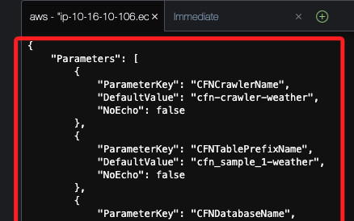

# ETL

_使用 AWS Glue 對數據集進行 ETL 操作_

<br>

## 任務 3，使用 CloudFormation 建立並部署 Glue 爬網程式

_在 `Task 1` 中，使用 Glue 控制台建立爬網程式以檢查數據源並推斷其結構。當爬網程式多次運行時，會自動查找數據存儲中的新增或已修改文件，並輸出自上次運行以來發現的新表和分區。_

<br>

## 搜尋 `gluelab` IAM 角色的 ARN

1. 進入 IAM 控制台。

    

<br>

2. 在左側欄中選擇 Roles，接著點擊清單中的 `gluelab`。

    

<br>

3. 複製 `Summary` 中的 ARN 備用。

    

<br>

## 建立 CloudFormation 模板

1. 進入 `Cloud9` 控制台。

    

<br>

2. 在預設的實體 `Cloud9 Instance` 點擊 `Open` 打開 IDE；這會開啟新的瀏覽夜面。

    

<br>

3. 在 Cloud9 IDE 中，展開上方功能選單的 `File`，點及 `New File` 新建文件。

    

<br>

4. 在編輯前，直接先將空文件保存為 `gluecrawler.cf.yml`；這些操作的快速鍵與本地常用編輯器都相同。

    

<br>

5. 將以下代碼複製並貼到文件中；特別注意，`yaml` 對於格式的規範是嚴格的。

    ```yaml
    AWSTemplateFormatVersion: '2010-09-09'
    Parameters:
        CFNCrawlerName:
            Type: String
            Default: cfn-crawler-weather
        CFNDatabaseName:
            Type: String
            Default: cfn-database-weather
        CFNTablePrefixName:
            Type: String
            Default: cfn_sample_1-weather
    Resources:
        CFNDatabaseWeather:
            Type: AWS::Glue::Database
            Properties:
                CatalogId: !Ref AWS::AccountId
                DatabaseInput:
                    Name: !Ref CFNDatabaseName
                    Description: "AWS Glue container to hold metadata tables for the weather crawler"
        CFNCrawlerWeather:
            Type: AWS::Glue::Crawler
            Properties:
                Name: !Ref CFNCrawlerName
                Role: <GLUELAB-ROLE-ARN>
                Description: AWS Glue crawler to crawl weather data
                DatabaseName: !Ref CFNDatabaseName
                Targets:
                    S3Targets:
                        - Path: "s3://noaa-ghcn-pds/csv/by_year/"
                TablePrefix: !Ref CFNTablePrefixName
                SchemaChangePolicy:
                    UpdateBehavior: "UPDATE_IN_DATABASE"
                    DeleteBehavior: "LOG"
                Configuration: "{\"Version\":1.0,\"CrawlerOutput\":{\"Partitions\":{\"AddOrUpdateBehavior\":\"InheritFromTable\"},\"Tables\":{\"AddOrUpdateBehavior\":\"MergeNewColumns\"}}}"
    ```

<br>

6. 接著要編輯文件，將其中 `<GLUELAB-ROLE-ARN>` 替換為之前複製備用的 `gluelab` 角色 ARN。

    

<br>

7. 完成後儲存，並確認頁籤上無白色圓點。

    

<br>

## 驗證並部署模板

1. 在 Cloud9 終端中，運行以下命令來驗證 CloudFormation 模板。

    ```bash
    aws cloudformation validate-template --template-body file://gluecrawler.cf.yml
    ```

<br>

2. 如果模板格式正確，會顯示驗證成功的消息。

    

<br>

## 查看 Stack

1. 在接續後面步驟前，先進入 `CloudFormation`。

    

<br>

2. 可查看當前有兩個 Stack。

    

<br>

## 建立 Stack

1. 運行以下命令來建立 CloudFormation Stack；特別注意，在建立 `CloudFormation Stack` 時，參數 `--capabilities` 可用來授權 `CloudFormation` 建立具有自定義名稱的資源，如 `IAM Role`，因為這些資源涉及更改或管理 AWS 中的權限，必須明確授權才能執行這些操作。

    ```bash
    aws cloudformation create-stack --stack-name gluecrawler --template-body file://gluecrawler.cf.yml --capabilities CAPABILITY_NAMED_IAM
    ```

    _輸出結果_

    

<br>

2. 可切換到前一個步驟的頁面查看這個添加的 Stack。

    

<br>

## 回到 Cloud9

1. 驗證 AWS Glue 數據庫是否已建立，會輸出與堆疊相關的數據庫。

    ```bash
    aws glue get-databases
    ```

<br>

2. 驗證爬網程式是否已建立。

    ```bash
    aws glue list-crawlers
    ```

    

<br>

3. 檢索爬網程式的詳細信息。

    ```bash
    aws glue get-crawler --name cfn-crawler-weather
    ```

<br>

## 總結

1. 以上任務將 Glue 爬網程式集成到 CloudFormation 模板中。

<br>

2. 在 Cloud9 終端中使用 AWS CLI 來驗證並部署模板，建立爬網程式。

<br>

3. 透過使用模板，可在其他 AWS 帳戶中重複使用爬網程式，並根據需要更改參數。

<br>

___

_END_