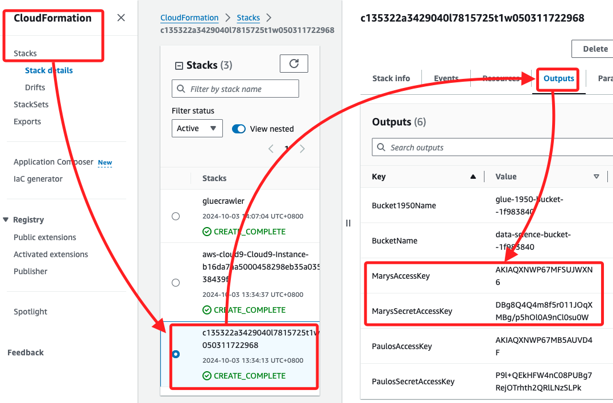
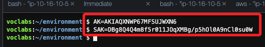
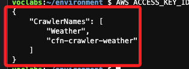
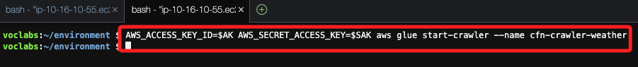
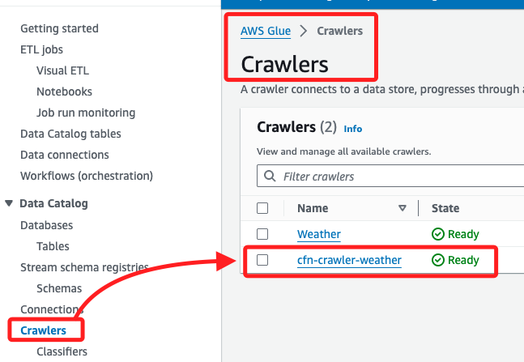

# ETL

_使用 AWS Glue 對數據集進行 ETL 操作_

<br>

## 任務 5，確認 Mary 能夠訪問並使用 AWS Glue 爬網程式

_測試另一個使用者是否能夠訪問 AWS Glue 爬網程式並使用它來提取、轉換和加載存儲在 Amazon S3 中的數據。_

<br>

1. 進入 CloudFormation 主控台，找到建立 Lab 環境的 Stack，並在 `Outputs` 標籤中複製 `MarysAccessKey` 和 `MarysSecretAccessKey`。

    

<br>

2. 返回到 Cloud9 終端，將這些值分別存儲為變數。

    ```bash
    AK=<ACCESS-KEY>
    SAK=<SECRET-ACCESS-KEY>
    ```

    

<br>

3. 使用 `mary` 的憑證測試 `list-crawlers` 命令。

    ```bash
    AWS_ACCESS_KEY_ID=$AK AWS_SECRET_ACCESS_KEY=$SAK aws glue list-crawlers
    ```

    

<br>

4. 檢索爬網程式的詳細信息。

    ```bash
    AWS_ACCESS_KEY_ID=$AK AWS_SECRET_ACCESS_KEY=$SAK aws glue get-crawler --name cfn-crawler-weather
    ```

<br>

5. 測試 `mary` 是否能夠運行爬網程式。

    ```bash
    AWS_ACCESS_KEY_ID=$AK AWS_SECRET_ACCESS_KEY=$SAK aws glue start-crawler --name cfn-crawler-weather
    ```

<br>

6. 特別注意，若爬網程式運行成功，終端不會顯示任何輸出。

    

<br>

7. 可在 Glue 控制台中查看爬網程式的運行情況，並等待狀態更改為 `Ready`；這個結果確認 `mary` 有權訪問並運行部署在 Glue 的爬網程式，並且提取數據。

    

<br>

___

_END_