# Amazon Redshift

_Storing and Analyzing Data by Using Amazon Redshift_

 

## 任務 1：檢視 IAM Role

_觀察預設 Role 是否具備適當權限訪問 Redshift_

 

1. 進入 `IAM`。

    

 

2. IAM 中有以下成員。

    

 

3. Lab 有預設角色 `MyRedshiftRole`，點擊進入。

    

 

4. 該角色預設附加了 `AmazonS3ReadOnlyAccess` 和 `RedshiftIAMLabPolicy` 策略。

    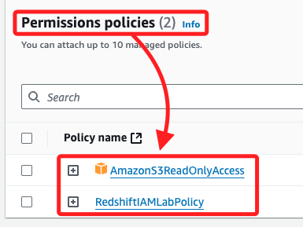

 

5. 可對 Policy 進性展開觀察，例如 `AmazonS3ReadOnlyAccess`；該 IAM 策略主要用於授權用戶對 `Amazon S3` 和 `S3 Object Lambda` 資源進行讀取和列出操作，適用於需要查看和檢索 S3 中存儲的數據但不需要修改權限的場景。

    

 

6. 另外，`RedshiftIAMLabPolicy` 部分允許用戶描述、創建、修改和刪除與 EC2 網路相關的資源，適用於管理 EC2 網路環境的場景。

    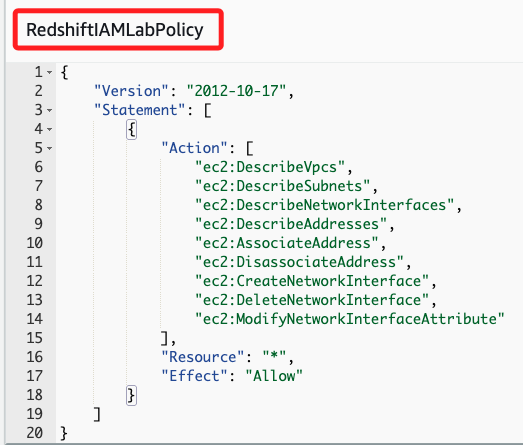

 

## 任務 2：建立並配置 Redshift 集群

1. 進入 `Redshift`。

    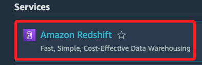

 

2. 點擊進入 Cluster；`Redshift 集群` 是數據倉庫的主要基礎設施組件，由一個或多個計算節點組成。集群的領導節點負責與客戶端應用程式交互，其他節點則進行計算。

    

 

3. 在下方 `Clusters` 區塊中點擊 `Create cluster`。

    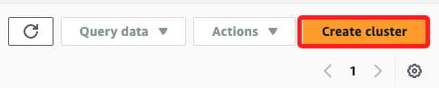

 

4. `Cluster identifier` 使用預設名稱 `redshift-cluster-1` 集群。

    

 

5. `Node type` 切換為為 `dc2.large`

    

 

6. `Number of nodes` 使用預設值 `2`。

    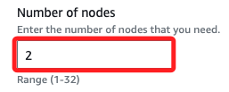

 

7. 在 `Database configurations` 區塊，使用預設的名稱 `awsuser`，並切換為手動建立密碼 `Manually add the admin password`；在 `Admin user password` 下方框中輸入自訂密碼，特別注意，密碼必須八個字元以上，並且包含一個大寫字母。

    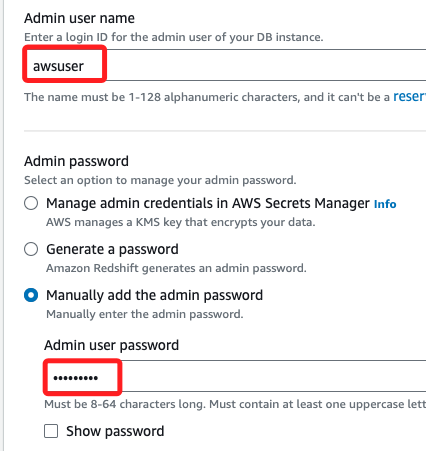

 

## 關於 Database encryption

_教程中並未提及這個部分_

 

1. 這裡勾選 `AWS managed key`，因為 Lab 並未被授權使用 `Customer managed key`；相關操作細節後補。

    

 

## 回到 Redshift

_教程內容與面板略有不同，這裡將以實際操作作為筆記_

 

1. 在 `Cluster permissions` 下的 `Associated IAM roles` 區塊，下拉 `Actions` 選單，點擊 `Associate IAM roles`。

    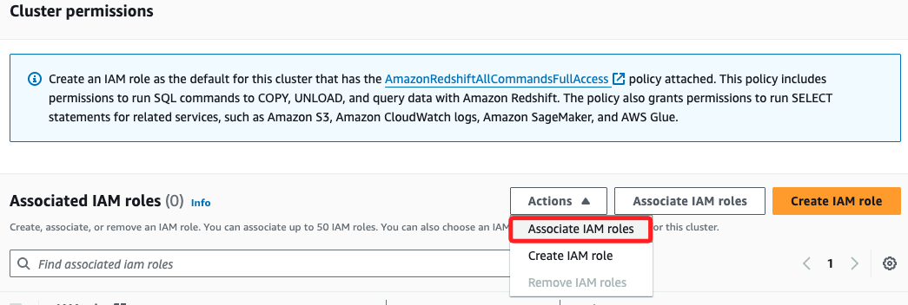

 

2. 在彈窗中選取 `MyRedshiftRole`，然後點擊 `Associate IAM roles`。

    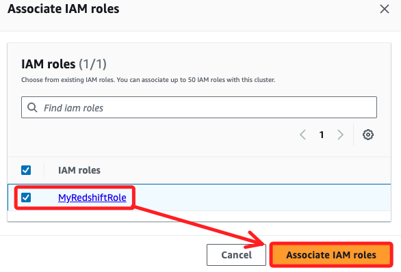

 

3. 完成後，在 `Associated IAM roles` 會顯示 `(1/1)`，沒勾選時會顯示 `(1)`。

    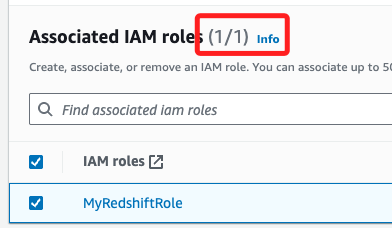

 

4. 完成以上步驟，點擊右下角 `Create cluster`；這需要幾分鐘時間來完成。

    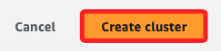

 

5. 完成時顯示 `Available`，點擊進入。

    

 

6. 上方會出現彈窗，官方教程特別提到，請忽略這些提示。

    

 

## 配置 VPC

1. 說明提到接下來要配置託管 Redshift 叢集的 VPC，允許流量通過預設連接埠 5439，也就是為 VPC 配置一個安全性群組，並將 Redshift Cluster 新增至該安全性群組。

    

 

2. 特別注意，說明中提到 Redshift 部署在 `三層架構` 中，這類模式在 AWS 文件中經常提到，也就是將部署在 `公共子網` 的網頁伺服器作為 `表示層`，與 `私有子網` 中的 `應用程式資料庫層` 進行互動，其中 `應用層` 是處理業務邏輯的伺服器與資料庫進行互動，在 AWS 中就是網頁應用伺服器對 Redshift 資料庫進行查詢或儲存數據；最後的 `資料層` 是資料庫所在的層級，通常位於 `私有子網` 中，不直接暴露於公網；`應用層` 的伺服器通過設置好的安全組和端口來訪問這些私有的資源，在 `Redshift` 預設的端口號為 `5439`。

 

3. 另外，說明也提到使用者是透過 NAT 網關存取 Web 應用程式，也就是說用戶的請求是間接到達 `私有子網` 中的數據庫資源，確保數據庫不會直接暴露給公網。

 

4. 說明最後提到可將 `堡壘主機（bastion host）` 新增至 `公用子網` 以透過 SSH 管理叢集，u=也就是可通過在 `VPC` 的 `公共子網` 中部署一個 `堡壘主機` 來實現對 `私有子網` 中 `Redshift Cluster` 的安全訪問和管理，堡壘主機可作為管理者登錄 `私有子網` 中資源的唯一入口，確保不直接暴露私有資源。

 

## 任務 3：在資料庫中建立表格

_從 S3 加載數據到 Redshift Cluster_

 

1. 進入 `EC2`。

    

 

2. 點擊 `Security Groups`。

    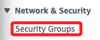

 

3. 點擊右上角 `Create security group`。

    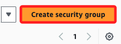

 

4. 命名為 `Redshift security group`，描述則填入 `Security group for my Redshift cluster`。

    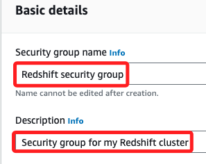

 

5. 點擊 `Add rule` 添加入站規則。

    

 

6. Type 選擇 `Redshift`，`Source` 選擇 `Anywhere-IPv4`，這預設會帶入 `0.0.0.0/0`，描述則填入 `Redshift inbound rule`。

    

 

7. 

#### 任務 4: 從 Amazon S3 加載數據
透過 `COPY` 命令，你將從 S3 存儲桶中加載數據到 Redshift 集群。每個表格使用不同的分隔符，例如 `\t` 和 `|`。

步驟包括：
- 使用 `COPY` 命令將數據從 S3 加載到表格中。
- 檢查數據加載是否成功。

#### 任務 5: 查詢數據
加載數據後，你可以撰寫 SQL 查詢來生成 Mary 所需的報告。Mary 提供了查詢來統計特定日期銷售的商品數量，以及查詢購買量最多的前 10 名客戶。

步驟包括：
- 使用 SQL 查詢來查詢 `sales` 和 `date` 表格，並找出特定日期的總銷量。
- 使用 SQL 查詢找出購買量最多的 10 位客戶。

#### 任務 6: 使用 AWS CLI 運行查詢
除了通過控制台運行查詢，你還可以使用 Amazon Redshift API、AWS SDK 庫和 AWS CLI 來執行操作。在這個任務中，你將通過 AWS Cloud9 終端執行 AWS CLI 命令，來查詢 Redshift 集群中的數據。

步驟包括：
- 使用 AWS CLI 在 Cloud9 中查詢 Redshift 資料庫。
- 使用 `get-statement-result` 命令檢索查詢結果。

#### 任務 7: 審查對 Redshift 的 IAM 訪問策略
你將審查附加到 DataScienceGroup 群組的 `Policy-For-Data-Scientists` IAM 策略，該策略允許使用 Redshift Data API 進行有限的資料庫操作。

步驟包括：
- 審查策略的 JSON，了解授權的動作和資源。

#### 任務 8: 確認使用者可以在 Redshift 資料庫上運行查詢
最後，確認 Mary 能夠透過 Redshift 查詢數據。使用 AWS CLI 指令模擬 Mary 的權限，並測試其能否檢索查詢結果。

步驟包括：
- 透過 Mary 的憑證運行 `execute-statement` 命令進行數據查詢。
- 使用 `get-statement-result` 命令檢索查詢結果。

---

這個教程展示了如何建立 Redshift 數據倉庫、加載數據以及進行查詢分析，並且提供了如何使用 IAM 角色和 AWS CLI 進行操作的完整指引。