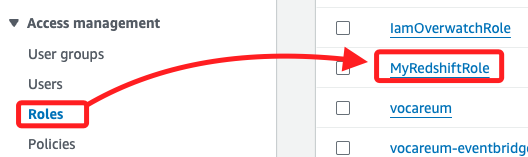
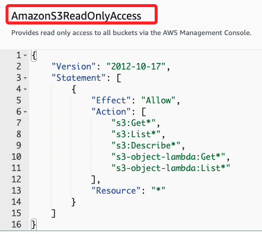

# Amazon Redshift

_Storing and Analyzing Data by Using Amazon Redshift_

 

## 任務 1：檢視 IAM Role

_觀察預設 Role 是否具備適當權限訪問 Redshift_

 

1. 進入 `IAM`。

    

 

2. IAM 中有以下成員。

    

 

3. Lab 有預設角色 `MyRedshiftRole`，點擊進入。

    

 

4. 該角色預設附加了 `AmazonS3ReadOnlyAccess` 和 `RedshiftIAMLabPolicy` 策略。

    

 

5. 可對 Policy 進性展開觀察，例如 `AmazonS3ReadOnlyAccess`；該 IAM 策略主要用於授權用戶對 `Amazon S3` 和 `S3 Object Lambda` 資源進行讀取和列出操作，適用於需要查看和檢索 S3 中存儲的數據但不需要修改權限的場景。

    

 

6. 另外，`RedshiftIAMLabPolicy` 部分允許用戶描述、建立、修改和刪除與 EC2 網路相關的資源，適用於管理 EC2 網路環境的場景。

    

 

___

_END_